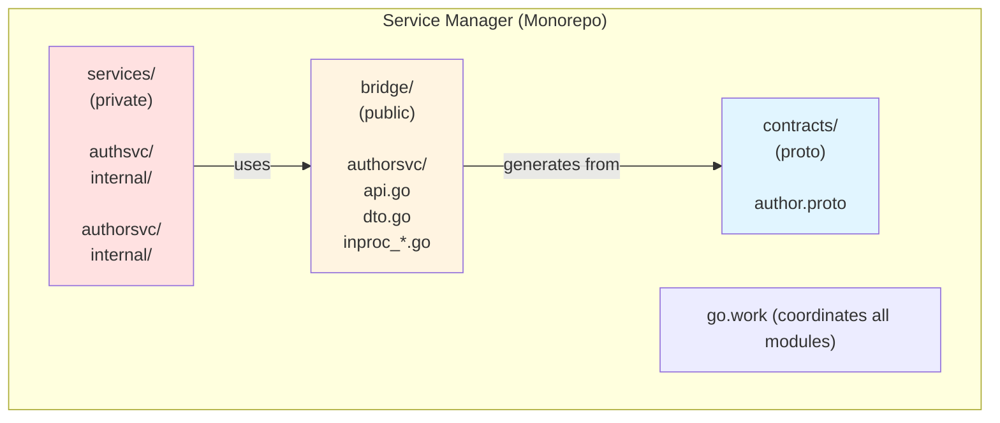
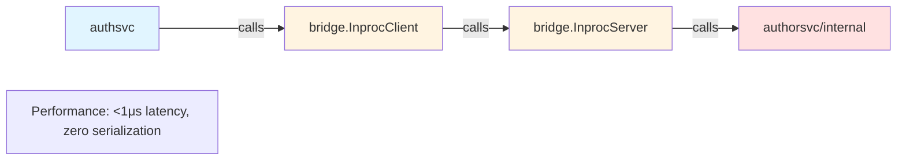
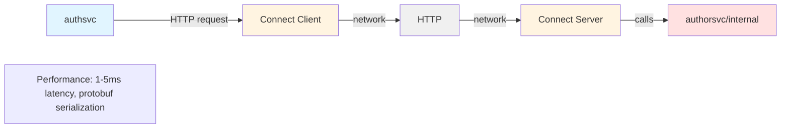
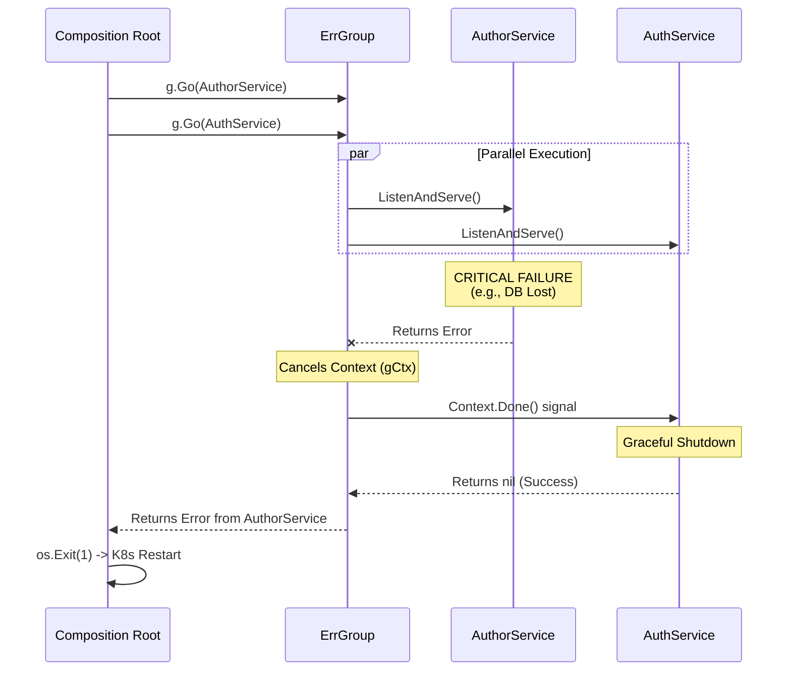
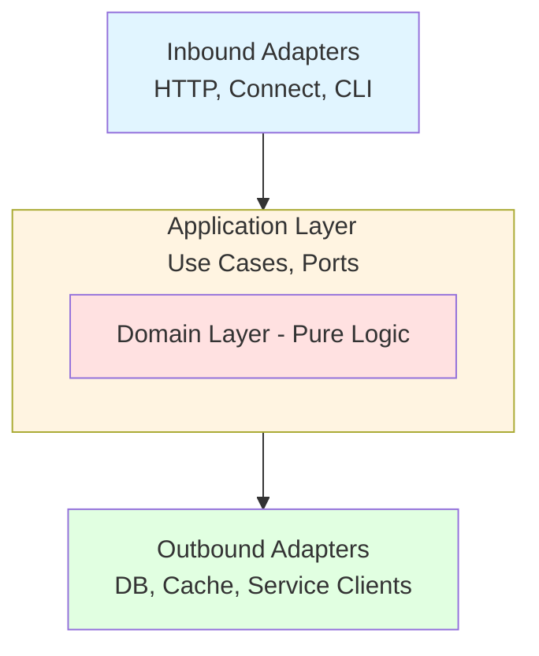

# Go Workspaces Modular Monolith with "Pure" Bridge Modules

**A Modular monolith pattern for building maintainable Go systems using workspaces with clear boundaries and flexible distribution.**

## Table of Contents
<!-- markdown-toc start - Don't edit this section. Run M-x markdown-toc-refresh-toc -->

- [Go Modular Monolith: Architecture White Paper](#go-modular-monolith-architecture-white-paper)
  - [Introduction](#introduction)
    - [The Monolith vs Microservices Dilemma](#the-monolith-vs-microservices-dilemma)
    - [What This Pattern Provides](#what-this-pattern-provides)
    - [Who This Is For](#who-this-is-for)
  - [Problem Statement](#problem-statement)
    - [The Challenges We're Solving](#the-challenges-were-solving)
    - [What Success Looks Like](#what-success-looks-like)
  - [Alternative Approaches](#alternative-approaches)
    - [Approach Comparison Matrix](#approach-comparison-matrix)
    - [1. Traditional Layered Monolith](#1-traditional-layered-monolith)
    - [2. Modular Monolith (Single Module)](#2-modular-monolith-single-module)
    - [3. Microservices-First](#3-microservices-first)
    - [4. Go Workspaces Modular Monolith with Bridge Modules (Recommended)](#4-go-workspaces-modular-monolith-with-bridge-modules-recommended)
  - [The Recommended Pattern](#the-recommended-pattern)
    - [Core Principles](#core-principles)
    - [High-Level Architecture Diagram](#high-level-architecture-diagram)
  - [Architecture Deep Dive](#architecture-deep-dive)
    - [Complete Directory Structure](#complete-directory-structure)
    - [Key Architectural Decisions](#key-architectural-decisions)
  - [Bridge Module Pattern](#bridge-module-pattern)
  - [Runtime Orchestration: The Supervisor Pattern](#runtime-orchestration-the-supervisor-pattern)
    - [The Monolith Composition Root Managed by `errgroup`](#the-monolith-composition-root-managed-by-errgroup)
      - [Handling Cross-Service Events](#handling-cross-service-events)
    - [Lifecycle Visualization](#lifecycle-visualization)
    - [Why "Shared Fate"?](#why-shared-fate)
    - [Advanced Supervision](#advanced-supervision)
      - [The Core Difference](#the-core-difference)
      - [When to use `suture`](#when-to-use-suture)
  - [DDD and Hexagonal Architecture](#ddd-and-hexagonal-architecture)
    - [The Hexagon: Ports and Adapters](#the-hexagon-ports-and-adapters)
    - [Domain Layer: Pure Business Logic](#domain-layer-pure-business-logic)
    - [Application Layer: Use Cases and Orchestration](#application-layer-use-cases-and-orchestration)
    - [Adapters Layer: I/O Boundaries](#adapters-layer-io-boundaries)
      - [Example Inbound Adapter (HTTP)](#example-inbound-adapter-http)
      - [Example Outbound Adapter (Repository)](#example-outbound-adapter-repository)
    - [Clean Dependency Rule](#clean-dependency-rule)
  - [Protobuf Contracts (optional)](#protobuf-contracts-optional)
  - [Testing Strategy](#testing-strategy)
  - [Operational Concerns](#operational-concerns)
  - [Decision Criteria](#decision-criteria)
    - [Use This Pattern When:](#use-this-pattern-when)
    - [Don't Use This Pattern When:](#dont-use-this-pattern-when)
    - [Comparison with Alternatives](#comparison-with-alternatives)
  - [Migration Scenarios](#migration-scenarios)
  - [Failure Modes](#failure-modes)
  - [Conclusion](#conclusion)
    - [Key Takeaways](#key-takeaways)
    - [When This Pattern Shines](#when-this-pattern-shines)
    - [Evolution Path](#evolution-path)
    - [Final Recommendation](#final-recommendation)
  - [References and Further Reading](#references-and-further-reading)
    - [Go Workspaces](#go-workspaces)
    - [Domain-Driven Design](#domain-driven-design)
    - [Hexagonal Architecture](#hexagonal-architecture)
    - [Protocol Buffers & Connect](#protocol-buffers--connect)
    - [Testing](#testing)
    - [Tools](#tools)

<!-- markdown-toc end -->


Before exploring the detailed white-paper, you can read [this 15 minutes blog post](https://blog.piprime.fr/en/innovative-go-modular-monolith-architecture/) that expose the key principles of this modular monolith architecture governed by a Go workspace.

## Introduction

### The Monolith vs Microservices Dilemma

The choice between monoliths and microservices is well-documented: monoliths can become tangled over time, while microservices introduce operational complexity from day one. This white paper presents a third approach—the **Go Workspaces Modular Monolith with Bridge Modules**—that provides clear service boundaries with flexible deployment options.

### What This Pattern Provides

- **Strong architectural boundaries** enforced by the Go compiler
- **In-process performance** during development and when services are co-located
- **Flexible distribution** when services need independent scaling
- **Clear migration path** from monolith to distributed without rewriting
- **DDD and hexagonal architecture** for maintainable domain logic
- **Optional protobuf contracts** for when you need network protocols

### Who This Is For

- Teams building new systems where future distribution is possible but not immediate
- Organizations consolidating microservices that should have been a monolith
- Projects migrating from tightly-coupled monoliths toward better boundaries
- Developers evaluating architectural approaches for medium-to-large Go systems (5-20 developers)

This is not the only valid approach. We'll compare it with alternatives and discuss when this pattern fits and when it doesn't.

## Problem Statement

### The Challenges We're Solving

**1. Boundary Erosion in Traditional Monoliths**

Classic Go monoliths rely on convention to maintain boundaries:
- `internal/` packages provide some protection but nothing prevents `serviceA` from importing `serviceB/internal` with relative imports
- Architectural violations happen gradually and silently
- Refactoring becomes increasingly difficult

**2. Premature Distribution Complexity**

Microservices-first approaches impose costs before they're justified:
- Operational overhead (Kubernetes, service mesh, monitoring)
- Network reliability concerns from day one
- Distributed transactions and eventual consistency
- Development environment complexity

**3. Difficult Migration Paths**

Existing patterns make evolution painful:
- Monolith -> Microservices: Requires complete rewrites of communication layers
- Microservices -> Monolith: Loses service boundaries when consolidating
- Either direction: High risk, long timelines, business disruption

### What Success Looks Like

An ideal pattern would provide:
- Compiler-enforced service boundaries
- In-process performance when appropriate
- Network distribution when needed
- Incremental migration (no big bang rewrites)
- Development simplicity (monorepo experience)
- Production flexibility (deploy together or separately)

## Alternative Approaches

Before presenting the recommended pattern, let's compare common architectural approaches and their trade-offs.

### Approach Comparison Matrix

| Pattern | Boundaries | Performance | Migration | Complexity | Best For |
|---------|-----------|-------------|-----------|------------|----------|
| **Go Work + Bridge** | Strong | Excellent | Easy | Medium | 5-20 devs, likely distribution |
| **Traditional Monolith** | None | Excellent | Hard | Very Low | 1-3 devs, simple domain |
| **Modular Monolith** | Weak | Excellent | Medium | Low | 2-5 devs, unlikely distribution |
| **Microservices** | Strongest | Good | N/A | Very High | 20+ devs, known distribution needs |
| **Shared Kernel** | Weak | Excellent | Very Hard | Medium | Avoid - creates tight coupling |

### 1. Traditional Layered Monolith

**Structure:** Single module, layered architecture (handlers -> services -> repositories).

**Pros:**
- Simplest setup
- Fast development
- Easy transactions
- Best initial performance

**Cons:**
- No boundaries (everything can call everything)
- Hard to split later
- Merge conflicts across team
- Cannot scale services independently

**When to use:** Solo developer, simple CRUD, MVP, unclear domain.

### 2. Modular Monolith (Single Module)

**Structure:** One `go.mod`, services use `internal/` packages and public facades with clearer boundaries than pure layered approach.

**Pros:**
- Simple setup
- Zero network overhead
- Shared dependency management
- Fast iteration

**Cons:**
- Weak boundaries (can be violated)
- Relies on discipline and linting
- Migration requires adding HTTP layer
- Shared dependency graph (for example, service A inherits service B's database drivers)

**When to use:** Small team (2-5 devs), performance critical, strong discipline.

### 3. Microservices-First

**Structure:** Separate repos, separate deployments, network-only communication.

**Pros:**
- Strongest isolation
- Independent deployment and scaling
- Technology freedom
- Team autonomy

**Cons:**
- Highest operational complexity
- Distributed system challenges from day one
- Development overhead (must run many services)
- Debugging difficulty (distributed tracing required)

**When to use:** Known scaling needs, large team (30+ devs), polyglot requirements

### 4. Go Workspaces Modular Monolith with Bridge Modules (Recommended)

**Structure:** Multiple Go modules coordinated by `go.work`, bridge modules for in-process calls

**Pros:**
- Strong boundaries (compiler-enforced)
- Excellent performance (in-process via bridges)
- Easy migration (swap adapters)
- Monorepo convenience provided by [go.work](https://go.dev/doc/tutorial/workspaces)
- Independent module versioning
- Explicit, visible seams

**Cons:**
- Medium setup complexity (multiple `go.mod` files)
- Requires understanding of bridge pattern
- More modules to coordinate

**When to use:** Medium team (5-20 devs), clear boundaries, likely future distribution.

**This is the pattern we recommend and detail in this white paper.**

## The Recommended Pattern

### Core Principles

**1. Go Workspaces for Module Coordination**

Use `go.work` to coordinate multiple independent Go modules in a single
repository:
- Each service is its own module with its own `go.mod`
- Workspace makes cross-module development seamless
- Compiler enforces module boundaries

**2. Bridge Modules for Explicit Boundaries**

Services communicate via public bridge modules:
- Bridge defines the service API with Go interfaces
- Bridge provides in-process client and server implementations
- Services can only import bridge, not other service internals
- **Compiler prevents boundary violations**

**3. Optional Network Transport**

Network protocols like HTTP/Connect/gRPC are opt-in:
- Use in-process bridges during development
- Add network transport when distribution is needed
- **Swap adapters via dependency injection**
- Same service code works with both transports

**4. Hexagonal Architecture Within Services**

Each service uses clean architecture internally:
- Domain layer for pure business logic
- Application layer with use cases and ports
- Adapters layer like HTTP, database, service clients
- Infrastructure layer for wiring and config

### High-Level Architecture Diagram



**In-Process:**


**Distributed:**


## Architecture Deep Dive

### Complete Directory Structure

See the file [complete-directory-structure.md](complete-directory-structure.md).

### Key Architectural Decisions

**1. Why Multiple Go Modules?**

Each service is an independent Go module because:
- **Compiler enforces boundaries** - Service A physically cannot import Service B's `internal/` package
- **Independent dependency graphs** - `authsvc` doesn't inherit `authorsvc`'s PostgreSQL driver
- **Independent versioning** - Services can evolve at different rates
- **Clear ownership** - Each module has its own `go.mod` showing dependencies
- **Future extraction** - Already a separate module, easy to move to separate repo

**2. Why Bridge Modules?**

Bridge modules provide truly independent service boundaries:
- **Public API definition** - Clear contract using Go interfaces
- **True module independence** - Bridge has literally zero dependencies (no `require` statements)
- **Compiler enforcement** - Services cannot import other service internals (different Go modules)
- **In-process performance** - Direct function calls via interfaces, zero network overhead
- **Explicit seam** - Visible boundary between services in the module structure
- **Flexible implementation** - Same interface works for in-process and network transports
- **Testability** - Easy to mock the bridge interface

**Key architectural principle:** Bridge modules contain ONLY interfaces, DTOs, errors, and thin client wrappers. All implementations (including InprocServer) live in service internal adapters, where they can access the service's application layer.

**3. Why Optional Protobuf?**

Protobuf contracts are generated but not required for in-process communication:
- Use **Go DTOs in bridges** during development (simple, idiomatic)
- Add **protobuf** when you need network transport
- Bridge can use either protobuf types or custom Go types
- Gradual adoption - start simple, add complexity when needed

**4. Why Go Workspaces?**

`go.work` coordinates independent modules:
- **Monorepo experience** - Feels like single codebase
- **Seamless cross-module development** - No publishing required
- **IDE integration** - Jump to definition across modules
- **Single test command** - `go test ./...` works across workspace
- **Replace directives** - Local overrides for development


## Bridge Module Pattern

See the file [bridge-module-pattern.md](bridge-module-pattern.md).

## Runtime Orchestration: The Supervisor Pattern

While `go.work` groups the code, the **Composition Root** groups the runtime. In a *Modular Monolith*, you need a single `main.go` that initializes all services, wires their bridges, and manages their lifecycles concurrently.

We use the Supervisor Pattern (via errgroup) to manage this. This ensures a "Shared Fate" architecture: if a critical service fails (e.g., DB disconnect), the supervisor cancels the context for all services, shutting down the monolith cleanly so the orchestrator (Kubernetes) can restart the pod.

### The Monolith Composition Root Managed by `errgroup`

See the file: [example-composition-root-managed-by-errgroup.md](example-composition-root-managed-by-errgroup.md).

#### Handling Cross-Service Events
See the file [cross-service-events.md](cross-service-events.md).

### Lifecycle Visualization
The following diagram illustrates how the errgroup acts as a safety net. Note how an error in authorsvc propagates to stop authsvc immediately.



### Why "Shared Fate"?

In a distributed microservices environment, if the Author Service goes down, the Auth Service might survive (partial availability). However, in a Modular Monolith, we prefer **Shared Fate** (Fail Fast).

If one module is unhealthy, the process state might be corrupt or resources might be leaking. It is safer to crash the entire pod and let the infrastructure restart a fresh instance than to leave the monolith in a "zombie" state where half the modules are working and half are dead.


### Advanced Supervision

For scenarios requiring fine-grained fault tolerance (e.g., ensuring a panic in a background report generator doesn't crash the HTTP API), consider using [suture](https://github.com/thejerf/suture). It brings Erlang-style supervision trees to Go, allowing individual services to restart automatically without taking down the entire process. For most Kubernetes deployments, however, the `errgroup` "fail fast" approach is preferred.

Using `github.com/thejerf/suture` changes the fundamental philosophy of the runtime from **"Fail Fast"** (Shared Fate) to **"Self-Healing"** (Erlang-style Supervision Trees).  
Here is the breakdown of why you might choose one over the other for the Modular Monolith, and how to implement it.

#### The Core Difference

| Feature | `errgroup` (Recommended for K8s) | `suture` (Recommended for Bare Metal/Daemons) |
| --- | --- | --- |
| **Philosophy** | **Crash Together.** If one service fails, the whole pod is unhealthy. Kill it and let Kubernetes restart a fresh instance. | **Keep Running.** If a service crashes, restart just that service. Isolate the failure so the rest of the app stays up. |
| **Complexity** | **Low.** Standard Go library pattern. | **Medium/High.** Requires understanding supervision trees, backoff strategies, and restart thresholds. |
| **Recovery** | Delegated to Infrastructure (Docker/K8s). | Handled internally by the Go binary. |
| **Best For** | HTTP Servers, stateless monoliths. | Background workers, queue consumers, stateful actors. |


#### When to use `suture`

You should use `suture` if:

* You have **critical background workers** (e.g., a log collector) that should *never* take down the main HTTP API if they panic.
* You are running on **Bare Metal** or non-orchestrated environments where a process crash requires manual intervention.
* You want **granular fault tolerance** (e.g., "Service A" can crash, but "Service B" must stay up).

*Note that it is need to wrap your HTTP servers to respect the `suture.Service` interface specifically, they must return when the context is cancelled:*

## DDD and Hexagonal Architecture

Each service uses Domain-Driven Design and Hexagonal Architecture internally. This section explains the layering within a service.

### The Hexagon: Ports and Adapters



### Domain Layer: Pure Business Logic

**Purpose:** Represent core business concepts and rules

**Characteristics:**
- No dependencies on frameworks, databases, or external systems
- Pure Go code using standard library only
- Fully testable without any infrastructure

**Components:**

1. **Entities** (aggregate roots)
   - Have identity (ID)
   - Have lifecycle (created, updated)
   - Encapsulate business rules
   - Example: `User`, `Session`, `Author`

2. **Value Objects**
   - No identity (compared by value)
   - Immutable
   - Self-validating
   - Example: `Email`, `Password`, `AuthorID`

3. **Repository Interfaces** (ports)
   - Defined by domain, implemented by adapters
   - Return domain types
   - Example: `UserRepository`, `SessionRepository`

4. **Domain Services**
   - Stateless operations on domain objects
   - Cross-aggregate business logic
   - Example: `AuthenticationPolicy`

**Example Domain Layer:**

See the file: [example-domain-layer.md](example-domain-layer.md)

### Application Layer: Use Cases and Orchestration

**Purpose:** Implement business workflows that coordinate domain objects

**Characteristics:**
- Depends on domain layer
- Defines ports (interfaces) for external dependencies
- No knowledge of HTTP, databases, or specific frameworks
- Transaction boundaries

**Components:**

1. **Commands** (write operations)
   - Change system state
   - Example: `LoginCommand`, `RegisterCommand`

2. **Queries** (read operations)
   - Return data without side effects
   - Can bypass domain for performance (CQRS-lite)
   - Example: `GetUserQuery`, `ValidateTokenQuery`

3. **Ports** (interfaces for adapters)
   - Owned by application layer
   - Implemented by adapters
   - Example: `AuthorClient`, `Cache`, `Logger`

4. **Application DTOs**
   - Data transfer objects for application layer
   - Decouple domain from external world

See the [Example Application Layer](example-application-layer.md).

### Adapters Layer: I/O Boundaries

**Purpose:** Implement ports and handle external communication

**Inbound Adapters** (primary/driving):
- Deliver requests to the application
- Examples: HTTP handlers, Connect handlers, CLI commands

**Outbound Adapters** (secondary/driven):
- Application calls external systems
- Examples: Database repositories, service clients, cache, events

#### Example Inbound Adapter (HTTP)

See the [Example Inbound Adapter](example-inbound-adapter.md).

#### Example Outbound Adapter (Repository)

See the [Example Outbound Adapter](example-outbound-adapter.md).

### Clean Dependency Rule

```
Domain Layer
    ↑
Application Layer (depends on Domain, defines Ports)
    ↑
Adapters Layer (implements Ports)
    ↑
Infrastructure Layer (wires everything)
    ↑
main.go (composition root)
```

**Rule:** Dependencies point inward. Inner layers don't know about outer layers.

- Domain has zero external dependencies
- Application depends on Domain + Ports (interfaces)
- Adapters depend on Application ports + external libraries
- Infrastructure knows about everything (wiring)

## Protobuf Contracts (optional)

See the file [protobuf-contracts.md](protobuf-contracts.md).

## Testing Strategy

See the file [testing-strategy.md](testing-strategy.md).

## Operational Concerns

See the file [operational-concerns.md](operational-concerns.md).

## Decision Criteria

### Use This Pattern When:

- **Medium team size (5-20 developers)**
- **Clear service boundaries exist**
- **Future distribution is likely (but not immediate)**
- **Moderate-to-high domain complexity**
- **Localhost development is acceptable**
- **Want strong boundaries without operational complexity**

### Don't Use This Pattern When:

- **Solo developer or simple CRUD** -> Use traditional monolith
- **Services need independent scaling NOW** -> Use microservices
- **Services need different languages/runtimes** -> Use polyglot microservices
- **Hard real-time or zero-allocation hot paths** -> additional abstraction layers may be undesirable
- **Strong compliance isolation required** -> Need physical separation

### Comparison with Alternatives

| Aspect | This Pattern | Simple Monolith | Microservices |
|--------|-------------|-----------------|---------------|
| Boundaries | Strong (compiler) | None | Strongest |
| Performance | Excellent (in-proc) | Excellent | Good |
| Dev Speed | Fast | Fastest | Slower |
| Ops Complexity | Low | Very Low | Very High |
| Migration Path | Easy | Hard | N/A |
| Best For | 5-20 devs, likely distribution | 1-5 devs, simple domain | 20+ devs, known distribution |

## Migration Scenarios

See the file [migration-scenarios.md](migration-scenarios.md).

## Failure Modes

See the file [failure-modes.md](failure-modes.md).

## Conclusion

### Key Takeaways

1. **Go Workspaces + Bridge Modules = Strong Boundaries + Flexibility**
   - Compiler-enforced service isolation
   - In-process performance when services are co-located
   - Network protocols when services are distributed
   - No "big bang" migration required

2. **DDD and Hexagonal Architecture Within Services**
   - Clean separation of concerns
   - Testable business logic
   - Flexible adapters for external systems

3. **Protobuf is Optional**
   - Start with Go interfaces in bridges
   - Add protobuf when you need network transport
   - Gradual adoption as needed

**If you expect external clients or cross-team ownership, define protobuf first—even if you don’t enable network transport yet.**

4. **This Pattern is a Middle Ground**
   - Simpler than microservices
   - Stronger than convention-based monoliths
   - Flexible enough to evolve

### When This Pattern Shines

- **Growing SaaS products** - Start simple, scale when needed
- **Internal platforms** - Multiple services, shared infrastructure
- **Migration from monoliths** - Incremental extraction with safety
- **Microservices consolidation** - Reduce complexity while keeping boundaries

### Evolution Path

```
Traditional Monolith
        ↓
  (Extract services)
        ↓
Go Workspaces + Bridges (in-process)
        ↓
  (Add Connect when needed)
        ↓
Go Workspaces + Bridges (network)
        ↓
  (Deploy separately)
        ↓
Distributed Microservices
```

**Each step is incremental and low-risk.**

### Final Recommendation

If you're building a Go system with:
- 5-20 developers
- Clear service boundaries
- Likely (but not immediate) need for distribution
- Want strong architectural discipline

**This pattern provides the best balance of simplicity, safety, and flexibility.**

## References and Further Reading

### Go Workspaces
- [Go Workspace Tutorial](https://go.dev/doc/tutorial/workspaces)
- [Go Modules Reference](https://go.dev/ref/mod)

### Project Layout
- [Standard Go Project Layout](https://github.com/golang-standards/project-layout)
- [Go DDD example application](https://github.com/ThreeDotsLabs/wild-workouts-go-ddd-example): Complete project to show how to apply DDD, Clean Architecture, and CQRS by practical refactoring.

### Domain-Driven Design
- *Domain-Driven Design* by Eric Evans
- *Implementing Domain-Driven Design* by Vaughn Vernon

### Hexagonal Architecture
- [Hexagonal Architecture](https://alistair.cockburn.us/hexagonal-architecture/) by Alistair Cockburn
- *Clean Architecture* by Robert C. Martin

### Protocol Buffers & Connect
- [Protocol Buffers Documentation](https://protobuf.dev/)
- [Connect RPC](https://connectrpc.com/)
- [Buf](https://buf.build/)

### Testing
- *Growing Object-Oriented Software, Guided by Tests* by Steve Freeman & Nat Pryce
- [Testing in Go](https://go.dev/doc/tutorial/add-a-test)

### Tools
- [arch-go](https://github.com/arch-go/arch-go): Architectural testing for Go
- [go-cleanarch](https://github.com/roblaszczak/go-cleanarch): Validating layer dependencies
- [godepgraph](https://github.com/kisielk/godepgraph): Visualizing dependency graphs
