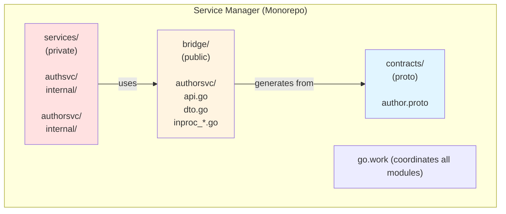
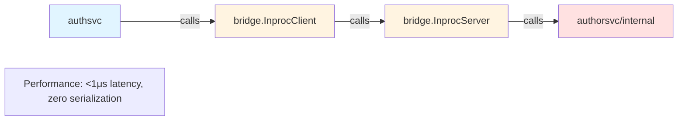
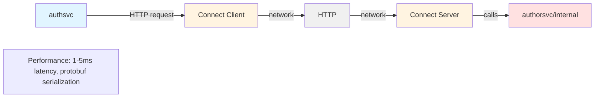
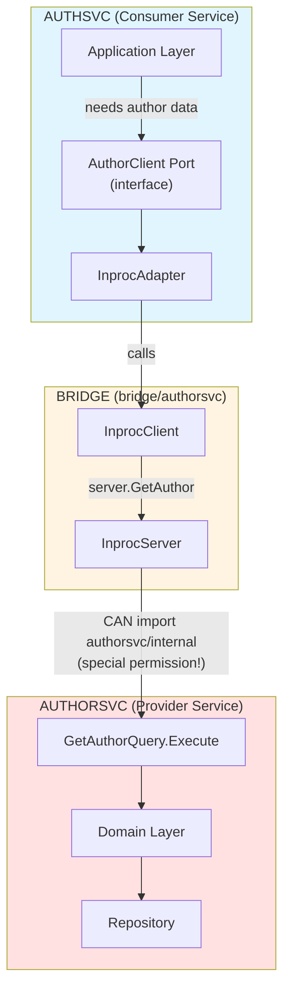
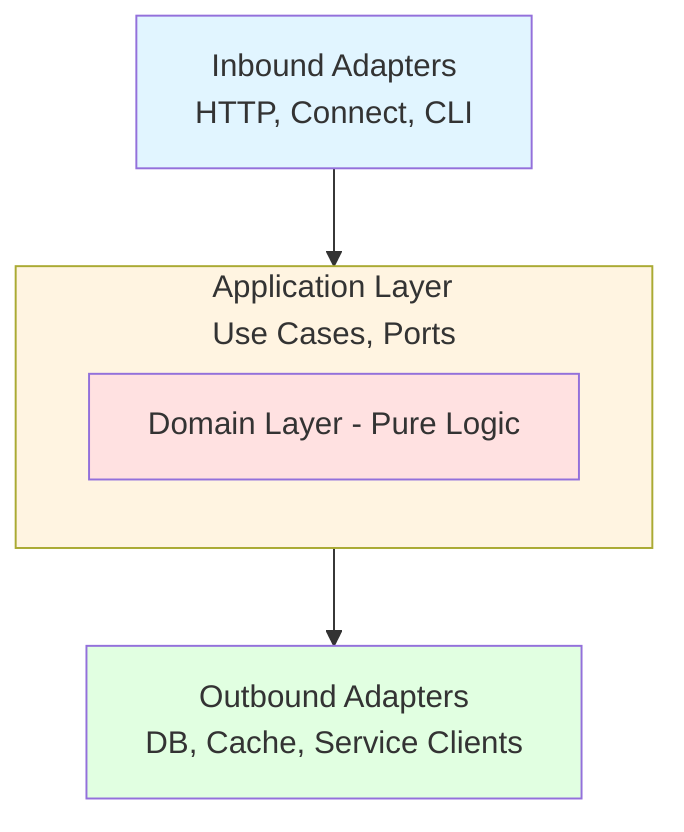
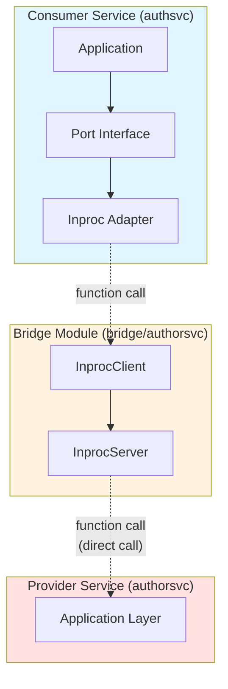
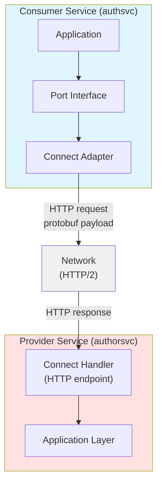

# Go Modular Monolith: Architecture White Paper

**A Modular monolith pattern for building maintainable Go systems using workspaces with clear boundaries and flexible distribution.**

Before exploring the detailed white-paper, you can read [this 15 minutes blog post](https://blog.piprime.fr/en/innovative-go-modular-monolith-architecture/) that expose the key principles of this modular monolith architecture governed by a Go workspace.

## Introduction

### The Monolith vs Microservices Dilemma

The choice between monoliths and microservices is well-documented: monoliths can become tangled over time, while microservices introduce operational complexity from day one. This white paper presents a third approach—the **Go Workspaces Modular Monolith with Bridge Modules**—that provides clear service boundaries with flexible deployment options.

### What This Pattern Provides

- **Strong architectural boundaries** enforced by the Go compiler
- **In-process performance** during development and when services are co-located
- **Flexible distribution** when services need independent scaling
- **Clear migration path** from monolith to distributed without rewriting
- **DDD and hexagonal architecture** for maintainable domain logic
- **Optional protobuf contracts** for when you need network protocols

### Who This Is For

- Teams building new systems where future distribution is possible but not immediate
- Organizations consolidating microservices that should have been a monolith
- Projects migrating from tightly-coupled monoliths toward better boundaries
- Developers evaluating architectural approaches for medium-to-large Go systems (5-20 developers)

This is not the only valid approach. We'll compare it with alternatives and discuss when this pattern fits and when it doesn't.

## Problem Statement

### The Challenges We're Solving

**1. Boundary Erosion in Traditional Monoliths**

Classic Go monoliths rely on convention to maintain boundaries:
- `internal/` packages provide some protection but nothing prevents `serviceA` from importing `serviceB/internal` with relative imports
- Architectural violations happen gradually and silently
- Refactoring becomes increasingly difficult

**2. Premature Distribution Complexity**

Microservices-first approaches impose costs before they're justified:
- Operational overhead (Kubernetes, service mesh, monitoring)
- Network reliability concerns from day one
- Distributed transactions and eventual consistency
- Development environment complexity

**3. Difficult Migration Paths**

Existing patterns make evolution painful:
- Monolith -> Microservices: Requires complete rewrites of communication layers
- Microservices -> Monolith: Loses service boundaries when consolidating
- Either direction: High risk, long timelines, business disruption

### What Success Looks Like

An ideal pattern would provide:
- Compiler-enforced service boundaries
- In-process performance when appropriate
- Network distribution when needed
- Incremental migration (no big bang rewrites)
- Development simplicity (monorepo experience)
- Production flexibility (deploy together or separately)

## Alternative Approaches

Before presenting the recommended pattern, let's compare common architectural approaches and their trade-offs.

### Approach Comparison Matrix

| Pattern | Boundaries | Performance | Migration | Complexity | Best For |
|---------|-----------|-------------|-----------|------------|----------|
| **Go Work + Bridge** | Strong | Excellent | Easy | Medium | 5-20 devs, likely distribution |
| **Single Module** | Weak | Excellent | Medium | Low | 2-5 devs, unlikely distribution |
| **Traditional Monolith** | None | Excellent | Hard | Very Low | 1-3 devs, simple domain |
| **Microservices** | Strongest | Good | N/A | Very High | 20+ devs, known distribution needs |
| **Shared Kernel** | Weak | Excellent | Very Hard | Medium | Avoid - creates tight coupling |

### 1. Traditional Layered Monolith

**Structure:** Single module, layered architecture (handlers -> services -> repositories).

**Pros:**
- Simplest setup
- Fast development
- Easy transactions
- Best initial performance

**Cons:**
- No boundaries (everything can call everything)
- Hard to split later
- Merge conflicts across team
- Cannot scale services independently

**When to use:** Solo developer, simple CRUD, MVP, unclear domain.

### 2. Single Module with Convention-Based Boundaries

**Structure:** One `go.mod`, services use `internal/` packages and public facades.

**Pros:**
- Simple setup
- Zero network overhead
- Shared dependency management
- Fast iteration

**Cons:**
- Weak boundaries (can be violated)
- Relies on discipline and linting
- Migration requires adding HTTP layer
- Shared dependency graph (for example, service A inherits service B's database drivers)

**When to use:** Small team (2-5 devs), performance critical, strong discipline.

### 3. Microservices-First

**Structure:** Separate repos, separate deployments, network-only communication.

**Pros:**
- Strongest isolation
- Independent deployment and scaling
- Technology freedom
- Team autonomy

**Cons:**
- Highest operational complexity
- Distributed system challenges from day one
- Development overhead (must run many services)
- Debugging difficulty (distributed tracing required)

**When to use:** Known scaling needs, large team (30+ devs), polyglot requirements

### 4. Go Workspaces Modular Monolith with Bridge Modules (Recommended)

**Structure:** Multiple Go modules coordinated by `go.work`, bridge modules for in-process calls

**Pros:**
- Strong boundaries (compiler-enforced)
- Excellent performance (in-process via bridges)
- Easy migration (swap adapters)
- Monorepo convenience provided by [go.work](https://go.dev/doc/tutorial/workspaces)
- Independent module versioning
- Explicit, visible seams

**Cons:**
- Medium setup complexity (multiple `go.mod` files)
- Requires understanding of bridge pattern
- More modules to coordinate

**When to use:** Medium team (5-20 devs), clear boundaries, likely future distribution.

**This is the pattern we recommend and detail in this white paper.**

## The Recommended Pattern

### Core Principles

**1. Go Workspaces for Module Coordination**

Use `go.work` to coordinate multiple independent Go modules in a single repository:
- Each service is its own module with its own `go.mod`
- Workspace makes cross-module development seamless
- Compiler enforces module boundaries

**2. Bridge Modules for Explicit Boundaries**

Services communicate via public bridge modules:
- Bridge defines the service API with Go interfaces
- Bridge provides in-process client and server implementations
- Services can only import bridge, not other service internals
- **Compiler prevents boundary violations**

**3. Optional Network Transport**

Network protocols like HTTP/Connect/gRPC are opt-in:
- Use in-process bridges during development
- Add network transport when distribution is needed
- **Swap adapters via dependency injection**
- Same service code works with both transports

**4. Hexagonal Architecture Within Services**

Each service uses clean architecture internally:
- Domain layer for pure business logic
- Application layer with use cases and ports
- Adapters layer like HTTP, database, service clients
- Infrastructure layer for wiring and config

### High-Level Architecture Diagram



**In-Process:**


**Distributed:**


## Architecture Deep Dive

### Complete Directory Structure

```
service-manager/
├── go.work                    # Go workspace definition
│                              # use (./contracts ./bridge/authorsvc ./services/...)
│
├── mise.toml                  # Root orchestration tasks
│
├── buf.yaml                   # Buf workspace config (optional)
├── buf.gen.yaml               # Protobuf code generation (optional)
│
├── contracts/                # Protobuf definitions (OPTIONAL - for network transport)
│   ├── go.mod                # Module: contracts v1.0.0
│   ├── README.md             # Contract versioning strategy
│   │
│   ├── auth/v1/
│   │   ├── auth.proto        # AuthService definition
│   │   ├── auth.pb.go        # Generated protobuf types
│   │   └── authconnect/
│   │       └── auth.connect.go # Generated Connect stubs
│   │
│   └── author/v1/
│       ├── author.proto      # AuthorService definition
│       ├── author.pb.go      # Generated
│       └── authorconnect/
│           └── author.connect.go # Generated
│
├── bridge/                    # Bridge modules (public service APIs)
│   │
│   └── authorsvc/            # Author service public API
│       ├── go.mod            # Module: bridge/authorsvc v1.0.0
│       │                     # Dependencies: none (pure interfaces)
│       │
│       ├── README.md         # Bridge usage documentation
│       │
│       ├── api.go            # Public service interface
│       │   # type AuthorService interface {
│       │   #   GetAuthor(ctx, id) (*AuthorDTO, error)
│       │   #   CreateAuthor(ctx, req) (*AuthorDTO, error)
│       │   # }
│       │
│       ├── dto.go            # Domain-friendly DTOs
│       │   # type AuthorDTO struct { ID, Name, Bio string }
│       │   # Alternative: use proto-generated types
│       │
│       ├── errors.go         # Public error types
│       │   # var ErrAuthorNotFound = errors.New("author not found")
│       │
│       ├── inproc_server.go  # In-process server implementation
│       │   # Implements AuthorService
│       │   # Wraps authorsvc/internal/application
│       │   # CAN import authorsvc/internal (same logical service)
│       │
│       └── inproc_client.go  # In-process client implementation
│           # Implements AuthorService
│           # Calls InprocServer directly (function call, no network)
│
├── services/
│   │
│   ├── authsvc/              # Authentication Service
│   │   ├── go.mod            # Module: services/authsvc v2.1.0
│   │   │                     # Dependencies: bridge/authorsvc, contracts (optional)
│   │   │
│   │   ├── README.md         # Service documentation
│   │   ├── mise.toml         # Service-specific tasks
│   │   ├── Dockerfile
│   │   │
│   │   ├── cmd/
│   │   │   └── authsvc/
│   │   │       └── main.go   # Composition root
│   │   │           # Wires dependencies:
│   │   │           # - In dev: uses bridge.InprocClient
│   │   │           # - In prod: uses authorconnect.Client
│   │   │
│   │   └── internal/         # PRIVATE - cannot be imported by other services
│   │       │
│   │       ├── domain/       # DOMAIN LAYER (pure business logic)
│   │       │   │             # No external dependencies
│   │       │   │             # No adapters, no infrastructure
│   │       │   │
│   │       │   ├── user/     # User aggregate
│   │       │   │   ├── user.go           # Entity (aggregate root)
│   │       │   │   ├── email.go          # Value object
│   │       │   │   ├── password.go       # Value object
│   │       │   │   └── repository.go     # Repository interface (port)
│   │       │   │
│   │       │   ├── session/  # Session aggregate
│   │       │   │   ├── session.go        # Entity
│   │       │   │   ├── token.go          # Value object
│   │       │   │   └── repository.go     # Repository interface
│   │       │   │
│   │       │   └── errors.go # Domain errors
│   │       │
│   │       ├── application/  # APPLICATION LAYER (use cases)
│   │       │   │             # Orchestrates domain objects
│   │       │   │             # Depends on: domain, ports (interfaces only)
│   │       │   │
│   │       │   ├── command/  # Write operations
│   │       │   │   ├── login.go          # Login use case
│   │       │   │   ├── logout.go         # Logout use case
│   │       │   │   ├── register.go       # Registration use case
│   │       │   │   └── change_password.go
│   │       │   │
│   │       │   ├── query/    # Read operations
│   │       │   │   ├── get_user.go
│   │       │   │   └── validate_token.go
│   │       │   │
│   │       │   ├── dto/      # Application DTOs
│   │       │   │   ├── user_dto.go
│   │       │   │   └── session_dto.go
│   │       │   │
│   │       │   └── ports/    # APPLICATION PORTS (interfaces)
│   │       │       │         # Owned by application layer
│   │       │       │         # Implemented by adapters
│   │       │       │
│   │       │       ├── author_client.go  # Outbound port
│   │       │       │   # type AuthorClient interface {
│   │       │       │   #   GetAuthor(ctx, id) (*AuthorInfo, error)
│   │       │       │   # }
│   │       │       │
│   │       │       ├── cache.go          # Outbound port
│   │       │       ├── logger.go         # Outbound port
│   │       │       └── event_publisher.go
│   │       │
│   │       ├── adapters/     # ADAPTERS LAYER (I/O boundaries)
│   │       │   │             # Implements ports from application layer
│   │       │   │
│   │       │   ├── inbound/  # Inbound adapters (primary/driving)
│   │       │   │   │         # External world -> Application
│   │       │   │   │
│   │       │   │   ├── http/ # HTTP REST adapter
│   │       │   │   │   ├── server.go
│   │       │   │   │   ├── handlers/
│   │       │   │   │   │   ├── login.go
│   │       │   │   │   │   ├── logout.go
│   │       │   │   │   │   └── register.go
│   │       │   │   │   ├── middleware/
│   │       │   │   │   └── dto/
│   │       │   │   │
│   │       │   │   └── connect/  # Connect/gRPC adapter (optional)
│   │       │   │       ├── server.go
│   │       │   │       └── handlers/
│   │       │   │           └── auth_handler.go
│   │       │   │
│   │       │   └── outbound/ # Outbound adapters (secondary/driven)
│   │       │       │         # Application -> External systems
│   │       │       │
│   │       │       ├── persistence/  # Database adapters
│   │       │       │   ├── postgres/
│   │       │       │   │   ├── user_repository.go
│   │       │       │   │   ├── session_repository.go
│   │       │       │   │   └── migrations/
│   │       │       │   │
│   │       │       │   └── memory/   # In-memory (testing)
│   │       │       │
│   │       │       ├── authorclient/  # Author service client adapters
│   │       │       │   ├── inproc/   # In-process adapter (TODAY)
│   │       │       │   │   └── client.go
│   │       │       │   │       # Implements ports.AuthorClient
│   │       │       │   │       # Uses bridge/authorsvc.InprocClient
│   │       │       │   │       # Zero network overhead
│   │       │       │   │
│   │       │       │   └── connect/  # Network adapter (LATER)
│   │       │       │       └── client.go
│   │       │       │           # Implements ports.AuthorClient
│   │       │       │           # Uses authorconnect.Client
│   │       │       │           # Network overhead (HTTP, serialization)
│   │       │       │
│   │       │       ├── cache/
│   │       │       │   ├── redis/
│   │       │       │   └── memory/
│   │       │       │
│   │       │       └── logger/
│   │       │           └── zap/
│   │       │
│   │       └── infra/        # INFRASTRUCTURE LAYER
│   │           │             # Technical concerns, wiring
│   │           │
│   │           ├── config/   # Configuration management
│   │           ├── wire/     # Dependency injection (optional)
│   │           ├── database/ # DB connection management
│   │           ├── observability/
│   │           └── server/   # Server lifecycle
│   │
│   └── authorsvc/            # Author Service (similar structure)
│       ├── go.mod            # Module: services/authorsvc v1.0.0
│       │                     # Dependencies: bridge/authorsvc (to implement server)
│       │
│       ├── cmd/authorsvc/
│       │   └── main.go       # Wires bridge.InprocServer to internal/application
│       │
│       └── internal/
│           ├── domain/
│           │   └── author/   # Author aggregate
│           │       ├── author.go
│           │       ├── author_id.go
│           │       ├── name.go
│           │       └── repository.go
│           │
│           ├── application/
│           │   ├── command/
│           │   │   ├── create_author.go
│           │   │   └── update_author.go
│           │   │
│           │   ├── query/
│           │   │   ├── get_author.go
│           │   │   └── list_authors.go
│           │   │
│           │   └── ports/
│           │       ├── image_client.go
│           │       └── logger.go
│           │
│           ├── adapters/
│           │   ├── inbound/
│           │   │   ├── http/
│           │   │   └── connect/
│           │   │
│           │   └── outbound/
│           │       ├── persistence/postgres/
│           │       ├── imageclient/
│           │       └── cache/
│           │
│           └── infra/
│
├── tools/
│   └── arch-test/            # Architectural boundary enforcement
│       └── main.go           # Validates import rules in CI
│
└── docs/
    ├── architecture/
    │   ├── decisions/        # Architecture Decision Records
    │   └── diagrams/
    │
    └── development/
        ├── local-setup.md
        ├── testing-guide.md
        └── adding-a-service.md
```

### Key Architectural Decisions

**1. Why Multiple Go Modules?**

Each service is an independent Go module because:
- **Compiler enforces boundaries** - Service A physically cannot import Service B's `internal/` package
- **Independent dependency graphs** - `authsvc` doesn't inherit `authorsvc`'s PostgreSQL driver
- **Independent versioning** - Services can evolve at different rates
- **Clear ownership** - Each module has its own `go.mod` showing dependencies
- **Future extraction** - Already a separate module, easy to move to separate repo

**2. Why Bridge Modules?**

Bridge modules provide explicit service boundaries:
- **Public API definition** - Clear contract in Go interfaces
- **In-process performance** - Direct function calls, zero network overhead
- **Explicit seam** - Visible boundary between services
- **Compiler enforcement** - Can only import bridge, not service internals
- **Flexible implementation** - Same interface works for in-process and network
- **Testability** - Easy to mock the bridge interface

**3. Why Optional Protobuf?**

Protobuf contracts are generated but not required for in-process communication:
- Use **Go DTOs in bridges** during development (simple, idiomatic)
- Add **protobuf** when you need network transport
- Bridge can use either protobuf types or custom Go types
- Gradual adoption - start simple, add complexity when needed

**4. Why Go Workspaces?**

`go.work` coordinates independent modules:
- **Monorepo experience** - Feels like single codebase
- **Seamless cross-module development** - No publishing required
- **IDE integration** - Jump to definition across modules
- **Single test command** - `go test ./...` works across workspace
- **Replace directives** - Local overrides for development

## Bridge Module Pattern

### Detailed Bridge Architecture

**The bridge module is the key innovation that enables strong boundaries with flexible transport.**

#### Bridge Module Responsibilities

A bridge module for a service:
1. **Defines the public API** with Go interfaces
2. **Defines DTOs** ([data transfer objects](https://martinfowler.com/eaaCatalog/dataTransferObject.html))
3. **Provides in-process server** that wraps service internals
4. **Provides in-process client** that calls server directly
5. **Defines public error types**

#### Example: Author Service Bridge

**File: `bridge/authorsvc/go.mod`**

```go
module github.com/example/service-manager/bridge/authorsvc

go 1.22

// No dependencies - pure interfaces and DTOs
```

**File: `bridge/authorsvc/api.go`**

```go
package authorsvc

import (
    "context"
    "time"
)

// AuthorService is the public API for the author service.
// Any service can import and use this interface.
//
// Implementations:
//   - InprocServer (wraps authorsvc/internal, in-process)
//   - Connect handler (network transport over HTTP)
type AuthorService interface {
    GetAuthor(ctx context.Context, id string) (*AuthorDTO, error)
    ListAuthors(ctx context.Context, req ListAuthorsRequest) (*ListAuthorsResponse, error)
    CreateAuthor(ctx context.Context, req CreateAuthorRequest) (*AuthorDTO, error)
    UpdateAuthor(ctx context.Context, req UpdateAuthorRequest) (*AuthorDTO, error)
}
```

**File: `bridge/authorsvc/dto.go`**

```go
package authorsvc

import "time"

// AuthorDTO is the public representation of an author.
// This decouples the bridge from internal domain models.
type AuthorDTO struct {
    ID        string
    Name      string
    Bio:       string
    Website:   string
    CreatedAt: time.Time,
    UpdatedAt: time.Time,
}

// Request/Response types
type ListAuthorsRequest struct {
    PageSize  int
    PageToken string
}

type ListAuthorsResponse struct {
    Authors       []*AuthorDTO
    NextPageToken string
}

type CreateAuthorRequest struct {
    Name    string
    Bio:       string
    Website:   string
}

type UpdateAuthorRequest struct {
    ID      string
    Name    string
    Bio:       string
    Website:   string
    CreatedAt: time.Time,
    UpdatedAt: time.Time,
}
```

**File: `bridge/authorsvc/errors.go`**

```go
package authorsvc

import "errors"

// Public errors that callers can check
var (
    ErrAuthorNotFound   = errors.New("author not found")
    ErrInvalidAuthorName = errors.New("invalid author name")
    ErrDuplicateAuthor  = errors.New("author already exists")
)
```

#### Understanding InprocServer and InprocClient

Before diving into the full implementation, let's understand what these components are and how they work together.

**What They Are:**

- **InprocServer**: The "server side" adapter that wraps a service's internal application layer and exposes it through the bridge interface
- **InprocClient**: The "client side" adapter that calls InprocServer directly via function calls (no network)

**Simplified Structure:**

```go
// InprocServer wraps the service's internal application layer
type InprocServer struct {
    // References to the REAL service's application layer
    getAuthorQuery    *query.GetAuthorQuery      // from authorsvc/internal/application/query
    listAuthorsQuery  *query.ListAuthorsQuery    // from authorsvc/internal/application/query
    createAuthorCmd   *command.CreateAuthorCommand  // from authorsvc/internal/application/command
    updateAuthorCmd   *command.UpdateAuthorCommand  // from authorsvc/internal/application/command
}

// InprocClient calls the server directly (no network)
type InprocClient struct {
    server *InprocServer  // Direct reference to server instance
}
```

**The Flow:**



**Lifecycle:**

1. **Authorsvc Startup** (provider service):
   ```go
   // authorsvc/cmd/main.go
   func main() {
       // Initialize internal application layer
       getAuthorQuery := query.NewGetAuthorQuery(repo)
       createAuthorCmd := command.NewCreateAuthorCommand(repo)

       // Create InprocServer wrapping the application layer
       authorServer := authorsvc.NewInprocServer(
           getAuthorQuery,
           // ... other queries/commands
       )

       // Register as singleton (shared across services in same process)
       RegisterAuthorService(authorServer)
   }
   ```

2. **Authsvc Startup** (consumer service):
   ```go
   // authsvc/cmd/main.go
   func main() {
       // Get reference to authorsvc's InprocServer (singleton)
       authorServer := GetAuthorService()

       // Create InprocClient that calls the server
       authorBridge := authorsvc.NewInprocClient(authorServer)

       // Wrap in port adapter
       authorClient := inproc.NewClient(authorBridge)

       // Wire into application
       deps := infra.InitializeDependencies(cfg, authorClient)
   }
   ```

3. **Runtime Call Flow**:
   ```go
   // authsvc application layer
   result := authorClient.GetAuthor(ctx, "author-123")
       │
       ▼ (interface call)
   // authsvc adapter
   inprocAdapter.GetAuthor(ctx, "author-123")
       │
       ▼ (direct function call)
   // bridge InprocClient
   client.server.GetAuthor(ctx, "author-123")
       │
       ▼ (direct function call)
   // bridge InprocServer
   server.getAuthorQuery.Execute(ctx, "author-123")
       │
       ▼ (direct function call)
   // authorsvc internal application layer
   query.Execute(ctx, "author-123")
   ```

**Key Principles:**

1. **Special Import Permission**:
   - InprocServer lives in `bridge/authorsvc/`
   - It's the ONLY code outside `authorsvc/` allowed to import `authorsvc/internal/*`
   - This is intentional and controlled

2. **Thin Delegation Layer**:
   - InprocServer contains NO business logic
   - It only translates between bridge DTOs and internal types
   - It maps domain errors to bridge errors

3. **Shared Singleton**:
   - When services run in same process, they share ONE InprocServer instance
   - No duplication of application layer instances
   - Efficient memory usage

4. **Zero Network Overhead**:
   - InprocClient -> InprocServer is a direct function call
   - No serialization, no HTTP, no network latency
   - Performance identical to direct internal imports (but with boundaries!)

5. **Swappable Implementation**:
   - Consumer sees only the bridge interface (`AuthorService`)
   - Can swap InprocClient for NetworkClient without changing application layer
   - Bridge provides the abstraction point

**Complete Implementation:**

Now let's see the full implementation with all methods and error handling.

**File: `bridge/authorsvc/inproc_server.go`**

```go
package authorsvc

import (
    "context"
    "errors"

    // CAN import authorsvc internals - they're part of the same logical service
    "github.com/example/service-manager/services/authorsvc/internal/application/command"
    "github.com/example/service-manager/services/authorsvc/internal/application/query"
    "github.com/example/service-manager/services/authorsvc/internal/domain/author"
)

// InprocServer implements AuthorService by calling authorsvc internals directly.
// This is the "server side" of the in-process bridge.
type InprocServer struct {
    getAuthorQuery    *query.GetAuthorQuery
    listAuthorsQuery  *query.ListAuthorsQuery
    createAuthorCmd   *command.CreateAuthorCommand
    updateAuthorCmd   *command.UpdateAuthorCommand
}

// NewInprocServer creates a new in-process server.
// Called from authorsvc/cmd/main.go during service startup.
func NewInprocServer(
    getAuthorQuery *query.GetAuthorQuery,
    listAuthorsQuery *query.ListAuthorsQuery,
    createAuthorCmd *command.CreateAuthorCommand,
    updateAuthorCmd *command.UpdateAuthorCommand,
) *InprocServer {
    return &InprocServer{
        getAuthorQuery:   getAuthorQuery,
        listAuthorsQuery: listAuthorsQuery,
        createAuthorCmd:  createAuthorCmd,
        updateAuthorCmd:  updateAuthorCmd,
    }
}

func (s *InprocServer) GetAuthor(ctx context.Context, id string) (*AuthorDTO, error) {
    // Call internal application layer directly
    result, err := s.getAuthorQuery.Execute(ctx, id)
    if err != nil {
        // Translate domain errors to bridge errors
        if errors.Is(err, author.ErrAuthorNotFound) {
            return nil, ErrAuthorNotFound
        }
        return nil, err
    }

    // Map internal DTO to bridge DTO
    return &AuthorDTO{
        ID:        result.ID,
        Name:      result.Name,
        Bio:       result.Bio,
        Website:   result.Website,
        AvatarURL: result.AvatarURL,
        CreatedAt: result.CreatedAt,
        UpdatedAt: result.UpdatedAt,
    }, nil
}

func (s *InprocServer) CreateAuthor(ctx context.Context, req CreateAuthorRequest) (*AuthorDTO, error) {
    input := command.CreateAuthorInput{
        Name:    req.Name,
        Bio:     req.Bio,
        Website: req.Website,
    }

    result, err := s.createAuthorCmd.Execute(ctx, input)
    if err != nil {
        if errors.Is(err, author.ErrInvalidName) {
            return nil, ErrInvalidAuthorName
        }
        if errors.Is(err, author.ErrDuplicateAuthor) {
            return nil, ErrDuplicateAuthor
        }
        return nil, err
    }

    return &AuthorDTO{
        ID:        result.ID,
        Name:      result.Name,
        Bio:       result.Bio,
        Website:   result.Website,
        CreatedAt: result.CreatedAt,
        UpdatedAt: result.UpdatedAt,
    }, nil
}

func (s *InprocServer) ListAuthors(ctx context.Context, req ListAuthorsRequest) (*ListAuthorsResponse, error) {
    input := query.ListAuthorsInput{
        PageSize:  req.PageSize,
        PageToken: req.PageToken,
    }

    result, err := s.listAuthorsQuery.Execute(ctx, input)
    if err != nil {
        return nil, err
    }

    // Map results
    var authors []*AuthorDTO
    for _, a := range result.Authors {
        authors = append(authors, &AuthorDTO{
            ID:        a.ID,
            Name:      a.Name,
            Bio:       a.Bio,
            Website:   a.Website,
            AvatarURL: a.AvatarURL,
            CreatedAt: a.CreatedAt,
            UpdatedAt: a.UpdatedAt,
        })
    }

    return &ListAuthorsResponse{
        Authors:       authors,
        NextPageToken: result.NextPageToken,
    }, nil
}

func (s *InprocServer) UpdateAuthor(ctx context.Context, req UpdateAuthorRequest) (*AuthorDTO, error) {
    input := command.UpdateAuthorInput{
        ID:      req.ID,
        Name:    req.Name,
        Bio:     req.Bio,
        Website: req.Website,
    }

    result, err := s.updateAuthorCmd.Execute(ctx, input)
    if err != nil {
        if errors.Is(err, author.ErrAuthorNotFound) {
            return nil, ErrAuthorNotFound
        }
        return nil, err
    }

    return &AuthorDTO{
        ID:        result.ID,
        Name:      result.Name,
        Bio:       result.Bio,
        Website:   result.Website,
        UpdatedAt: result.UpdatedAt,
    }, nil
}
```

**File: `bridge/authorsvc/inproc_client.go`**

```go
package authorsvc

import "context"

// InprocClient implements AuthorService by calling InprocServer directly.
// This is the "client side" of the in-process bridge.
//
// Performance: Direct function call - <1μs latency, zero serialization overhead.
type InprocClient struct {
    server *InprocServer
}

// NewInprocClient creates a new in-process client.
// Pass the same InprocServer instance that the authorsvc is using.
func NewInprocClient(server *InprocServer) *InprocClient {
    return &InprocClient{server: server}
}

func (c *InprocClient) GetAuthor(ctx context.Context, id string) (*AuthorDTO, error) {
    // Direct function call - no network, no serialization
    return c.server.GetAuthor(ctx, id)
}

func (c *InprocClient) CreateAuthor(ctx context.Context, req CreateAuthorRequest) (*AuthorDTO, error) {
    return c.server.CreateAuthor(ctx, req)
}

func (c *InprocClient) ListAuthors(ctx context.Context, req ListAuthorsRequest) (*ListAuthorsResponse, error) {
    return c.server.ListAuthors(ctx, req)
}

func (c *InprocClient) UpdateAuthor(ctx context.Context, req UpdateAuthorRequest) (*AuthorDTO, error) {
    return c.server.UpdateAuthor(ctx, req)
}
```

#### Using the Bridge in Another Service

**File: `services/authsvc/internal/adapters/outbound/authorclient/inproc/client.go`**

```go
package inproc

import (
    "context"

    // Import the bridge (public, allowed)
    "github.com/example/service-manager/bridge/authorsvc"

    // Import application port (internal to authsvc)
    "github.com/example/service-manager/services/authsvc/internal/application/ports"
)

// Client adapts the bridge.AuthorService to our application's ports.AuthorClient.
type Client struct {
    bridge authorsvc.AuthorService
}

func NewClient(bridge authorsvc.AuthorService) *Client {
    return &Client{bridge: bridge}
}

func (c *Client) GetAuthor(ctx context.Context, authorID string) (*ports.AuthorInfo, error) {
    // Call bridge (which calls authorsvc internally)
    dto, err := c.bridge.GetAuthor(ctx, authorID)
    if err != nil {
        // Translate bridge errors to application errors
        if errors.Is(err, authorsvc.ErrAuthorNotFound) {
            return nil, ports.ErrAuthorNotFound
        }
        return nil, ports.ErrAuthorServiceDown
    }

    // Map bridge DTO to application DTO
    return &ports.AuthorInfo{
        ID:        dto.ID,
        Name:      dto.Name,
        Bio:       dto.Bio,
        AvatarURL: dto.AvatarURL,
    }, nil
}
```

#### Wiring in main.go

**File: `services/authsvc/cmd/authsvc/main.go`**

```go
package main

import (
    "log"

    "github.com/example/service-manager/bridge/authorsvc"
    "github.com/example/service-manager/services/authsvc/internal/adapters/outbound/authorclient/inproc"
    "github.com/example/service-manager/services/authsvc/internal/infra"
)

func main() {
    cfg := infra.LoadConfig()

    // Get the AuthorService InprocServer from authorsvc
    // (In practice, this is a singleton shared across services in same process)
    authorServer := getAuthorServiceInprocServer() // Implementation detail

    // Create in-process client
    authorBridge := authorsvc.NewInprocClient(authorServer)

    // Wrap in adapter
    authorClient := inproc.NewClient(authorBridge)

    // Wire up authsvc with the author client
    deps := infra.InitializeDependencies(cfg, authorClient)

    // Start server...
}
```

### Bridge Pattern Benefits

1. **Compiler-Enforced Boundaries**
   - authsvc cannot import `authorsvc/internal` (compiler error)
   - authsvc can only import `bridge/authorsvc` (public API)
   - Violations are caught at compile time, not runtime or review

2. **Zero Network Overhead**
   - In-process client -> server is a direct function call
   - No serialization, no HTTP stack, no network latency
   - Performance equivalent to shared-module monolith

3. **Clear Migration Path**
   - Today: authsvc uses `bridge/authorsvc.InprocClient`
   - Tomorrow: authsvc uses `authorconnect.Client` (HTTP/Connect)
   - Change is localized to wiring in `main.go`
   - Application layer is unchanged

4. **Explicit Seam**
   - Bridge makes the service boundary visible
   - Clear "public API" vs "internal implementation"
   - Documentation target for service contracts

5. **Flexible Implementation**
   - Same interface works for multiple transports
   - Can mix transports (some in-process, some network)
   - Easy to test (mock the bridge interface)

### Bridge Anti-Patterns

**Bridge modules must remain:**

- **Stateless** - No global variables, no caches, no state
- **Business-logic free** - No domain rules, no validation beyond DTO structure
- **DTO + interface only** - Just data contracts and method signatures

**Warning Signs You're Creating a Shared Kernel:**

✗ **Business rules in bridge modules**
```go
// BAD: Business logic in bridge
func (dto *AuthorDTO) Validate() error {
    if len(dto.Name) < 3 {
        return errors.New("name too short")
    }
    // This is domain logic - belongs in authorsvc/internal/domain
}
```

✓ **Keep bridges pure:**
```go
// GOOD: Bridge is just a contract
type AuthorDTO struct {
    ID   string
    Name string
    Bio  string
}

// Validation happens in the service's domain layer
```

✗ **Shared utilities in bridge**
```go
// BAD: Shared business utilities
package authorsvc

func CalculateAuthorRating(articles int, followers int) int {
    // This creates coupling - multiple services depend on this logic
}
```

✗ **Domain models in bridge**
```go
// BAD: Exposing internal domain models
package authorsvc

import "github.com/.../services/authorsvc/internal/domain/author"

type AuthorService interface {
    GetAuthor(ctx context.Context, id string) (*author.Author, error)
    // Exposing internal domain type breaks the boundary
}
```

✓ **Use DTOs instead:**
```go
// GOOD: Bridge-specific DTOs decouple from internal domain
type AuthorDTO struct {
    ID   string
    Name string
}

type AuthorService interface {
    GetAuthor(ctx context.Context, id string) (*AuthorDTO, error)
    // DTO is owned by the bridge, not the internal domain
}
```

**The Golden Rule:**

> If you're tempted to import a bridge module from multiple services to share business logic, you're recreating a shared-kernel monolith. Stop and refactor the logic into the appropriate service's domain layer instead.

**What Belongs in Bridge Modules:**

- Interface definitions (service contracts)
- DTOs (pure data structures)
- Error constants (semantic errors like `ErrNotFound`)
- InprocServer (wraps internal application layer)
- InprocClient (calls InprocServer)

**What Does NOT Belong in Bridge Modules:**

- Business validation rules
- Domain calculations or algorithms
- Shared utilities across services
- Database models or repository logic
- HTTP handlers or transport-specific code
- Configuration or feature flags

By keeping bridge modules pure, you maintain clean service boundaries and avoid the coupling problems that plague shared-kernel architectures.

---

## DDD and Hexagonal Architecture

Each service uses Domain-Driven Design and Hexagonal Architecture internally. This section explains the layering within a service.

### The Hexagon: Ports and Adapters



### Domain Layer: Pure Business Logic

**Purpose:** Represent core business concepts and rules

**Characteristics:**
- No dependencies on frameworks, databases, or external systems
- Pure Go code using standard library only
- Fully testable without any infrastructure

**Components:**

1. **Entities** (aggregate roots)
   - Have identity (ID)
   - Have lifecycle (created, updated)
   - Encapsulate business rules
   - Example: `User`, `Session`, `Author`

2. **Value Objects**
   - No identity (compared by value)
   - Immutable
   - Self-validating
   - Example: `Email`, `Password`, `AuthorID`

3. **Repository Interfaces** (ports)
   - Defined by domain, implemented by adapters
   - Return domain types
   - Example: `UserRepository`, `SessionRepository`

4. **Domain Services**
   - Stateless operations on domain objects
   - Cross-aggregate business logic
   - Example: `AuthenticationPolicy`

**Example Domain Layer:**

```go
// services/authsvc/internal/domain/user/user.go
package user

import "time"

// User is an aggregate root representing a user account.
type User struct {
    id             string
    email          Email
    hashedPassword HashedPassword
    createdAt      time.Time
    updatedAt      time.Time
}

// NewUser creates a new user with invariants validated.
func NewUser(id string, email Email, hashedPassword HashedPassword) *User {
    return &User{
        id:             id,
        email:          email,
        hashedPassword: hashedPassword,
        createdAt:      time.Now(),
        updatedAt:      time.Now(),
    }
}

// ChangePassword validates and changes the user's password.
func (u *User) ChangePassword(oldPassword string, newPassword string) error {
    // Verify old password
    if !u.hashedPassword.Verify(oldPassword) {
        return ErrInvalidPassword
    }

    // Validate new password strength
    if err := ValidatePasswordStrength(newPassword); err != nil {
        return err
    }

    // Hash and store new password
    newHash, err := HashPassword(newPassword)
    if err != nil {
        return err
    }

    u.hashedPassword = newHash
    u.updatedAt = time.Now()
    return nil
}

// VerifyPassword checks if the given password matches.
func (u *User) VerifyPassword(password string) bool {
    return u.hashedPassword.Verify(password)
}

// Getters
func (u *User) ID() string { return u.id }
func (u *User) Email() Email { return u.email }
func (u *User) CreatedAt() time.Time { return u.createdAt }
func (u *User) UpdatedAt() time.Time { return u.updatedAt }
```

```go
// services/authsvc/internal/domain/user/email.go
package user

import (
    "errors"
    "regexp"
    "strings"
)

// Email is a value object representing a valid email address.
type Email struct {
    value string
}

var emailRegex = regexp.MustCompile(`^[a-zA-Z0-9._%+-]+@[a-zA-Z0-9.-]+\.[a-zA-Z]{2,}$`)

// NewEmail creates an Email value object with validation.
func NewEmail(email string) (Email, error) {
    email = strings.TrimSpace(strings.ToLower(email))

    if email == "" {
        return Email{}, errors.New("email cannot be empty")
    }

    if !emailRegex.MatchString(email) {
        return Email{}, errors.New("invalid email format")
    }

    return Email{value: email}, nil
}

func (e Email) String() string {
    return e.value
}

func (e Email) Equals(other Email) bool {
    return e.value == other.value
}
```

```go
// services/authsvc/internal/domain/user/repository.go
package user

import "context"

// Repository defines persistence operations for users.
// This interface is owned by the domain layer.
// It will be implemented by an adapter (e.g., PostgresUserRepository).
type Repository interface {
    Save(ctx context.Context, user *User) error
    FindByID(ctx context.Context, id string) (*User, error)
    FindByEmail(ctx context.Context, email Email) (*User, error)
    Delete(ctx context.Context, id string) error
}
```

### Application Layer: Use Cases and Orchestration

**Purpose:** Implement business workflows that coordinate domain objects

**Characteristics:**
- Depends on domain layer
- Defines ports (interfaces) for external dependencies
- No knowledge of HTTP, databases, or specific frameworks
- Transaction boundaries

**Components:**

1. **Commands** (write operations)
   - Change system state
   - Example: `LoginCommand`, `RegisterCommand`

2. **Queries** (read operations)
   - Return data without side effects
   - Can bypass domain for performance (CQRS-lite)
   - Example: `GetUserQuery`, `ValidateTokenQuery`

3. **Ports** (interfaces for adapters)
   - Owned by application layer
   - Implemented by adapters
   - Example: `AuthorClient`, `Cache`, `Logger`

4. **Application DTOs**
   - Data transfer objects for application layer
   - Decouple domain from external world

**Example Application Layer:**

```go
// services/authsvc/internal/application/command/login.go
package command

import (
    "context"
    "time"

    "github.com/example/service-manager/services/authsvc/internal/application/ports"
    "github.com/example/service-manager/services/authsvc/internal/domain/session"
    "github.com/example/service-manager/services/authsvc/internal/domain/user"
)

// LoginCommand handles user login.
type LoginCommand struct {
    userRepo      user.Repository
    sessionRepo   session.Repository
    authorClient  ports.AuthorClient
    logger        ports.Logger
}

func NewLoginCommand(
    userRepo user.Repository,
    sessionRepo session.Repository,
    authorClient ports.AuthorClient,
    logger ports.Logger,
) *LoginCommand {
    return &LoginCommand{
        userRepo:     userRepo,
        sessionRepo:  sessionRepo,
        authorClient: authorClient,
        logger:       logger,
    }
}

type LoginInput struct {
    Email    string
    Password string
}

type LoginOutput struct {
    Token      string
    UserID     string
    AuthorName string
    ExpiresAt  time.Time
}

func (c *LoginCommand) Execute(ctx context.Context, input LoginInput) (*LoginOutput, error) {
    // 1. Parse and validate email
    email, err := user.NewEmail(input.Email)
    if err != nil {
        return nil, ErrInvalidCredentials
    }

    // 2. Find user by email
    u, err := c.userRepo.FindByEmail(ctx, email)
    if err != nil {
        if errors.Is(err, user.ErrUserNotFound) {
            return nil, ErrInvalidCredentials
        }
        return nil, err
    }

    // 3. Verify password (domain logic)
    if !u.VerifyPassword(input.Password) {
        c.logger.Warn(ctx, "failed login attempt", ports.LogField{Key: "user_id", Value: u.ID()})
        return nil, ErrInvalidCredentials
    }

    // 4. Create session (domain logic)
    sess := session.New(u.ID(), 24*time.Hour)

    // 5. Enrich with author information (optional, graceful degradation)
    var authorName string
    authorInfo, err := c.authorClient.GetAuthor(ctx, u.ID())
    if err != nil {
        c.logger.Warn(ctx, "failed to fetch author info", ports.LogField{Key: "error", Value: err})
        // Continue without author info
    } else {
        authorName = authorInfo.Name
    }

    // 6. Save session
    if err := c.sessionRepo.Save(ctx, sess); err != nil {
        return nil, err
    }

    // 7. Log success
    c.logger.Info(ctx, "user logged in",
        ports.LogField{Key: "user_id", Value: u.ID()},
        ports.LogField{Key: "session_id", Value: sess.ID()},
    )

    // 8. Return result
    return &LoginOutput{
        Token:      sess.Token().String(),
        UserID:     u.ID(),
        AuthorName: authorName,
        ExpiresAt:  sess.ExpiresAt(),
    }, nil
}
```

```go
// services/authsvc/internal/application/ports/author_client.go
package ports

import "context"

// AuthorClient is an outbound port for fetching author information.
// This interface is owned by the application layer.
// It will be implemented by an adapter (e.g., InprocAuthorClient, ConnectAuthorClient).
type AuthorClient interface {
    GetAuthor(ctx context.Context, authorID string) (*AuthorInfo, error)
}

// AuthorInfo is an application DTO for author data.
type AuthorInfo struct {
    ID        string
    Name      string
    Bio       string
    AvatarURL string
}

// Application-level errors
var (
    ErrAuthorNotFound    = errors.New("author not found")
    ErrAuthorServiceDown = errors.New("author service unavailable")
)
```

### Adapters Layer: I/O Boundaries

**Purpose:** Implement ports and handle external communication

**Inbound Adapters** (primary/driving):
- Deliver requests to the application
- Examples: HTTP handlers, Connect handlers, CLI commands

**Outbound Adapters** (secondary/driven):
- Application calls external systems
- Examples: Database repositories, service clients, cache, events

**Example Inbound Adapter (HTTP):**

```go
// services/authsvc/internal/adapters/inbound/http/handlers/login.go
package handlers

import (
    "encoding/json"
    "net/http"

    "github.com/example/service-manager/services/authsvc/internal/application/command"
)

type LoginHandler struct {
    loginCmd *command.LoginCommand
}

func NewLoginHandler(loginCmd *command.LoginCommand) *LoginHandler {
    return &LoginHandler{loginCmd: loginCmd}
}

type LoginRequest struct {
    Email    string `json:"email"`
    Password string `json:"password"`
}

type LoginResponse struct {
    Token      string `json:"token"`
    UserID     string `json:"user_id"`
    AuthorName string `json:"author_name,omitempty"`
    ExpiresAt  int64  `json:"expires_at"`
}

func (h *LoginHandler) ServeHTTP(w http.ResponseWriter, r *http.Request) {
    // 1. Parse request
    var req LoginRequest
    if err := json.NewDecoder(r.Body).Decode(&req); err != nil {
        http.Error(w, "invalid request", http.StatusBadRequest)
        return
    }

    // 2. Call application layer
    input := command.LoginInput{
        Email:    req.Email,
        Password: req.Password,
    }

    output, err := h.loginCmd.Execute(r.Context(), input)
    if err != nil {
        // 3. Map application errors to HTTP status codes
        switch {
        case errors.Is(err, command.ErrInvalidCredentials):
            http.Error(w, "invalid credentials", http.StatusUnauthorized)
        default:
            http.Error(w, "internal server error", http.StatusInternalServerError)
        }
        return
    }

    // 4. Return response
    resp := LoginResponse{
        Token:      output.Token,
        UserID:     output.UserID,
        AuthorName: output.AuthorName,
        ExpiresAt:  output.ExpiresAt.Unix(),
    }

    w.Header().Set("Content-Type", "application/json")
    w.WriteHeader(http.StatusOK)
    json.NewEncoder(w).Encode(resp)
}
```

**Example Outbound Adapter (Repository):**

```go
// services/authsvc/internal/adapters/outbound/persistence/postgres/user_repository.go
package postgres

import (
    "context"
    "database/sql"
    "errors"

    "github.com/example/service-manager/services/authsvc/internal/domain/user"
)

type UserRepository struct {
    db *sql.DB
}

func NewUserRepository(db *sql.DB) *UserRepository {
    return &UserRepository{db: db}
}

func (r *UserRepository) Save(ctx context.Context, u *user.User) error {
    query := `
        INSERT INTO users (id, email, hashed_password, created_at, updated_at)
        VALUES ($1, $2, $3, $4, $5)
        ON CONFLICT (id) DO UPDATE SET
            email = EXCLUDED.email,
            hashed_password = EXCLUDED.hashed_password,
            updated_at = EXCLUDED.updated_at
    `

    _, err := r.db.ExecContext(ctx, query,
        u.ID(),
        u.Email().String(),
        u.HashedPassword().String(), // Assumes getter method
        u.CreatedAt(),
        u.UpdatedAt(),
    )

    return err
}

func (r *UserRepository) FindByEmail(ctx context.Context, email user.Email) (*user.User, error) {
    query := `
        SELECT id, email, hashed_password, created_at, updated_at
        FROM users
        WHERE email = $1
    `

    var (
        id             string
        emailStr       string
        passwordStr    string
        createdAt      time.Time
        updatedAt      time.Time
    )

    err := r.db.QueryRowContext(ctx, query, email.String()).Scan(
        &id, &emailStr, &passwordStr, &createdAt, &updatedAt,
    )

    if errors.Is(err, sql.ErrNoRows) {
        return nil, user.ErrUserNotFound
    }
    if err != nil {
        return nil, err
    }

    // Reconstruct domain object
    e, _ := user.NewEmail(emailStr) // Already validated in DB
    p := user.NewHashedPassword(passwordStr)

    return user.Reconstruct(id, e, p, createdAt, updatedAt), nil
}
```

### Clean Dependency Rule

```
Domain Layer
    ↑
Application Layer (depends on Domain, defines Ports)
    ↑
Adapters Layer (implements Ports)
    ↑
Infrastructure Layer (wires everything)
    ↑
main.go (composition root)
```

**Rule:** Dependencies point inward. Inner layers don't know about outer layers.

- Domain has zero external dependencies
- Application depends on Domain + Ports (interfaces)
- Adapters depend on Application ports + external libraries
- Infrastructure knows about everything (wiring)

## Protobuf Contracts

Protobuf contracts are **optional** in this architecture. Use them when you need network transport.

### When to Use Protobuf

**Use protobuf when:**
- Services will communicate over the network
- You need backward compatibility guarantees
- You want code generation for multiple languages
- You need schema evolution with breaking change detection

**Skip protobuf when:**
- Services always run in the same process
- You want simpler Go interfaces (use bridge DTOs)
- Prototyping or early development

### Hybrid Approach: Bridge DTOs Now, Protobuf Later

**Option 1: Bridge with Go DTOs (Simple)**

```go
// bridge/authorsvc/dto.go
type AuthorDTO struct {
    ID   string
    Name string
    Bio  string
}
```

**Option 2: Bridge with Protobuf DTOs (Network-Ready)**

```go
// bridge/authorsvc/dto.go
import authorv1 "github.com/example/service-manager/contracts/author/v1"

// Use protobuf-generated types
type AuthorDTO = authorv1.Author
```

**You can start with Option 1 and migrate to Option 2 when needed.**

### Understanding Network Transport with Connect

Before implementing network transport, let's understand how it parallels the in-process bridge pattern and how to swap between them.

**What Connect Provides:**

- **Connect Handler** (Inbound): Network server that receives HTTP requests and calls the service's internal application layer
- **Connect Client** (Outbound): Network client that makes HTTP requests to remote services

**Parallel Structure:**

**IN-PROCESS:**


**NETWORK:**


**Key Insight:** Both approaches implement the same application port interface - only the transport mechanism changes.

**The Swap Mechanism:**

```go
// services/authsvc/cmd/authsvc/main.go
package main

import (
    "net/http"
    "time"

    "github.com/example/service-manager/bridge/authorsvc"
    "github.com/example/service-manager/services/authsvc/internal/adapters/outbound/authorclient/inproc"
    "github.com/example/service-manager/services/authsvc/internal/adapters/outbound/authorclient/connect"
    "github.com/example/service-manager/services/authsvc/internal/application/ports"
    "github.com/example/service-manager/services/authsvc/internal/infra"
)

func main() {
    cfg := infra.LoadConfig()

    // SWAP POINT: Choose adapter based on configuration
    var authorClient ports.AuthorClient

    if cfg.UseInProcessBridge {
        // ===== OPTION 1: In-Process =====
        // Get the AuthorService InprocServer from authorsvc
        // (In practice, this is a singleton shared across services in same process)
        authorServer := getAuthorServiceInprocServer()

        // Wrap in bridge client
        authorBridge := authorsvc.NewInprocClient(authorServer)

        // Wrap in port adapter
        authorClient = inproc.NewClient(authorBridge)
        // Performance: <1μs, zero serialization

    } else {
        // ===== OPTION 2: Network =====
        // Create HTTP client to remote service
        authorClient = connect.NewClient(
            cfg.AuthorServiceURL, // e.g., "https://author-service:8080"
            &http.Client{
                Timeout: 5 * time.Second,
            },
        )
        // Performance: 1-5ms, protobuf serialization
    }

    // Rest of wiring is IDENTICAL - application doesn't know the difference
    deps := infra.InitializeDependencies(cfg, authorClient)

    // Start server...
}
```

**What Changes:**

| Aspect | In-Process | Network |
|--------|-----------|---------|
| **Consumer Adapter** | `inproc.NewClient(bridge)` | `connect.NewClient(url, http)` |
| **Transport** | Function call | HTTP/2 |
| **Serialization** | None (shared memory) | Protobuf |
| **Latency** | <1μs | 1-5ms |
| **Dependencies** | Bridge module | Contracts module |
| **Provider Needs** | Nothing (shares process) | Connect Handler + HTTP server |

**What Stays the Same:**

- Application layer code (commands, queries, domain)
- Port interface definition (`ports.AuthorClient`)
- Business logic and tests
- Domain models
- Port interface consumers

**Migration Path:**

```
Step 1: Start with In-Process
├─ Use bridge with InprocServer/Client
├─ No protobuf needed
├─ Simple Go interfaces
└─ Fast development iteration

Step 2: Add Protobuf (when ready)
├─ Define .proto contract
├─ Generate code (buf generate)
├─ Bridge DTOs can use protobuf types
└─ Still using in-process transport

Step 3: Implement Connect Handlers
├─ Add Connect handler (inbound adapter)
├─ Handler calls same application layer
├─ Test with both transports
└─ Still running in same process

Step 4: Implement Connect Client
├─ Add Connect client (outbound adapter)
├─ Implements same port interface
├─ Ready for distributed deployment
└─ Can still run in same process

Step 5: Deploy Separately
├─ Configure with UseInProcessBridge=false
├─ Point to remote service URL
├─ Zero application code changes
└─ Gradually split services
```

**Configuration Example:**

```yaml
# Development: config/dev.yaml
use_in_process_bridge: true
author_service_url: ""  # Not needed

# Staging: config/staging.yaml
use_in_process_bridge: false
author_service_url: "http://author-service:8080"

# Production: config/prod.yaml
use_in_process_bridge: false
author_service_url: "https://author-service.internal:8080"
```

**When to Use Each:**

**In-Process (via Bridge):**
- Local development
- Integration tests
- Services that always deploy together
- Performance-critical paths
- Early prototyping

**Network (via Connect):**
- Need independent scaling
- Services owned by different teams
- Different deployment schedules
- Geographic distribution
- Polyglot consumers (other languages)

### Complete Protobuf Workflow

When you're ready to add network transport, follow this workflow.

#### 1. Define Service Contract

**File: `contracts/author/v1/author.proto`**

```protobuf
syntax = "proto3";

package author.v1;

option go_package = "github.com/example/service-manager/contracts/author/v1;authorv1";

service AuthorService {
  rpc GetAuthor(GetAuthorRequest) returns (GetAuthorResponse) {}
  rpc CreateAuthor(CreateAuthorRequest) returns (CreateAuthorResponse) {}
}

message Author {
  string id = 1;
  string name = 2;
  string bio = 3;
  string website = 4;
  int64 created_at = 5;
  int64 updated_at = 6;
}

message GetAuthorRequest {
  string id = 1;
}

message GetAuthorResponse {
  Author author = 1;
}

message CreateAuthorRequest {
  string name = 1;
  string bio = 2;
  string website = 3;
}

message CreateAuthorResponse {
  Author author = 1;
}
```

#### 2. Generate Code

```bash
# Using buf
buf generate

# Generated files:
# - contracts/author/v1/author.pb.go (protobuf types)
# - contracts/author/v1/authorconnect/author.connect.go (Connect stubs)
```

#### 3. Implement Connect Handler (Inbound Adapter)

```go
// services/authorsvc/internal/adapters/inbound/connect/handlers/author_handler.go
package handlers

import (
    "context"
    "connectrpc.com/connect"

    authorv1 "github.com/example/service-manager/contracts/author/v1"
    "github.com/example/service-manager/contracts/author/v1/authorconnect"
    "github.com/example/service-manager/services/authorsvc/internal/application/command"
    "github.com/example/service-manager/services/authorsvc/internal/application/query"
)

type AuthorHandler struct {
    getAuthorQuery  *query.GetAuthorQuery
    createAuthorCmd *command.CreateAuthorCommand
}

func NewAuthorHandler(
    getAuthorQuery *query.GetAuthorQuery,
    createAuthorCmd *command.CreateAuthorCommand,
) *AuthorHandler {
    return &AuthorHandler{
        getAuthorQuery:  getAuthorQuery,
        createAuthorCmd: createAuthorCmd,
    }
}

// Ensure we implement the interface
var _ authorconnect.AuthorServiceHandler = (*AuthorHandler)(nil)

func (h *AuthorHandler) GetAuthor(
    ctx context.Context,
    req *connect.Request[authorv1.GetAuthorRequest],
) (*connect.Response[authorv1.GetAuthorResponse], error) {
    // Call application layer
    result, err := h.getAuthorQuery.Execute(ctx, req.Msg.Id)
    if err != nil {
        return nil, connect.NewError(connect.CodeNotFound, err)
    }

    // Map to protobuf
    author := &authorv1.Author{
        Id:        result.ID,
        Name:      result.Name,
        Bio:       result.Bio,
        Website:   result.Website,
        CreatedAt: result.CreatedAt.Unix(),
        UpdatedAt: result.UpdatedAt.Unix(),
    }

    return connect.NewResponse(&authorv1.GetAuthorResponse{
        Author: author,
    }), nil
}
```

#### 4. Create Connect Client (Outbound Adapter)

```go
// services/authsvc/internal/adapters/outbound/authorclient/connect/client.go
package connect

import (
    "context"
    "net/http"

    "connectrpc.com/connect"
    authorv1 "github.com/example/service-manager/contracts/author/v1"
    "github.com/example/service-manager/contracts/author/v1/authorconnect"
    "github.com/example/service-manager/services/authsvc/internal/application/ports"
)

type Client struct {
    client authorconnect.AuthorServiceClient
}

func NewClient(baseURL string, httpClient *http.Client) *Client {
    if httpClient == nil {
        httpClient = http.DefaultClient
    }

    client := authorconnect.NewAuthorServiceClient(
        httpClient,
        baseURL,
    )

    return &Client{client: client}
}

func (c *Client) GetAuthor(ctx context.Context, authorID string) (*ports.AuthorInfo, error) {
    req := connect.NewRequest(&authorv1.GetAuthorRequest{
        Id: authorID,
    })

    resp, err := c.client.GetAuthor(ctx, req)
    if err != nil {
        return nil, translateError(err)
    }

    author := resp.Msg.Author
    return &ports.AuthorInfo{
        ID:   author.Id,
        Name: author.Name,
        Bio:  author.Bio,
    }, nil
}

func translateError(err error) error {
    var connectErr *connect.Error
    if errors.As(err, &connectErr) {
        switch connectErr.Code() {
        case connect.CodeNotFound:
            return ports.ErrAuthorNotFound
        default:
            return ports.ErrAuthorServiceDown
        }
    }
    return err
}
```

#### 5. Wire Based on Configuration

```go
// services/authsvc/cmd/authsvc/main.go
func main() {
    cfg := infra.LoadConfig()

    var authorClient ports.AuthorClient

    if cfg.UseInProcessBridge {
        // In-process via bridge
        authorServer := getAuthorServiceInprocServer()
        authorBridge := authorsvc.NewInprocClient(authorServer)
        authorClient = inproc.NewClient(authorBridge)
    } else {
        // Network via Connect
        authorClient = connect.NewClient(cfg.AuthorServiceURL, &http.Client{
            Timeout: 5 * time.Second,
        })
    }

    // Wire the rest of the service
    deps := infra.InitializeDependencies(cfg, authorClient)
    // ...
}
```

### Contract Versioning

**Adding fields (backward compatible):**

```protobuf
message Author {
  string id = 1;
  string name = 2;
  string bio = 3;
  int32 article_count = 4;  // NEW FIELD - backward compatible
}
```

**Breaking changes require new version:**

```
contracts/
└── author/
    ├── v1/
    │   └── author.proto    # Existing
    └── v2/
        └── author.proto    # Breaking changes
```

**Check for breaking changes in CI:**

```bash
buf breaking --against '.git#branch=main'
```

## Development Workflow

### Initial Setup

```bash
# Clone repository
git clone https://github.com/example/service-manager.git
cd service-manager

# Install tools
mise install

# Setup development environment
mise run setup

# Start local databases
mise run db:start

# Start all services
mise run dev
```

### Daily Development

**Start working:**

```bash
# Start all services with hot reload
mise run dev

# Services running on:
# - authsvc: http://localhost:8001
# - authorsvc: http://localhost:8002
```

**Make changes:**

```bash
# Edit code - services auto-restart
emacs services/authsvc/internal/domain/user/user.go

# Run tests
cd services/authsvc
mise run test

# Run linter
mise run lint
```

**Add a new method to bridge:**

```bash
# 1. Update bridge interface
emacs bridge/authorsvc/api.go

# 2. Implement in bridge server
emacs bridge/authorsvc/inproc_server.go

# 3. Implement in bridge client
emacs bridge/authorsvc/inproc_client.go

# 4. Use in other service
emacs services/authsvc/internal/adapters/outbound/authorclient/inproc/client.go

# 5. Test
go test ./...
```

### Workspace Management

```bash
# View workspace
cat go.work

# Sync workspace
go work sync

# Add new service to workspace
go work use ./services/newsvc

# Run tests across workspace
go test ./...

# Tidy all modules
for dir in services/*/ bridge/*/; do
    (cd "$dir" && go mod tidy)
done
```

### Common Tasks

**Create a new service:**

```bash
# 1. Create service structure
mkdir -p services/newsvc/{cmd/newsvc,internal/{domain,application,adapters,infra}}

# 2. Initialize module
cd services/newsvc
go mod init github.com/example/service-manager/services/newsvc

# 3. Add to workspace
cd ../..
go work use ./services/newsvc

# 4. Create bridge
mkdir -p bridge/newsvc
cd bridge/newsvc
go mod init github.com/example/service-manager/bridge/newsvc
cd ../..
go work use ./bridge/newsvc
```

**Test service integration:**

```bash
# Start all services
mise run dev

# Test with curl
curl http://localhost:8001/health
curl -X POST http://localhost:8001/api/v1/auth/login \
  -H "Content-Type: application/json" \
  -d '{"email":"user@example.com","password":"secret"}'
```

**Check architectural boundaries:**

```bash
# Run architecture tests
mise run arch:check

# Output:
# ✓ service-isolation: authsvc does not import authorsvc/internal
# ✓ domain-purity: domain layer has no infrastructure imports
# ✓ adapter-direction: ports don't import adapters
```

## Testing Strategy

Test at multiple levels to ensure correctness and maintainability.

### Testing Pyramid

```
      /\      E2E Tests (few, slow)
     /  \
    /____\    Contract Tests (some, medium)
   /      \
  /________\  Integration Tests (more, faster)
 /          \
/____________\ Unit Tests (most, fastest)
```

### 1. Unit Tests (Domain Layer)

**Focus:** Business logic in isolation

```go
// services/authsvc/internal/domain/user/user_test.go
func TestUser_ChangePassword(t *testing.T) {
    u := user.NewUser("user-123",
        user.MustNewEmail("user@example.com"),
        user.MustHashPassword("oldpass123"),
    )

    err := u.ChangePassword("oldpass123", "newpass456")

    require.NoError(t, err)
    assert.True(t, u.VerifyPassword("newpass456"))
    assert.False(t, u.VerifyPassword("oldpass123"))
}
```

**Characteristics:**
- Very fast (<1ms per test)
- No external dependencies
- No mocks needed
- High coverage on business rules

### 2. Use Case Tests (Application Layer)

**Focus:** Orchestration logic with mocked ports

```go
// services/authsvc/internal/application/command/login_test.go
func TestLoginCommand_Execute(t *testing.T) {
    // Setup mocks
    userRepo := mocks.NewUserRepository(t)
    sessionRepo := mocks.NewSessionRepository(t)
    authorClient := mocks.NewAuthorClient(t)

    // Mock expectations
    userRepo.On("FindByEmail", ctx, testEmail).Return(testUser, nil)
    sessionRepo.On("Save", ctx, mock.Anything).Return(nil)
    authorClient.On("GetAuthor", ctx, "user-123").Return(&ports.AuthorInfo{
        Name: "John Doe",
    }, nil)

    // Execute
    cmd := command.NewLoginCommand(userRepo, sessionRepo, authorClient, logger)
    result, err := cmd.Execute(ctx, command.LoginInput{
        Email:    "user@example.com",
        Password: "password123",
    })

    // Assert
    require.NoError(t, err)
    assert.NotEmpty(t, result.Token)
    assert.Equal(t, "John Doe", result.AuthorName)

    userRepo.AssertExpectations(t)
}
```

**Characteristics:**
- Fast (~1-10ms per test)
- Tests use case logic
- Mocked external dependencies
- Tests error handling and edge cases

### 3. Integration Tests (Adapters)

**Focus:** Adapters with real external systems

```go
// services/authsvc/internal/adapters/outbound/persistence/postgres/user_repository_test.go
func TestUserRepository_Save(t *testing.T) {
    if testing.Short() {
        t.Skip("Skipping integration test")
    }

    db := integration.SetupTestDB(t)
    defer integration.TeardownTestDB(t, db)

    repo := postgres.NewUserRepository(db)
    u := user.NewUser("user-123",
        user.MustNewEmail("user@example.com"),
        user.MustHashPassword("password123"),
    )

    err := repo.Save(context.Background(), u)
    require.NoError(t, err)

    found, err := repo.FindByID(context.Background(), "user-123")
    require.NoError(t, err)
    assert.Equal(t, u.Email(), found.Email())
}
```

**Characteristics:**
- Medium speed (~10-100ms per test)
- Real database/cache/external systems
- Tests adapter implementation
- Can use test containers

### 4. Contract Tests (Bridge/Service Boundaries)

**Focus:** Service-to-service communication

```go
// services/authsvc/test/contract/author_bridge_test.go
func TestAuthorBridge_InProcess(t *testing.T) {
    // Start authorsvc with test data
    authorServer := startTestAuthorService(t)
    defer authorServer.Stop()

    // Create bridge client
    bridge := authorsvc.NewInprocClient(authorServer)

    // Test contract
    author, err := bridge.GetAuthor(context.Background(), "test-author-123")
    require.NoError(t, err)
    assert.Equal(t, "Test Author", author.Name)

    // Test error handling
    _, err = bridge.GetAuthor(context.Background(), "nonexistent")
    assert.ErrorIs(t, err, authorsvc.ErrAuthorNotFound)
}
```

**Characteristics:**
- Tests service boundaries
- Tests both in-process and network transports
- Validates error handling across services

### 5. End-to-End Tests

**Focus:** Full user scenarios

```go
// test/e2e/user_registration_test.go
func TestUserRegistrationFlow(t *testing.T) {
    env := helpers.StartE2EEnvironment(t)
    defer env.Stop()

    // Register
    registerResp, err := env.AuthClient.Register(ctx, "user@example.com", "SecurePass123!")
    require.NoError(t, err)

    // Create author profile
    authorResp, err := env.AuthorClient.CreateAuthor(ctx, "Jane Smith", "Writer")
    require.NoError(t, err)

    // Login
    loginResp, err := env.AuthClient.Login(ctx, "user@example.com", "SecurePass123!")
    require.NoError(t, err)
    assert.Equal(t, "Jane Smith", loginResp.AuthorName)
}
```

**Characteristics:**
- Tests complete flows
- All services running
- Real interactions

### Running Tests

```bash
# Unit tests only (fast)
go test ./... -short

# All tests
go test ./...

# With coverage
go test ./... -coverprofile=coverage.out
go tool cover -html=coverage.out

# Specific service
cd services/authsvc
go test ./...

# Integration tests only
go test ./... -run Integration

# Via mise
mise run test:unit
mise run test:integration
mise run test:all
```

## Operational Concerns

### CI/CD Pipeline

**Key stages:**

1. **Validate** - Check workspace, go.mod files
2. **Lint** - golangci-lint, buf lint
3. **Architecture Check** - Enforce boundaries
4. **Unit Tests** - Fast tests without infrastructure
5. **Integration Tests** - With databases
6. **Contract Tests** - Service-to-service
7. **Build** - Docker images
8. **Security Scan** - Gosec, Trivy

**Example GitHub Actions:**

```yaml
name: CI
on: [push, pull_request]

jobs:
  validate:
    runs-on: ubuntu-latest
    steps:
      - uses: actions/checkout@v4
      - uses: actions/setup-go@v5
        with:
          go-version: '1.22'
      - run: go work sync
      - run: go mod verify

  arch-check:
    runs-on: ubuntu-latest
    steps:
      - uses: actions/checkout@v4
      - uses: actions/setup-go@v5
      - run: go run ./tools/arch-test

  test:
    runs-on: ubuntu-latest
    services:
      postgres:
        image: postgres:16
        env:
          POSTGRES_PASSWORD: postgres
        ports:
          - 5432:5432
    steps:
      - uses: actions/checkout@v4
      - uses: actions/setup-go@v5
      - run: go test ./... -race -coverprofile=coverage.out
```

### Architectural Boundary Enforcement

Architecture tests validate that code structure matches intended design. These tests should run in CI and fail the build on violations.

#### Architecture Testing Tools

**1. Custom Architecture Tests (`tools/arch-test/main.go`)**

A comprehensive validation tool that checks:

**Service Isolation:**
- Services don't import other service `internal/` packages
- Services only communicate via bridge modules or network
- No cross-service imports except through public contracts

**Layer Purity:**
- Domain layer has zero infrastructure dependencies
- Domain doesn't import `database/sql`, `net/http`, or framework packages
- Application layer doesn't import adapters
- Adapters implement application ports (dependency inversion)

**Module Dependencies:**
- Bridge modules have no dependencies (pure interfaces)
- Services depend only on: bridges, contracts, and standard libraries
- No circular dependencies between modules (at go.mod level - compiler already prevents package-level cycles)
- Dependency graph flows in correct direction

**Import Graph Validation:**
- Validate module dependency graph
- Detect transitive dependency violations
- Ensure clean dependency tree
- Use companion visualization tools (see below)

**Complete Implementation:**

```go
// tools/arch-test/main.go
package main

import (
    "fmt"
    "go/parser"
    "go/token"
    "os"
    "path/filepath"
    "strings"
)

type ArchRule struct {
    Name        string
    Description string
    Check       func() error
}

func main() {
    rules := []ArchRule{
        {
            Name:        "service-isolation",
            Description: "Services must not import other services' internal packages",
            Check:       checkServiceIsolation,
        },
        {
            Name:        "domain-purity",
            Description: "Domain layer must not import infrastructure",
            Check:       checkDomainPurity,
        },
        {
            Name:        "adapter-direction",
            Description: "Adapters depend on ports, not vice versa",
            Check:       checkAdapterDirection,
        },
        {
            Name:        "bridge-purity",
            Description: "Bridge modules must have zero dependencies",
            Check:       checkBridgePurity,
        },
        {
            Name:        "module-dependencies",
            Description: "Validate module dependency graph (checks go.mod, not package imports)",
            Check:       checkModuleDependencies,
        },
        {
            Name:        "layer-dependencies",
            Description: "Layers must depend only on inner layers",
            Check:       checkLayerDependencies,
        },
    }

    fmt.Println("Validating architectural boundaries...\n")

    failed := false
    for _, rule := range rules {
        fmt.Printf("Checking: %s\n", rule.Name)
        fmt.Printf("  %s\n", rule.Description)

        if err := rule.Check(); err != nil {
            fmt.Printf("  ✗ FAILED: %v\n\n", err)
            failed = true
        } else {
            fmt.Printf("  ✓ PASSED\n\n")
        }
    }

    if failed {
        fmt.Println("✗ Architecture validation failed")
        os.Exit(1)
    }

    fmt.Println("✓ All architecture checks passed")
}

// checkServiceIsolation ensures services don't import each other's internals
func checkServiceIsolation() error {
    servicesDir := "services"
    services, err := os.ReadDir(servicesDir)
    if err != nil {
        return err
    }

    for _, service := range services {
        if !service.IsDir() {
            continue
        }

        servicePath := filepath.Join(servicesDir, service.Name())

        err := filepath.Walk(servicePath, func(path string, info os.FileInfo, err error) error {
            if err != nil {
                return err
            }

            if !strings.HasSuffix(path, ".go") || strings.HasSuffix(path, "_test.go") {
                return nil
            }

            fset := token.NewFileSet()
            f, err := parser.ParseFile(fset, path, nil, parser.ImportsOnly)
            if err != nil {
                return err
            }

            for _, imp := range f.Imports {
                importPath := strings.Trim(imp.Path.Value, "\"")

                // Check if importing another service's internal
                for _, otherService := range services {
                    if otherService.Name() == service.Name() {
                        continue
                    }

                    forbiddenImport := fmt.Sprintf("services/%s/internal", otherService.Name())
                    if strings.Contains(importPath, forbiddenImport) {
                        return fmt.Errorf(
                            "%s imports %s (cross-service internal import)",
                            path, importPath,
                        )
                    }
                }
            }

            return nil
        })

        if err != nil {
            return err
        }
    }

    return nil
}

// checkDomainPurity ensures domain layer has no infrastructure dependencies
func checkDomainPurity() error {
    forbiddenImports := []string{
        "database/sql",
        "net/http",
        "/adapters/",
        "/infra/",
        "github.com/gin-gonic",
        "github.com/gorilla",
        "gorm.io",
        "connectrpc.com",
    }

    return filepath.Walk("services", func(path string, info os.FileInfo, err error) error {
        if err != nil {
            return err
        }

        // Only check domain layer files
        if !strings.Contains(path, "/internal/domain/") || !strings.HasSuffix(path, ".go") {
            return nil
        }

        fset := token.NewFileSet()
        f, err := parser.ParseFile(fset, path, nil, parser.ImportsOnly)
        if err != nil {
            return err
        }

        for _, imp := range f.Imports {
            importPath := strings.Trim(imp.Path.Value, "\"")

            for _, forbidden := range forbiddenImports {
                if strings.Contains(importPath, forbidden) {
                    return fmt.Errorf(
                        "%s: domain imports forbidden package %s",
                        path, importPath,
                    )
                }
            }
        }

        return nil
    })
}

// checkAdapterDirection ensures adapters implement ports, not vice versa
func checkAdapterDirection() error {
    return filepath.Walk("services", func(path string, info os.FileInfo, err error) error {
        if err != nil {
            return err
        }

        // Check application/ports files
        if !strings.Contains(path, "/application/ports/") || !strings.HasSuffix(path, ".go") {
            return nil
        }

        fset := token.NewFileSet()
        f, err := parser.ParseFile(fset, path, nil, parser.ImportsOnly)
        if err != nil {
            return err
        }

        // Ports must not import adapters
        for _, imp := range f.Imports {
            importPath := strings.Trim(imp.Path.Value, "\"")

            if strings.Contains(importPath, "/adapters/") {
                return fmt.Errorf(
                    "%s: port imports adapter (dependency inversion violated)",
                    path,
                )
            }
        }

        return nil
    })
}

// checkBridgePurity ensures bridge modules have no dependencies
func checkBridgePurity() error {
    bridgeModules, err := os.ReadDir("bridge")
    if err != nil {
        // Bridge directory might not exist yet
        return nil
    }

    for _, bridge := range bridgeModules {
        if !bridge.IsDir() {
            continue
        }

        goModPath := filepath.Join("bridge", bridge.Name(), "go.mod")
        content, err := os.ReadFile(goModPath)
        if err != nil {
            continue
        }

        // Check for require statements (besides standard library)
        lines := strings.Split(string(content), "\n")
        inRequire := false
        for _, line := range lines {
            line = strings.TrimSpace(line)

            if strings.HasPrefix(line, "require (") {
                inRequire = true
                continue
            }

            if inRequire && line == ")" {
                inRequire = false
                continue
            }

            if inRequire || strings.HasPrefix(line, "require ") {
                // Allow only indirect dependencies (from go.sum)
                if !strings.Contains(line, "// indirect") && !strings.HasPrefix(line, "//") {
                    // Check if it's not a standard library
                    parts := strings.Fields(line)
                    if len(parts) > 0 && strings.Contains(parts[0], ".") {
                        return fmt.Errorf(
                            "bridge/%s has external dependency: %s (bridges must be dependency-free)",
                            bridge.Name(), line,
                        )
                    }
                }
            }
        }
    }

    return nil
}

// checkModuleDependencies validates the module dependency graph.
// NOTE: This checks MODULE-level dependencies (go.mod require statements),
// NOT package-level imports (which the Go compiler already validates).
// Go workspaces allow module cycles, but we forbid them architecturally.
func checkModuleDependencies() error {
    // Build dependency graph from go.mod files
    graph := make(map[string][]string)

    err := filepath.Walk(".", func(path string, info os.FileInfo, err error) error {
        if err != nil {
            return err
        }

        if info.Name() != "go.mod" {
            return nil
        }

        content, err := os.ReadFile(path)
        if err != nil {
            return err
        }

        // Extract module name
        lines := strings.Split(string(content), "\n")
        var moduleName string
        for _, line := range lines {
            if strings.HasPrefix(line, "module ") {
                moduleName = strings.TrimSpace(strings.TrimPrefix(line, "module "))
                break
            }
        }

        // Extract dependencies
        var deps []string
        inRequire := false
        for _, line := range lines {
            line = strings.TrimSpace(line)

            if strings.HasPrefix(line, "require (") {
                inRequire = true
                continue
            }

            if inRequire && line == ")" {
                inRequire = false
                continue
            }

            if inRequire || strings.HasPrefix(line, "require ") {
                parts := strings.Fields(line)
                if len(parts) > 0 && strings.Contains(parts[0], "service-manager") {
                    deps = append(deps, parts[0])
                }
            }
        }

        graph[moduleName] = deps
        return nil
    })

    if err != nil {
        return err
    }

    // Check for circular dependencies at MODULE level
    // NOTE: Go compiler prevents package-level cycles automatically.
    // However, Go workspaces ALLOW module-level cycles (A requires B, B requires A).
    // We forbid module cycles because:
    // - Bridge modules should be dependency-free (pure interfaces)
    // - Services should depend on bridges, not vice versa
    // - Circular module deps prevent independent evolution
    //
    // Example violation:
    //   services/authsvc/go.mod: require bridge/authorsvc ✓ OK
    //   bridge/authorsvc/go.mod: require services/authsvc ✗ CYCLE!
    for module := range graph {
        visited := make(map[string]bool)
        if hasCycle(module, graph, visited, make(map[string]bool)) {
            return fmt.Errorf("circular dependency detected involving %s", module)
        }
    }

    return nil
}

// hasCycle detects circular dependencies at the MODULE level using DFS.
// This checks go.mod dependencies, NOT package imports (compiler already prevents those).
func hasCycle(module string, graph map[string][]string, visited, recStack map[string]bool) bool {
    visited[module] = true
    recStack[module] = true

    for _, dep := range graph[module] {
        if !visited[dep] {
            if hasCycle(dep, graph, visited, recStack) {
                return true
            }
        } else if recStack[dep] {
            return true
        }
    }

    recStack[module] = false
    return false
}

// checkLayerDependencies ensures layers depend only on inner layers
func checkLayerDependencies() error {
    // Layer hierarchy (outer -> inner)
    // Infra can import: adapters, application, domain
    // Adapters can import: application, domain
    // Application can import: domain
    // Domain can import: nothing (except stdlib)

    layerRules := map[string][]string{
        "/internal/domain/":      {},
        "/internal/application/": {"/internal/domain/"},
        "/internal/adapters/":    {"/internal/application/", "/internal/domain/"},
        "/internal/infra/":       {"/internal/adapters/", "/internal/application/", "/internal/domain/"},
    }

    return filepath.Walk("services", func(path string, info os.FileInfo, err error) error {
        if err != nil {
            return err
        }

        if !strings.HasSuffix(path, ".go") || strings.HasSuffix(path, "_test.go") {
            return nil
        }

        // Determine current layer
        var currentLayer string
        for layer := range layerRules {
            if strings.Contains(path, layer) {
                currentLayer = layer
                break
            }
        }

        if currentLayer == "" {
            return nil
        }

        fset := token.NewFileSet()
        f, err := parser.ParseFile(fset, path, nil, parser.ImportsOnly)
        if err != nil {
            return err
        }

        allowedLayers := layerRules[currentLayer]

        for _, imp := range f.Imports {
            importPath := strings.Trim(imp.Path.Value, "\"")

            // Check if importing from a layer
            for layer := range layerRules {
                if !strings.Contains(importPath, layer) {
                    continue
                }

                // Check if this layer is allowed
                allowed := false
                for _, allowedLayer := range allowedLayers {
                    if layer == allowedLayer {
                        allowed = true
                        break
                    }
                }

                if !allowed {
                    return fmt.Errorf(
                        "%s: %s cannot import from %s (layer violation)",
                        path, currentLayer, layer,
                    )
                }
            }
        }

        return nil
    })
}
```

#### Running Architecture Tests

```bash
# Locally
go run ./tools/arch-test

# In CI (fails build on violations)
- name: Validate Architecture
  run: go run ./tools/arch-test

# Via mise
mise run arch:check
```

#### 2. Third-Party Tools

**Architecture Testing:**
- [arch-go](https://github.com/fdaines/arch-go): Comprehensive architecture testing
- [go-cleanarch](https://github.com/roblaszczak/go-cleanarch): Layer dependency validation

**Dependency Visualization:**

Use these companion tools to visualize and analyze your dependency graph:

- **[godepgraph](https://github.com/kisielk/godepgraph)** (Recommended)
  - Generates dependency graphs in Graphviz DOT format
  - Color-codes different package types
  - Simple, focused tool for package-level dependencies

  ```bash
  # Install
  go install github.com/kisielk/godepgraph@latest

  # Generate visualization
  godepgraph -s github.com/yourorg/yourproject | dot -Tpng -o deps.png

  # Focus on specific package
  godepgraph -s -o github.com/yourorg/yourproject/services/authsvc | dot -Tpng -o authsvc-deps.png
  ```

- **[goda](https://github.com/loov/goda)** (Advanced)
  - Comprehensive dependency analysis toolkit
  - Multiple visualization commands (graph, tree, list)
  - Supports filtering and clustering
  - Can output directly to SVG

  ```bash
  # Install
  go install github.com/loov/goda@latest

  # Generate graph with clustering
  goda graph "./..." | dot -Tsvg -o deps.svg

  # Show dependency tree
  goda tree "./..."

  # Analyze specific service dependencies
  goda graph "reach(./services/authsvc/...)" | dot -Tpng -o authsvc-reach.png
  ```

- **[graphdot](https://github.com/ewohltman/graphdot)** (Module-level)
  - Visualizes Go module dependencies (go.mod level)
  - Good for understanding module-level architecture
  - Run in project root to generate DOT output

  ```bash
  # Install
  go install github.com/ewohltman/graphdot@latest

  # Generate module dependency graph
  graphdot | dot -Tpng -o modules.png
  ```

**Usage Recommendations:**

1. **During Development**: Use `godepgraph` to quickly check service boundaries
2. **Architecture Review**: Use `goda` for comprehensive dependency analysis
3. **Module Planning**: Use `graphdot` to visualize module-level dependencies
4. **Documentation**: Include generated graphs in architecture documentation

#### Integration with CI

Architecture tests should be:
- **Required** - Block merge if tests fail
- **Fast** - Run on every PR (~5-10 seconds)
- **Clear** - Provide actionable error messages
- **Comprehensive** - Cover all architectural rules

Example CI failure message:
```
✗ Architecture validation failed

Checking: service-isolation
  ✗ FAILED: services/authsvc/internal/adapters/outbound/helper.go
    imports services/authorsvc/internal/domain/author
    (cross-service internal import)

Fix: Remove direct import of authorsvc internals.
      Use bridge/authorsvc instead.
```

#### Additional Validation Rules

**Naming Conventions:**
```go
// Ensure domain entities don't have infrastructure suffixes
func checkNamingConventions() error {
    forbiddenSuffixes := []string{"DTO", "Handler", "Controller", "Repository"}
    // Check domain layer files...
}
```

**Dependency Limits:**
```go
// Ensure services don't exceed dependency count
func checkDependencyCount() error {
    maxDependencies := 10
    // Count imports per file...
}
```

**Test Coverage:**
```go
// Ensure domain layer has high coverage
func checkDomainCoverage() error {
    minCoverage := 80.0 // percent
    // Parse coverage.out...
}
```

#### References

- [go-cleanarch](https://github.com/bxcodec/go-clean-arch) - Clean Architecture reference implementation in Go
- [arch-go](https://github.com/fdaines/arch-go) - Architecture testing tool
- [golang-standards/project-layout](https://github.com/golang-standards/project-layout) - Standard Go project layout

**Note:** While go-cleanarch provides excellent examples of clean architecture in Go, our pattern adds:
- Go workspaces for true module isolation
- Bridge modules for explicit service boundaries
- Support for both in-process and network communication

### Observability

**Metrics (Prometheus):**

```go
// services/authsvc/internal/infra/observability/metrics.go
var (
    HTTPRequestsTotal = promauto.NewCounterVec(...)
    LoginAttemptsTotal = promauto.NewCounterVec(...)
    ActiveSessionsGauge = promauto.NewGauge(...)
    DatabaseQueryDuration = promauto.NewHistogramVec(...)
)
```

**Logging (Structured):**

```go
logger.Info(ctx, "user logged in",
    ports.LogField{Key: "user_id", Value: userID},
    ports.LogField{Key: "trace_id", Value: traceID},
)
```

**Tracing (OpenTelemetry):**

```go
tracer := otel.Tracer("authsvc")
ctx, span := tracer.Start(ctx, "LoginCommand.Execute")
defer span.End()
```

### Deployment

**Development:**
- All services run on localhost (in-process bridges)
- Single `mise run dev` command
- Hot reload via [air](https://github.com/air-verse/air).

**Production Options:**

**Option 1: Single deployment (all services in one process)**
```bash
# Build single binary that runs all services
go build -o bin/service-manager ./cmd/sm
```

**Option 2: Separate deployments (distributed)**
```bash
# Build separate binaries
go build -o bin/authsvc ./services/authsvc/cmd/authsvc
go build -o bin/authorsvc ./services/authorsvc/cmd/authorsvc

# Deploy to separate pods/hosts
# Services use Connect/HTTP to communicate
```

**Option 3: Hybrid (mix of co-located and distributed)**

- Co-locate non-critical services
- Distribute performance-critical services

## Decision Criteria

### Use This Pattern When:

- **Medium team size (5-20 developers)**
- **Clear service boundaries exist**
- **Future distribution is likely (but not immediate)**
- **Moderate-to-high domain complexity**
- **Localhost development is acceptable**
- **Want strong boundaries without operational complexity**

### Don't Use This Pattern When:

- **Solo developer or simple CRUD** -> Use traditional monolith
- **Services need independent scaling NOW** -> Use microservices
- **Services need different languages/runtimes** -> Use polyglot microservices
- **Hard real-time or zero-allocation hot paths** -> additional abstraction layers may be undesirable
- **Strong compliance isolation required** -> Need physical separation

### Comparison with Alternatives

| Aspect | This Pattern | Simple Monolith | Microservices |
|--------|-------------|-----------------|---------------|
| Boundaries | Strong (compiler) | None | Strongest |
| Performance | Excellent (in-proc) | Excellent | Good |
| Dev Speed | Fast | Fastest | Slower |
| Ops Complexity | Low | Very Low | Very High |
| Migration Path | Easy | Hard | N/A |
| Best For | 5-20 devs, likely distribution | 1-5 devs, simple domain | 20+ devs, known distribution |

## Migration Scenarios

### Scenario 1: From Traditional Monolith

**Starting point:** Single Go module, layered architecture

**Migration path:**

1. **Identify service boundaries** (1-2 weeks)
   - Analyze domain and find bounded contexts
   - Map existing code to future services

2. **Extract first service** (2-4 weeks)
   - Create service module + bridge
   - Move domain logic to new service
   - Create adapters for dependencies
   - Test thoroughly

3. **Repeat for remaining services** (incremental)
   - Extract one service at a time
   - Maintain working system throughout

**Effort:** Medium (requires refactoring, but incremental)

### Scenario 2: From Single Module with Conventions

**Starting point:** One `go.mod`, convention-based boundaries

**Migration path:**

1. **Create bridge modules** (1 week)
   - Extract public APIs to bridge modules
   - Define interfaces and DTOs

2. **Split into separate Go modules** (1-2 weeks)
   - Create `go.mod` per service
   - Add `go.work` to coordinate
   - Update imports to use bridges

3. **Verify boundaries** (1 week)
   - Add arch-test tool
   - Fix any violations
   - Add to CI

**Effort:** Low-Medium (structure already exists, just formalize)

### Scenario 3: From Microservices (Consolidation)

**Starting point:** Separate repos, separate deployments

**Migration path:**

1. **Create monorepo** (1 week)
   - Move services to single repo
   - Keep separate modules
   - Add `go.work`

2. **Create bridge modules** (1-2 weeks)
   - Extract in-process interfaces
   - Implement InprocServer/Client
   - Keep Connect handlers

3. **Switch to in-process** (1 week per service)
   - Update wiring to use bridges
   - Test with both transports
   - Remove network calls for co-located services

**Effort:** Low (services already separated, just consolidate)

### Scenario 4: To Microservices (Distribution)

**Starting point:** This pattern (Go Workspaces + Bridges)

**Migration path:**

1. **Enable Connect handlers** (1 week)
   - Add protobuf contracts (if not using)
   - Implement Connect handlers (inbound)
   - Implement Connect clients (outbound)

2. **Test network transport** (1 week)
   - Switch service A to use Connect client
   - Keep services B, C on bridges
   - Verify functionality

3. **Deploy separately** (1 week per service)
   - Create deployment manifests
   - Deploy to separate hosts/pods
   - Update service URLs
   - Monitor and iterate

**Effort:** Very Low (services already isolated, adapters ready)

## Failure Modes

Even with a well-designed architecture, common anti-patterns can undermine its benefits. Recognize and avoid these failure modes:

### Bridge Bloat

**Problem:** Bridge modules accumulate business logic, validation, or utilities instead of staying pure interfaces.

**Symptoms:**
- Bridge DTOs contain validation logic
- Helper functions performing calculations in bridge package
- Bridge modules importing external dependencies (databases, HTTP clients)
- Multiple services depending on bridge utilities for shared behavior

**Example:**
```go
// ✗ BAD: Business logic in bridge
package authorsvc

func (dto *AuthorDTO) IsPopular() bool {
    return dto.FollowerCount > 10000  // Business rule in bridge!
}

func CalculateRating(articles, followers int) float64 {
    return float64(articles) * 0.3 + float64(followers) * 0.7  // Shared utility
}
```

**Solution:**
- Keep bridges as pure data transfer and interface definitions
- Move validation to domain layer
- Duplicate simple utilities rather than sharing through bridges
- If logic is needed in multiple services, it belongs in a shared library, not a bridge

**Why it happens:** Teams see bridges as "shared" and use them for convenience, creating coupling.

### Over-Modularization

**Problem:** Creating too many small services or modules too early, before domain boundaries are understood.

**Symptoms:**
- Services that always deploy together
- Frequent changes requiring updates to multiple services
- Circular communication patterns (A calls B, B calls A)
- Services with single responsibilities that could be functions
- More bridge modules than services

**Example:**
```
✗ BAD: Too granular
services/
├── user-creation-svc/      # Just creates users
├── user-validation-svc/    # Just validates users
├── user-notification-svc/  # Just sends user emails
└── user-storage-svc/       # Just stores users

✓ GOOD: Cohesive boundary
services/
└── usersvc/                # Manages user lifecycle
    └── internal/
        ├── domain/
        ├── application/
        └── adapters/
```

**Solution:**
- Start with fewer, larger services based on business capabilities
- Let service boundaries emerge from understanding the domain
- Use internal packages for organization within a service
- Only create a new service when you understand the boundary and have a reason to deploy separately

**Why it happens:** Microservice enthusiasm, misunderstanding of DDD bounded contexts, premature optimization.

### Premature Service Extraction

**Problem:** Splitting services into separate deployments before understanding operational requirements or communication patterns.

**Symptoms:**
- Network calls for operations that should be transactional
- Performance degradation after extraction
- Distributed transaction complexity
- Frequent "rollback" discussions to merge services back
- Teams spending more time on infrastructure than features

**Example:**
```go
// ✗ PROBLEM: Extracted too early, now need distributed transaction
func CreateArticle(ctx context.Context, req CreateArticleRequest) error {
    // Network call
    author, err := authorClient.GetAuthor(ctx, req.AuthorID)
    if err != nil {
        return err
    }

    // Network call
    article, err := articleClient.CreateArticle(ctx, req)
    if err != nil {
        return err  // Author check succeeded but article failed - inconsistent!
    }

    // Network call
    err = notificationClient.NotifyFollowers(ctx, article.ID)
    if err != nil {
        // What now? Rollback article creation?
    }

    return nil
}
```

**Solution:**
- Keep services in-process (using bridges) until you have a clear reason to separate
- Understand transactional boundaries before extracting
- Use architecture tests to enforce boundaries without deploying separately
- Extract only when you need independent scaling, deployment, or team ownership

**Why it happens:** Pressure to "do microservices," resume-driven development, misunderstanding that boundaries ≠ deployment.

### Bridge-Internal Confusion

**Problem:** Teams confuse when to use bridge interfaces vs. internal application ports.

**Symptoms:**
- Application layer directly importing bridge modules instead of using adapters
- Port interfaces duplicating bridge interfaces exactly
- Confusion about "which interface to use"
- Tight coupling to bridge DTOs in domain layer

**Example:**
```go
// ✗ BAD: Application layer directly using bridge
package command

import (
    "github.com/.../bridge/authorsvc"  // Wrong layer!
)

type CreateArticleCommand struct {
    authorService authorsvc.AuthorService  // Directly coupled to bridge
}
```

**Solution:**
- **Bridge** = Service-to-service boundary (external API)
- **Port** = Application-to-adapter boundary (internal API)
- Application layer only knows about ports, never about bridges
- Adapters implement ports and may use bridges internally

**Correct flow:**
```
Application -> Port (owns) -> Adapter (implements) -> Bridge (uses) -> Other Service
```

**Why it happens:** Misunderstanding hexagonal architecture, treating bridges as "just another dependency."

### Ignoring the Compiler

**Problem:** Bypassing module boundaries through reflection, build tags, or repository structure tricks.

**Symptoms:**
- Using reflection to access internal types
- Build tag hacks to share code
- Git submodules to work around go.mod restrictions
- "Helper" packages outside module structure
- Complaints that "Go modules are too restrictive"

**Example:**
```go
// ✗ BAD: Using reflection to bypass boundaries
func GetInternalState(service interface{}) map[string]interface{} {
    val := reflect.ValueOf(service).Elem()
    // Access unexported fields...
}
```

**Solution:**
- If the compiler prevents it, that's the architecture working correctly
- Redesign the boundary rather than bypassing it
- Make internal APIs public through bridge if truly needed
- Trust that boundaries prevent coupling for good reason

**Why it happens:** Impatience, viewing boundaries as obstacles rather than design constraints.

### Skipping Architecture Tests

**Problem:** Not implementing or enforcing architectural rules with automated tests.

**Symptoms:**
- Service boundaries erode over time
- "Just this once" cross-service imports
- Domain layer importing infrastructure "temporarily"
- Bridge modules growing dependencies
- Discovered during code review instead of CI

**Solution:**
- Implement `tools/arch-test` as shown in this white paper
- Run architecture tests in CI (fail the build on violations)
- Treat architectural violations like failing tests - must fix immediately
- Review and update architectural rules as the system evolves

**Why it happens:** "It compiles, ship it" mentality, treating architecture as documentation instead of enforceable design.

## Conclusion

### Key Takeaways

1. **Go Workspaces + Bridge Modules = Strong Boundaries + Flexibility**
   - Compiler-enforced service isolation
   - In-process performance when services are co-located
   - Network protocols when services are distributed
   - No "big bang" migration required

2. **DDD and Hexagonal Architecture Within Services**
   - Clean separation of concerns
   - Testable business logic
   - Flexible adapters for external systems

3. **Protobuf is Optional**
   - Start with Go interfaces in bridges
   - Add protobuf when you need network transport
   - Gradual adoption as needed

**If you expect external clients or cross-team ownership, define protobuf first—even if you don’t enable network transport yet.**

4. **This Pattern is a Middle Ground**
   - Simpler than microservices
   - Stronger than convention-based monoliths
   - Flexible enough to evolve

### When This Pattern Shines

- **Growing SaaS products** - Start simple, scale when needed
- **Internal platforms** - Multiple services, shared infrastructure
- **Migration from monoliths** - Incremental extraction with safety
- **Microservices consolidation** - Reduce complexity while keeping boundaries

### Evolution Path

```
Traditional Monolith
        ↓
  (Extract services)
        ↓
Go Workspaces + Bridges (in-process)
        ↓
  (Add Connect when needed)
        ↓
Go Workspaces + Bridges (network)
        ↓
  (Deploy separately)
        ↓
Distributed Microservices
```

**Each step is incremental and low-risk.**

### Final Recommendation

If you're building a Go system with:
- 5-20 developers
- Clear service boundaries
- Likely (but not immediate) need for distribution
- Want strong architectural discipline

**This pattern provides the best balance of simplicity, safety, and flexibility.**

## References and Further Reading

### Go Workspaces
- [Go Workspace Tutorial](https://go.dev/doc/tutorial/workspaces)
- [Go Modules Reference](https://go.dev/ref/mod)

### Domain-Driven Design
- *Domain-Driven Design* by Eric Evans
- *Implementing Domain-Driven Design* by Vaughn Vernon

### Hexagonal Architecture
- [Hexagonal Architecture](https://alistair.cockburn.us/hexagonal-architecture/) by Alistair Cockburn
- *Clean Architecture* by Robert C. Martin

### Protocol Buffers & Connect
- [Protocol Buffers Documentation](https://protobuf.dev/)
- [Connect RPC](https://connectrpc.com/)
- [Buf](https://buf.build/)

### Testing
- *Growing Object-Oriented Software, Guided by Tests* by Steve Freeman & Nat Pryce
- [Testing in Go](https://go.dev/doc/tutorial/add-a-test)

### Tools
- [arch-go](https://github.com/arch-go/arch-go): Architectural testing for Go
- [go-cleanarch](https://github.com/roblaszczak/go-cleanarch): Validating layer dependencies
- [godepgraph](https://github.com/kisielk/godepgraph): Visualizing dependency graphs
