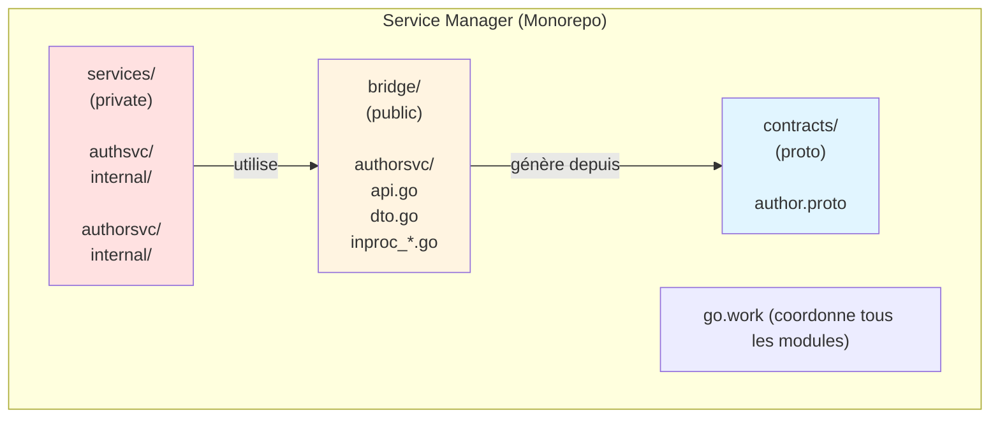
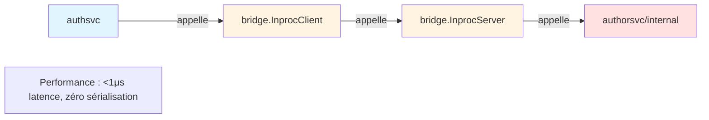
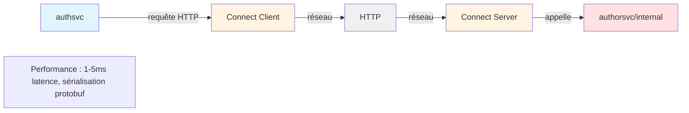
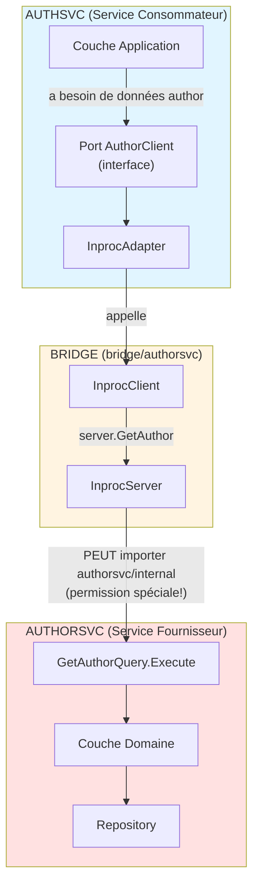
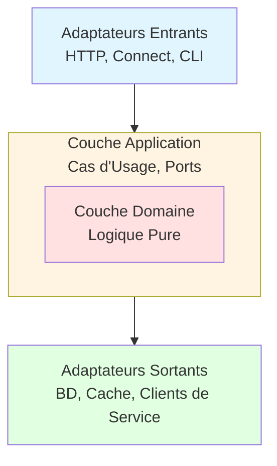
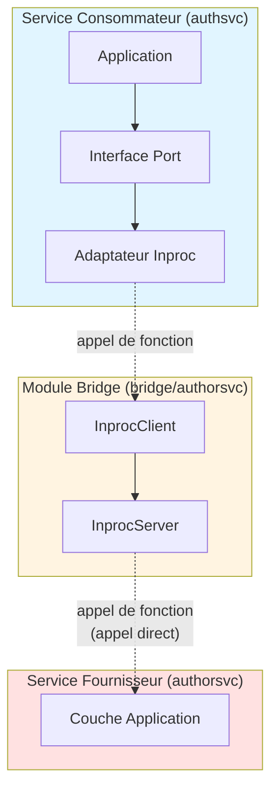
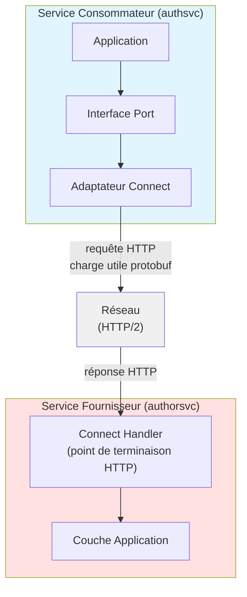

# Monolithe Modulaire Go : Livre Blanc d'Architecture

**Un pattern monolithe modulaire pour construire des systèmes Go maintenables utilisant les "workspaces" avec des frontières claires et une distribution flexible**.

Avant d’explorer ce livre blanc détaillé, on peut lire [ce post de blog de 15 minutes](https://blog.piprime.fr/fr/innovative-go-modular-monolith-architecture/) qui exposent les principes clés de cette architecture monolithique modulaire régie par workspaces Go.

## Introduction

### Le Dilemme Monolithe vs Microservices

Le choix entre monolithes et microservices est bien documenté : les monolithes peuvent devenir enchevêtrés au fil du temps, tandis que les microservices introduisent une complexité opérationnelle dès le premier jour. Ce livre blanc présente une troisième approche, le **Monolithe Modulaire Go Workspaces avec Modules Bridge**, qui fournit des frontières de services claires avec des options de déploiement flexibles.

### Ce que ce Pattern Fournit

- **Frontières architecturales fortes** imposées par le compilateur Go
- **Performance in-process** pendant le développement et lorsque les services sont co-localisés
- **Distribution flexible** lorsque les services nécessitent une mise à l'échelle indépendante
- **Chemin de migration clair** du monolithe au distribué sans réécriture
- **DDD et architecture hexagonale** pour une logique métier maintenable
- **Contrats protobuf optionnels** pour quand vous avez besoin de protocoles réseau

### À qui s'adresse ce Pattern

- Équipes construisant de nouveaux systèmes où la distribution future est possible mais pas immédiate
- Organisations consolidant des microservices qui auraient dû être un monolithe
- Projets migrant de monolithes fortement couplés vers de meilleures frontières
- Développeurs évaluant des approches architecturales pour des systèmes Go de taille moyenne à grande (5-20 développeurs)

Ce n'est pas la seule approche valide. Nous la comparerons avec des alternatives et discuterons quand ce pattern convient et quand il ne convient pas.

## Énoncé du Problème

### Les Défis que Nous Résolvons

**1. Érosion des Frontières dans les Monolithes Traditionnels**

Les monolithes Go classiques s'appuient sur des conventions pour maintenir les frontières :
- Les packages `internal/` offrent une certaine protection mais rien n'empêche `serviceA` d'importer `serviceB/internal` avec des imports relatifs
- Les violations architecturales se produisent graduellement et silencieusement
- Le refactoring devient de plus en plus difficile

**2. Complexité de Distribution Prématurée**

Les approches microservices-first imposent des coûts avant qu'ils ne soient justifiés :
- Surcharge opérationnelle (Kubernetes, service mesh, monitoring)
- Préoccupations de fiabilité réseau dès le premier jour
- Transactions distribuées et cohérence éventuelle
- Complexité de l'environnement de développement

**3. Chemins de Migration Difficiles**

Les patterns existants rendent l'évolution douloureuse :
- Monolithe -> Microservices : Nécessite une réécriture complète des couches de communication
- Microservices -> Monolithe : Perd les frontières de services lors de la consolidation
- Dans les deux sens : Risque élevé, délais longs, perturbation métier

### Que serait l'idéal ?

Un pattern idéal fournirait :
- Frontières de services imposées par le compilateur
- Performance in-process lorsque approprié
- Distribution réseau lorsque nécessaire
- Migration incrémentale (pas de réécriture big bang)
- Simplicité de développement (expérience monorepo)
- Flexibilité de production (déployer ensemble ou séparément)

## Approches Alternatives

Avant de présenter le pattern recommandé, comparons les approches architecturales courantes et leurs compromis.

### Matrice de Comparaison des Approches

| Pattern | Frontières | Performance | Migration | Complexité | Meilleur Pour |
|---------|------------|-------------|-----------|------------|---------------|
| **Go Work + Bridge** | Fortes | Excellente | Facile | Moyenne | 5-20 dev, distribution probable |
| **Module Unique** | Faibles | Excellente | Moyenne | Faible | 2-5 dev, distribution improbable |
| **Monolithe Traditionnel** | Aucune | Excellente | Difficile | Très faible | 1-3 dev, domaine simple |
| **Microservices** | Les plus fortes | Bonne | N/A | Très élevée | 20+ dev, besoins de distribution connus |
| **Kernel Partagé** | Faibles | Excellente | Très difficile | Moyenne | À éviter - crée un couplage fort |

### 1. Monolithe en Couches Traditionnel

**Structure :** Module unique, architecture en couches (handlers -> services -> repositories).

**Avantages :**
- Configuration la plus simple
- Développement rapide
- Transactions faciles
- Meilleure performance initiale

**Inconvénients :**
- Pas de frontières (tout peut appeler tout)
- Difficile à diviser plus tard
- Conflits de merge entre équipes
- Impossible de mettre à l'échelle les services indépendamment

**Quand l'utiliser :** Développeur solo, CRUD simple, MVP, domaine incertain.

### 2. Module Unique avec Frontières Basées sur les Conventions

**Structure :** Un seul `go.mod`, les services utilisent des packages `internal/` et des façades publiques.

**Avantages :**
- Configuration simple
- Zéro surcharge réseau
- Gestion partagée des dépendances
- Itération rapide

**Inconvénients :**
- Frontières faibles (peuvent être violées)
- Repose sur la discipline et le linting
- La migration nécessite l'ajout d'une couche HTTP
- Graphe de dépendances partagé (par exemple, le service A hérite des drivers de base de données du service B)

**Quand l'utiliser :** Petite équipe (2-5 dev), critique en performance, forte discipline.

### 3. Microservices-First

**Structure :** Dépôts séparés, déploiements séparés, communication uniquement par réseau.

**Avantages :**
- Isolation la plus forte
- Déploiement et mise à l'échelle indépendants
- Liberté technologique
- Autonomie des équipes

**Inconvénients :**
- Complexité opérationnelle la plus élevée
- Défis des systèmes distribués dès le premier jour
- Surcharge de développement (doit exécuter plusieurs services)
- Difficulté de débogage (traçage distribué requis)

**Quand l'utiliser :** Besoins de mise à l'échelle connus, grande équipe (30+ dev), exigences polyglot.

### 4. Monolithe Modulaire Go Workspaces avec Modules Bridge (Recommandé)

**Structure :** Plusieurs modules Go coordonnés par `go.work`, modules `bridge` pour les appels in-process.

**Avantages :**
- Frontières fortes (imposées par le compilateur)
- Performance excellente (in-process via bridges)
- Migration facile (échange d'adaptateurs)
- Commodité monorepo fournie par [go.work](https://go.dev/doc/tutorial/workspaces)
- Versionnage indépendant des modules
- Jointures explicites et visibles

**Inconvénients :**
- Complexité de configuration moyenne (plusieurs fichiers `go.mod`)
- Nécessite la compréhension du pattern bridge
- Plus de modules à coordonner

**Quand l'utiliser :** Équipe moyenne (5-20 dev), frontières claires, distribution future probable.

**C'est le pattern que nous recommandons et détaillons dans ce livre blanc.**

## Le Pattern Recommandé

### Principes Fondamentaux

**1. Go Workspaces pour la Coordination des Modules**

Utiliser `go.work` pour coordonner plusieurs modules Go indépendants dans un seul dépôt :
- Chaque service est son propre module avec son propre `go.mod`
- Le workspace rend le développement cross-module transparent
- Le compilateur impose les frontières des modules

**2. Modules Bridge pour des Frontières Explicites**

Les services communiquent via des modules bridge publics :
- Le bridge définit l'API du service avec des interfaces Go
- Le bridge fournit des implémentations client et serveur in-process
- Les services peuvent uniquement importer le bridge, pas les internals des autres services
- **Le compilateur empêche les violations de frontières**

**3. Transport Réseau Optionnel**

Les protocoles réseau comme HTTP/Connect/gRPC sont optionnels :
- Utiliser les bridges in-process pendant le développement
- Ajouter le transport réseau lorsque la distribution est nécessaire
- **Échanger les adaptateurs via injection de dépendances**
- Le même code de service fonctionne avec les deux transports

**4. Architecture Hexagonale au Sein des Services**

Chaque service utilise une architecture propre en interne :
- Couche domaine pour la logique métier pure
- Couche application avec les cas d'usage et les ports
- Couche adaptateurs comme HTTP, base de données, clients de service
- Couche infrastructure pour le câblage et la configuration

### Diagramme d'Architecture de Haut Niveau



**In-Process :**


**Distribué :**


## Plongée Approfondie dans l'Architecture

### Structure Complète des Répertoires

```
service-manager/
├── go.work                    # Définition du workspace Go
│                              # use (./contracts ./bridge/authorsvc ./services/...)
│
├── mise.toml                  # Tâches d'orchestration racine
│
├── buf.yaml                   # Configuration du workspace Buf (optionnel)
├── buf.gen.yaml               # Génération de code Protobuf (optionnel)
│
├── contracts/                # Définitions Protobuf (OPTIONNEL - pour transport réseau)
│   ├── go.mod                # Module : contracts v1.0.0
│   ├── README.md             # Stratégie de versionnage des contrats
│   │
│   ├── auth/v1/
│   │   ├── auth.proto        # Définition AuthService
│   │   ├── auth.pb.go        # Types protobuf générés
│   │   └── authconnect/
│   │       └── auth.connect.go # Stubs Connect générés
│   │
│   └── author/v1/
│       ├── author.proto      # Définition AuthorService
│       ├── author.pb.go      # Généré
│       └── authorconnect/
│           └── author.connect.go # Généré
│
├── bridge/                    # Modules bridge (APIs de service publiques)
│   │
│   └── authorsvc/            # API publique du service Author
│       ├── go.mod            # Module : bridge/authorsvc v1.0.0
│       │                     # Dépendances : aucune (interfaces pures)
│       │
│       ├── README.md         # Documentation d'utilisation du bridge
│       │
│       ├── api.go            # Interface de service publique
│       │   # type AuthorService interface {
│       │   #   GetAuthor(ctx, id) (*AuthorDTO, error)
│       │   #   CreateAuthor(ctx, req) (*AuthorDTO, error)
│       │   # }
│       │
│       ├── dto.go            # DTOs amicaux pour le domaine
│       │   # type AuthorDTO struct { ID, Name, Bio string }
│       │   # Alternative : utiliser des types générés par proto
│       │
│       ├── errors.go         # Types d'erreur publics
│       │   # var ErrAuthorNotFound = errors.New("author not found")
│       │
│       ├── inproc_server.go  # Implémentation serveur in-process
│       │   # Implémente AuthorService
│       │   # Encapsule authorsvc/internal/application
│       │   # PEUT importer authorsvc/internal (même service logique)
│       │
│       └── inproc_client.go  # Implémentation client in-process
│           # Implémente AuthorService
│           # Appelle InprocServer directement (appel de fonction, pas de réseau)
│
├── services/
│   │
│   ├── authsvc/              # Service d'Authentification
│   │   ├── go.mod            # Module : services/authsvc v2.1.0
│   │   │                     # Dépendances : bridge/authorsvc, contracts (optionnel)
│   │   │
│   │   ├── README.md         # Documentation du service
│   │   ├── mise.toml         # Tâches spécifiques au service
│   │   ├── Dockerfile
│   │   │
│   │   ├── cmd/
│   │   │   └── authsvc/
│   │   │       └── main.go   # Racine de composition
│   │   │           # Câble les dépendances :
│   │   │           # - En dev : utilise bridge.InprocClient
│   │   │           # - En prod : utilise authorconnect.Client
│   │   │
│   │   └── internal/         # PRIVÉ - ne peut pas être importé par d'autres services
│   │       │
│   │       ├── domain/       # COUCHE DOMAINE (logique métier pure)
│   │       │   │             # Pas de dépendances externes
│   │       │   │             # Pas d'adaptateurs, pas d'infrastructure
│   │       │   │
│   │       │   ├── user/     # Agrégat User
│   │       │   │   ├── user.go           # Entité (racine d'agrégat)
│   │       │   │   ├── email.go          # Objet valeur
│   │       │   │   ├── password.go       # Objet valeur
│   │       │   │   └── repository.go     # Interface de dépôt (port)
│   │       │   │
│   │       │   ├── session/  # Agrégat Session
│   │       │   │   ├── session.go        # Entité
│   │       │   │   ├── token.go          # Objet valeur
│   │       │   │   └── repository.go     # Interface de dépôt
│   │       │   │
│   │       │   └── errors.go # Erreurs du domaine
│   │       │
│   │       ├── application/  # COUCHE APPLICATION (cas d'usage)
│   │       │   │             # Orchestre les objets du domaine
│   │       │   │             # Dépend de : domain, ports (interfaces uniquement)
│   │       │   │
│   │       │   ├── command/  # Opérations d'écriture
│   │       │   │   ├── login.go          # Cas d'usage Login
│   │       │   │   ├── logout.go         # Cas d'usage Logout
│   │       │   │   ├── register.go       # Cas d'usage Registration
│   │       │   │   └── change_password.go
│   │       │   │
│   │       │   ├── query/    # Opérations de lecture
│   │       │   │   ├── get_user.go
│   │       │   │   └── validate_token.go
│   │       │   │
│   │       │   ├── dto/      # DTOs de l'application
│   │       │   │   ├── user_dto.go
│   │       │   │   └── session_dto.go
│   │       │   │
│   │       │   └── ports/    # PORTS D'APPLICATION (interfaces)
│   │       │       │         # Appartiennent à la couche application
│   │       │       │         # Implémentés par les adaptateurs
│   │       │       │
│   │       │       ├── author_client.go  # Port sortant
│   │       │       │   # type AuthorClient interface {
│   │       │       │   #   GetAuthor(ctx, id) (*AuthorInfo, error)
│   │       │       │   # }
│   │       │       │
│   │       │       ├── cache.go          # Port sortant
│   │       │       ├── logger.go         # Port sortant
│   │       │       └── event_publisher.go
│   │       │
│   │       ├── adapters/     # COUCHE ADAPTATEURS (frontières I/O)
│   │       │   │             # Implémente les ports de la couche application
│   │       │   │
│   │       │   ├── inbound/  # Adaptateurs entrants (primaires/pilotants)
│   │       │   │   │         # Monde externe -> Application
│   │       │   │   │
│   │       │   │   ├── http/ # Adaptateur HTTP REST
│   │       │   │   │   ├── server.go
│   │       │   │   │   ├── handlers/
│   │       │   │   │   │   ├── login.go
│   │       │   │   │   │   ├── logout.go
│   │       │   │   │   │   └── register.go
│   │       │   │   │   ├── middleware/
│   │       │   │   │   └── dto/
│   │       │   │   │
│   │       │   │   └── connect/  # Adaptateur Connect/gRPC (optionnel)
│   │       │   │       ├── server.go
│   │       │   │       └── handlers/
│   │       │   │           └── auth_handler.go
│   │       │   │
│   │       │   └── outbound/ # Adaptateurs sortants (secondaires/pilotés)
│   │       │       │         # Application -> Systèmes externes
│   │       │       │
│   │       │       ├── persistence/  # Adaptateurs de base de données
│   │       │       │   ├── postgres/
│   │       │       │   │   ├── user_repository.go
│   │       │       │   │   ├── session_repository.go
│   │       │       │   │   └── migrations/
│   │       │       │   │
│   │       │       │   └── memory/   # En mémoire (tests)
│   │       │       │
│   │       │       ├── authorclient/  # Adaptateurs client du service Author
│   │       │       │   ├── inproc/   # Adaptateur in-process (AUJOURD'HUI)
│   │       │       │   │   └── client.go
│   │       │       │   │       # Implémente ports.AuthorClient
│   │       │       │   │       # Utilise bridge/authorsvc.InprocClient
│   │       │       │   │       # Zéro surcharge réseau
│   │       │       │   │
│   │       │       │   └── connect/  # Adaptateur réseau (PLUS TARD)
│   │       │       │       └── client.go
│   │       │       │           # Implémente ports.AuthorClient
│   │       │       │           # Utilise authorconnect.Client
│   │       │       │           # Surcharge réseau (HTTP, sérialisation)
│   │       │       │
│   │       │       ├── cache/
│   │       │       │   ├── redis/
│   │       │       │   └── memory/
│   │       │       │
│   │       │       └── logger/
│   │       │           └── zap/
│   │       │
│   │       └── infra/        # COUCHE INFRASTRUCTURE
│   │           │             # Préoccupations techniques, câblage
│   │           │
│   │           ├── config/   # Gestion de la configuration
│   │           ├── wire/     # Injection de dépendances (optionnel)
│   │           ├── database/ # Gestion de connexion BD
│   │           ├── observability/
│   │           └── server/   # Cycle de vie du serveur
│   │
│   └── authorsvc/            # Service Author (structure similaire)
│       ├── go.mod            # Module : services/authorsvc v1.0.0
│       │                     # Dépendances : bridge/authorsvc (pour implémenter le serveur)
│       │
│       ├── cmd/authorsvc/
│       │   └── main.go       # Câble bridge.InprocServer à internal/application
│       │
│       └── internal/
│           ├── domain/
│           │   └── author/   # Agrégat Author
│           │       ├── author.go
│           │       ├── author_id.go
│           │       ├── name.go
│           │       └── repository.go
│           │
│           ├── application/
│           │   ├── command/
│           │   │   ├── create_author.go
│           │   │   └── update_author.go
│           │   │
│           │   ├── query/
│           │   │   ├── get_author.go
│           │   │   └── list_authors.go
│           │   │
│           │   └── ports/
│           │       ├── image_client.go
│           │       └── logger.go
│           │
│           ├── adapters/
│           │   ├── inbound/
│           │   │   ├── http/
│           │   │   └── connect/
│           │   │
│           │   └── outbound/
│           │       ├── persistence/postgres/
│           │       ├── imageclient/
│           │       └── cache/
│           │
│           └── infra/
│
├── tools/
│   └── arch-test/            # Application des frontières architecturales
│       └── main.go           # Valide les règles d'import dans CI
│
└── docs/
    ├── architecture/
    │   ├── decisions/        # Architecture Decision Records
    │   └── diagrams/
    │
    └── development/
        ├── local-setup.md
        ├── testing-guide.md
        └── adding-a-service.md
```

### Décisions Architecturales Clés

**1. Pourquoi Plusieurs Modules Go ?**

Chaque service est un module Go indépendant parce que :
- **Le compilateur impose les frontières** - Le Service A ne peut physiquement pas importer le package `internal/` du Service B
- **Graphes de dépendances indépendants** - `authsvc` n'hérite pas du driver PostgreSQL de `authorsvc`
- **Versionnage indépendant** - Les services peuvent évoluer à des rythmes différents
- **Propriété claire** - Chaque module a son propre `go.mod` montrant les dépendances
- **Extraction future** - Déjà un module séparé, facile à déplacer vers un dépôt séparé

**2. Pourquoi les Modules Bridge ?**

Les modules bridge fournissent des frontières de service explicites :
- **Définition d'API publique** - Contrat clair dans les interfaces Go
- **Performance in-process** - Appels de fonctions directs, zéro surcharge réseau
- **Jointure explicite** - Frontière visible entre les services
- **Application par le compilateur** - Peut uniquement importer le bridge, pas les internals du service
- **Évolutivité contrôlée** - Changements d'API versionnés et documentés

**3. Pourquoi l'Architecture Hexagonale ?**

La clean architecture au sein des services permet :
- **Tests du domaine** - Logique métier sans infrastructure
- **Adaptateurs échangeables** - Échanger PostgreSQL pour MongoDB sans toucher le domaine
- **Ports définis par l'application** - Le domaine définit ce dont il a besoin
- **Indépendance des frameworks** - Peut échanger HTTP pour gRPC
- **Maintien à long terme** - Les règles métier sont isolées des détails techniques

## Module Bridge : Le Cœur du Pattern

Les modules bridge sont le mécanisme clé qui permet des frontières fortes avec une performance in-process.

### Conception du Module Bridge

Un module bridge typique contient :

**Fichier : `bridge/authorsvc/api.go`**

```go
package authorsvc

import "context"

// AuthorService définit le contrat public du service author.
// Tout service peut importer et utiliser cette interface.
//
// Implémentations :
//   - InprocServer (encapsule authorsvc/internal, in-process)
//   - Connect handler (transport réseau sur HTTP)
type AuthorService interface {
    GetAuthor(ctx context.Context, id string) (*AuthorDTO, error)
    CreateAuthor(ctx context.Context, req CreateAuthorRequest) (*AuthorDTO, error)
    ListAuthors(ctx context.Context, req ListAuthorsRequest) (*ListAuthorsResponse, error)
    UpdateAuthor(ctx context.Context, req UpdateAuthorRequest) (*AuthorDTO, error)
}

// Requêtes et réponses

type CreateAuthorRequest struct {
    Name    string
    Bio     string
    Website string
}

type UpdateAuthorRequest struct {
    ID      string
    Name    string
    Bio     string
    Website string
}

type ListAuthorsRequest struct {
    Limit  int
    Offset int
}

type ListAuthorsResponse struct {
    Authors []*AuthorDTO
    Total   int
}
```

**Fichier : `bridge/authorsvc/dto.go`**

```go
package authorsvc

import "time"

// AuthorDTO est le type de transfert de données pour author.
// Conçu pour être amical pour le consommateur, pas couplé aux détails d'implémentation.
type AuthorDTO struct {
    ID        string
    Name      string
    Bio       string
    Website   string
    AvatarURL string
    CreatedAt time.Time
    UpdatedAt time.Time
}
```

**Fichier : `bridge/authorsvc/errors.go`**

```go
package authorsvc

import "errors"

// Erreurs publiques que les appelants peuvent vérifier
var (
    ErrAuthorNotFound   = errors.New("author not found")
    ErrInvalidAuthorName = errors.New("invalid author name")
    ErrDuplicateAuthor  = errors.New("author already exists")
)
```

### Comprendre InprocServer et InprocClient

Avant de plonger dans l'implémentation complète, comprenons ce que sont ces composants et comment ils fonctionnent ensemble.

**Ce qu'ils sont :**

- **InprocServer** : L'adaptateur "côté serveur" qui encapsule la couche application interne d'un service et l'expose via l'interface bridge
- **InprocClient** : L'adaptateur "côté client" qui appelle InprocServer directement via des appels de fonction (pas de réseau)

**Structure Simplifiée :**

```go
// InprocServer encapsule la couche application interne du service
type InprocServer struct {
    // Références à la couche application RÉELLE du service
    getAuthorQuery    *query.GetAuthorQuery      // depuis authorsvc/internal/application/query
    listAuthorsQuery  *query.ListAuthorsQuery    // depuis authorsvc/internal/application/query
    createAuthorCmd   *command.CreateAuthorCommand  // depuis authorsvc/internal/application/command
    updateAuthorCmd   *command.UpdateAuthorCommand  // depuis authorsvc/internal/application/command
}

// InprocClient appelle le serveur directement (pas de réseau)
type InprocClient struct {
    server *InprocServer  // Référence directe à l'instance serveur
}
```

**Le Flux :**



**Cycle de Vie :**

1. **Démarrage d'Authorsvc** (service fournisseur) :
   ```go
   // authorsvc/cmd/main.go
   func main() {
       // Initialiser la couche application interne
       getAuthorQuery := query.NewGetAuthorQuery(repo)
       createAuthorCmd := command.NewCreateAuthorCommand(repo)

       // Créer InprocServer encapsulant la couche application
       authorServer := authorsvc.NewInprocServer(
           getAuthorQuery,
           // ... autres queries/commands
       )

       // Enregistrer comme singleton (partagé entre services dans le même processus)
       RegisterAuthorService(authorServer)
   }
   ```

2. **Démarrage d'Authsvc** (service consommateur) :
   ```go
   // authsvc/cmd/main.go
   func main() {
       // Obtenir la référence à l'InprocServer d'authorsvc (singleton)
       authorServer := GetAuthorService()

       // Créer InprocClient qui appelle le serveur
       authorBridge := authorsvc.NewInprocClient(authorServer)

       // Encapsuler dans l'adaptateur de port
       authorClient := inproc.NewClient(authorBridge)

       // Câbler dans l'application
       deps := infra.InitializeDependencies(cfg, authorClient)
   }
   ```

3. **Flux d'Appel à l'Exécution** :
   ```go
   // couche application authsvc
   result := authorClient.GetAuthor(ctx, "author-123")
       │
       ▼ (appel d'interface)
   // adaptateur authsvc
   inprocAdapter.GetAuthor(ctx, "author-123")
       │
       ▼ (appel de fonction direct)
   // bridge InprocClient
   client.server.GetAuthor(ctx, "author-123")
       │
       ▼ (appel de fonction direct)
   // bridge InprocServer
   server.getAuthorQuery.Execute(ctx, "author-123")
       │
       ▼ (appel de fonction direct)
   // couche application interne authorsvc
   query.Execute(ctx, "author-123")
   ```

**Principes Clés :**

1. **Permission Spéciale d'Import** :
   - InprocServer vit dans `bridge/authorsvc/`
   - C'est le SEUL code en dehors de `authorsvc/` autorisé à importer `authorsvc/internal/*`
   - C'est intentionnel et contrôlé

2. **Couche de Délégation Fine** :
   - InprocServer ne contient AUCUNE logique métier
   - Il traduit uniquement entre les DTOs bridge et les types internes
   - Il mappe les erreurs du domaine aux erreurs du bridge

3. **Singleton Partagé** :
   - Lorsque les services s'exécutent dans le même processus, ils partagent UNE instance InprocServer
   - Pas de duplication des instances de couche application
   - Utilisation efficace de la mémoire

4. **Zéro Surcharge Réseau** :
   - InprocClient -> InprocServer est un appel de fonction direct
   - Pas de sérialisation, pas de HTTP, pas de latence réseau
   - Performance identique aux imports internes directs (mais avec des frontières !)

5. **Implémentation Échangeable** :
   - Le consommateur ne voit que l'interface bridge (`AuthorService`)
   - Peut échanger InprocClient pour NetworkClient sans changer la couche application
   - Le bridge fournit le point d'abstraction

**Implémentation Complète :**

Voyons maintenant l'implémentation complète avec toutes les méthodes et la gestion des erreurs.

**Fichier : `bridge/authorsvc/inproc_server.go`**

```go
package authorsvc

import (
    "context"
    "errors"

    // PEUT importer les internals authorsvc - ils font partie du même service logique
    "github.com/example/service-manager/services/authorsvc/internal/application/command"
    "github.com/example/service-manager/services/authorsvc/internal/application/query"
    "github.com/example/service-manager/services/authorsvc/internal/domain/author"
)

// InprocServer implémente AuthorService en appelant directement les internals authorsvc.
// Ceci est le "côté serveur" du bridge in-process.
type InprocServer struct {
    getAuthorQuery    *query.GetAuthorQuery
    listAuthorsQuery  *query.ListAuthorsQuery
    createAuthorCmd   *command.CreateAuthorCommand
    updateAuthorCmd   *command.UpdateAuthorCommand
}

// NewInprocServer crée un nouveau serveur in-process.
// Appelé depuis authorsvc/cmd/main.go lors du démarrage du service.
func NewInprocServer(
    getAuthorQuery *query.GetAuthorQuery,
    listAuthorsQuery *query.ListAuthorsQuery,
    createAuthorCmd *command.CreateAuthorCommand,
    updateAuthorCmd *command.UpdateAuthorCommand,
) *InprocServer {
    return &InprocServer{
        getAuthorQuery:   getAuthorQuery,
        listAuthorsQuery: listAuthorsQuery,
        createAuthorCmd:  createAuthorCmd,
        updateAuthorCmd:  updateAuthorCmd,
    }
}

func (s *InprocServer) GetAuthor(ctx context.Context, id string) (*AuthorDTO, error) {
    // Appeler directement la couche application interne
    result, err := s.getAuthorQuery.Execute(ctx, id)
    if err != nil {
        // Traduire les erreurs du domaine en erreurs du bridge
        if errors.Is(err, author.ErrAuthorNotFound) {
            return nil, ErrAuthorNotFound
        }
        return nil, err
    }

    // Mapper le DTO interne au DTO du bridge
    return &AuthorDTO{
        ID:        result.ID,
        Name:      result.Name,
        Bio:       result.Bio,
        Website:   result.Website,
        AvatarURL: result.AvatarURL,
        CreatedAt: result.CreatedAt,
        UpdatedAt: result.UpdatedAt,
    }, nil
}

func (s *InprocServer) CreateAuthor(ctx context.Context, req CreateAuthorRequest) (*AuthorDTO, error) {
    input := command.CreateAuthorInput{
        Name:    req.Name,
        Bio:     req.Bio,
        Website: req.Website,
    }

    result, err := s.createAuthorCmd.Execute(ctx, input)
    if err != nil {
        if errors.Is(err, author.ErrInvalidName) {
            return nil, ErrInvalidAuthorName
        }
        if errors.Is(err, author.ErrDuplicateAuthor) {
            return nil, ErrDuplicateAuthor
        }
        return nil, err
    }

    return &AuthorDTO{
        ID:        result.ID,
        Name:      result.Name,
        Bio:       result.Bio,
        Website:   result.Website,
        AvatarURL: result.AvatarURL,
        CreatedAt: result.CreatedAt,
        UpdatedAt: result.UpdatedAt,
    }, nil
}

func (s *InprocServer) ListAuthors(ctx context.Context, req ListAuthorsRequest) (*ListAuthorsResponse, error) {
    input := query.ListAuthorsInput{
        Limit:  req.Limit,
        Offset: req.Offset,
    }

    result, err := s.listAuthorsQuery.Execute(ctx, input)
    if err != nil {
        return nil, err
    }

    authors := make([]*AuthorDTO, len(result.Authors))
    for i, a := range result.Authors {
        authors[i] = &AuthorDTO{
            ID:        a.ID,
            Name:      a.Name,
            Bio:       a.Bio,
            Website:   a.Website,
            AvatarURL: a.AvatarURL,
            CreatedAt: a.CreatedAt,
            UpdatedAt: a.UpdatedAt,
        }
    }

    return &ListAuthorsResponse{
        Authors: authors,
        Total:   result.Total,
    }, nil
}

func (s *InprocServer) UpdateAuthor(ctx context.Context, req UpdateAuthorRequest) (*AuthorDTO, error) {
    input := command.UpdateAuthorInput{
        ID:      req.ID,
        Name:    req.Name,
        Bio:     req.Bio,
        Website: req.Website,
    }

    result, err := s.updateAuthorCmd.Execute(ctx, input)
    if err != nil {
        if errors.Is(err, author.ErrAuthorNotFound) {
            return nil, ErrAuthorNotFound
        }
        if errors.Is(err, author.ErrInvalidName) {
            return nil, ErrInvalidAuthorName
        }
        return nil, err
    }

    return &AuthorDTO{
        ID:        result.ID,
        Name:      result.Name,
        Bio:       result.Bio,
        Website:   result.Website,
        AvatarURL: result.AvatarURL,
        CreatedAt: result.CreatedAt,
        UpdatedAt: result.UpdatedAt,
    }, nil
}
```

**Fichier : `bridge/authorsvc/inproc_client.go`**

```go
package authorsvc

import "context"

// InprocClient implémente AuthorService en appelant InprocServer directement.
// Ceci est le "côté client" du bridge in-process.
//
// Le consommateur (authsvc) obtient une référence à l'InprocServer d'authorsvc
// et l'encapsule dans ce client pour les appels directs de fonction.
type InprocClient struct {
    server *InprocServer
}

// NewInprocClient crée un nouveau client in-process.
// Passer la même instance InprocServer que authorsvc utilise.
func NewInprocClient(server *InprocServer) *InprocClient {
    return &InprocClient{server: server}
}

func (c *InprocClient) GetAuthor(ctx context.Context, id string) (*AuthorDTO, error) {
    return c.server.GetAuthor(ctx, id)
}

func (c *InprocClient) CreateAuthor(ctx context.Context, req CreateAuthorRequest) (*AuthorDTO, error) {
    return c.server.CreateAuthor(ctx, req)
}

func (c *InprocClient) ListAuthors(ctx context.Context, req ListAuthorsRequest) (*ListAuthorsResponse, error) {
    return c.server.ListAuthors(ctx, req)
}

func (c *InprocClient) UpdateAuthor(ctx context.Context, req UpdateAuthorRequest) (*AuthorDTO, error) {
    return c.server.UpdateAuthor(ctx, req)
}
```

### Utiliser le Bridge depuis un Service Consommateur

Maintenant, voyons comment `authsvc` (service d'authentification) utilise le bridge `authorsvc` pour obtenir des informations sur les authors.

**Fichier : `services/authsvc/internal/application/ports/author_client.go`**

```go
package ports

import "context"

// AuthorClient est un port sortant pour récupérer des informations author.
// Cette interface appartient à la couche application.
// Elle sera implémentée par un adaptateur (par ex., InprocAuthorClient, ConnectAuthorClient).
type AuthorClient interface {
    GetAuthor(ctx context.Context, authorID string) (*AuthorInfo, error)
}

// AuthorInfo est un DTO d'application pour les données author.
type AuthorInfo struct {
    ID        string
    Name      string
    Bio       string
    AvatarURL string
}
```

**Fichier : `services/authsvc/internal/adapters/outbound/authorclient/inproc/client.go`**

```go
package inproc

import (
    "context"

    "github.com/example/service-manager/bridge/authorsvc"

    // Importer le port de l'application (interne à authsvc)
    "github.com/example/service-manager/services/authsvc/internal/application/ports"
)

// Client adapte bridge.AuthorService au ports.AuthorClient de notre application.
// C'est un adaptateur sortant qui implémente notre port d'application.
type Client struct {
    bridgeClient authorsvc.AuthorService
}

func NewClient(bridgeClient authorsvc.AuthorService) *Client {
    return &Client{bridgeClient: bridgeClient}
}

func (c *Client) GetAuthor(ctx context.Context, authorID string) (*ports.AuthorInfo, error) {
    // Appeler le bridge
    dto, err := c.bridgeClient.GetAuthor(ctx, authorID)
    if err != nil {
        return nil, translateError(err)
    }

    // Mapper le DTO bridge au DTO de notre application
    return &ports.AuthorInfo{
        ID:        dto.ID,
        Name:      dto.Name,
        Bio:       dto.Bio,
        AvatarURL: dto.AvatarURL,
    }, nil
}

func translateError(err error) error {
    // Traduire les erreurs bridge en erreurs de port d'application
    // selon les besoins
    return err
}
```

#### Câblage dans main.go

**Fichier : `services/authsvc/cmd/authsvc/main.go`**

```go
package main

import (
    "log"

    "github.com/example/service-manager/bridge/authorsvc"
    "github.com/example/service-manager/services/authsvc/internal/adapters/outbound/authorclient/inproc"
    "github.com/example/service-manager/services/authsvc/internal/infra"
)

func main() {
    cfg := infra.LoadConfig()

    // Obtenir l'InprocServer AuthorService depuis authorsvc
    // (En pratique, c'est un singleton partagé entre les services dans le même processus)
    authorServer := getAuthorServiceInprocServer() // Détail d'implémentation

    // Créer le client in-process
    authorBridge := authorsvc.NewInprocClient(authorServer)

    // Encapsuler dans l'adaptateur
    authorClient := inproc.NewClient(authorBridge)

    // Câbler authsvc avec le client author
    deps := infra.InitializeDependencies(cfg, authorClient)

    // Démarrer le serveur...
}
```

### Avantages du Pattern Bridge

1. **Frontières Imposées par le Compilateur**
   - authsvc ne peut pas importer `authorsvc/internal` (erreur compilateur)
   - authsvc peut uniquement importer `bridge/authorsvc` (API publique)
   - Les violations sont détectées au moment de la compilation, pas à l'exécution ou lors de la revue

2. **Zéro Surcharge Réseau**
   - Client in-process -> serveur est un appel de fonction direct
   - Pas de sérialisation, pas de stack HTTP, pas de latence réseau
   - Performance équivalente au monolithe à module partagé

3. **Chemin de Migration Clair**
   - Aujourd'hui : authsvc utilise `bridge/authorsvc.InprocClient`
   - Demain : authsvc utilise `authorconnect.Client` (HTTP/Connect)
   - Le changement est localisé au câblage dans `main.go`
   - La couche application reste inchangée

4. **Jointure Explicite**
   - Le bridge rend la frontière de service visible
   - "API publique" claire vs "implémentation interne"
   - Cible de documentation pour les contrats de service

5. **Implémentation Flexible**
   - La même interface fonctionne pour plusieurs transports
   - Peut exécuter in-process pendant le développement
   - Peut passer au réseau en production
   - Peut même mixer : certains services in-process, d'autres sur réseau

### Ce qu'il NE faut PAS mettre dans les Bridges

Les bridges doivent rester de fines couches de contrat. Éviter :

✗ **Logique métier dans les bridges**
```go
// MAUVAIS : Logique métier dans le bridge
package authorsvc

func (dto *AuthorDTO) IsPopular() bool {
    return dto.FollowerCount > 10000  // Règle métier dans le bridge !
}
```

✗ **Utilitaires partagés dans le bridge**
```go
// MAUVAIS : Utilitaires métier partagés
package authorsvc

func CalculateAuthorRating(articles int, followers int) int {
    // Cela crée du couplage - plusieurs services dépendent de cette logique
}
```

✗ **Modèles du domaine dans le bridge**
```go
// MAUVAIS : Exposition des modèles du domaine internes
package authorsvc

import "github.com/.../services/authorsvc/internal/domain/author"

type AuthorService interface {
    GetAuthor(ctx context.Context, id string) (*author.Author, error)
    // Exposer le type du domaine interne casse la frontière
}
```

✓ **Utiliser plutôt des DTOs :**
```go
// BON : DTOs spécifiques au bridge découplés du domaine interne
type AuthorDTO struct {
    ID   string
    Name string
}

// Le bridge mappe entre les types du domaine interne et les DTOs bridge
```

## Architecture Hexagonale au Sein des Services

Chaque service utilise une clean architecture avec des couches claires et un flux de dépendances contrôlé.

### L'Hexagone : Ports et Adaptateurs



### Les Couches

**1. Couche Domaine (centre)**
   - Logique métier pure, pas de dépendances externes
   - Entités, objets valeur, services du domaine
   - Interfaces de dépôt (ports) définies ici, implémentées en dehors

**2. Couche Application**
   - Cas d'usage et orchestration
   - Commandes (opérations d'écriture) et queries (opérations de lecture)
   - Ports (interfaces pour adaptateurs) appartiennent à cette couche

**3. Couche Adaptateurs**
   - Implémente les ports de la couche application
   - Inbound : HTTP, Connect, CLI, files de messages
   - Outbound : Bases de données, clients HTTP, files de messages

**4. Couche Infrastructure**
   - Préoccupations techniques
   - Câblage des dépendances
   - Configuration
   - Cycle de vie du serveur

### Couche Application : Détails

La couche application orchestre le domaine et définit les ports.

**1. Commandes** (opérations d'écriture)
   - Changer l'état du système
   - Exemple : `LoginCommand`, `RegisterCommand`

**2. Queries** (opérations de lecture)
   - Renvoyer des données sans effets de bord
   - Peut contourner le domaine pour la performance (CQRS-lite)
   - Exemple : `GetUserQuery`, `ValidateTokenQuery`

**3. Ports** (interfaces pour adaptateurs)
   - Appartiennent à la couche application
   - Implémentés par les adaptateurs
   - Exemple : `AuthorClient`, `Cache`, `Logger`

**4. DTOs de l'Application**
   - Objets de transfert de données pour la couche application
   - Découplent le domaine du monde externe

**Exemple de Couche Application :**

```go
// services/authsvc/internal/application/command/login.go
package command

import (
    "context"
    "time"

    "github.com/example/service-manager/services/authsvc/internal/application/ports"
    "github.com/example/service-manager/services/authsvc/internal/domain/session"
    "github.com/example/service-manager/services/authsvc/internal/domain/user"
)

// LoginCommand gère la connexion utilisateur.
type LoginCommand struct {
    userRepo      user.Repository
    sessionRepo   session.Repository
    authorClient  ports.AuthorClient
    logger        ports.Logger
}

func NewLoginCommand(
    userRepo user.Repository,
    sessionRepo session.Repository,
    authorClient ports.AuthorClient,
    logger ports.Logger,
) *LoginCommand {
    return &LoginCommand{
        userRepo:     userRepo,
        sessionRepo:  sessionRepo,
        authorClient: authorClient,
        logger:       logger,
    }
}

func (c *LoginCommand) Execute(ctx context.Context, input LoginInput) (*LoginResult, error) {
    // 1. Valider les credentials
    u, err := c.userRepo.FindByEmail(ctx, input.Email)
    if err != nil {
        c.logger.Info("login failed: user not found", "email", input.Email)
        return nil, ErrInvalidCredentials
    }

    if !u.VerifyPassword(input.Password) {
        c.logger.Info("login failed: invalid password", "email", input.Email)
        return nil, ErrInvalidCredentials
    }

    // 2. Créer une session
    sess := session.New(u.ID, time.Hour*24)
    if err := c.sessionRepo.Save(ctx, sess); err != nil {
        c.logger.Error("failed to save session", "error", err)
        return nil, err
    }

    // 3. Optionnellement récupérer les infos author depuis l'autre service
    var authorInfo *ports.AuthorInfo
    if u.IsAuthor {
        authorInfo, _ = c.authorClient.GetAuthor(ctx, u.ID)
    }

    return &LoginResult{
        Token:      sess.Token,
        ExpiresAt:  sess.ExpiresAt,
        AuthorInfo: authorInfo,
    }, nil
}

type LoginInput struct {
    Email    string
    Password string
}

type LoginResult struct {
    Token      string
    ExpiresAt  time.Time
    AuthorInfo *ports.AuthorInfo
}

var ErrInvalidCredentials = errors.New("invalid credentials")
```

### Ports d'Application

Les ports sont des interfaces définies par la couche application et implémentées par les adaptateurs.

```go
// services/authsvc/internal/application/ports/author_client.go
package ports

import "context"

// AuthorClient est un port sortant pour récupérer des informations author.
// Cette interface appartient à la couche application.
// Elle sera implémentée par un adaptateur (par ex., InprocAuthorClient, ConnectAuthorClient).
type AuthorClient interface {
    GetAuthor(ctx context.Context, authorID string) (*AuthorInfo, error)
}

// AuthorInfo est un DTO d'application pour les données author.
type AuthorInfo struct {
    ID        string
    Name      string
    Bio       string
    AvatarURL string
}
```

### Adaptateurs : Inbound et Outbound

Les adaptateurs implémentent les ports et connectent l'application au monde externe.

**Adaptateurs Inbound** (primaires/pilotants) :
   - HTTP REST
   - Connect/gRPC
   - Consommateurs de file de messages
   - CLI

**Adaptateurs Outbound** (secondaires/pilotés) :
   - Dépôts de bases de données
   - Clients HTTP
   - Files de messages
   - Systèmes de cache

**Exemple d'Adaptateur Inbound (HTTP) :**

```go
// services/authsvc/internal/adapters/inbound/http/handlers/login.go
package handlers

import (
    "encoding/json"
    "net/http"

    "github.com/example/service-manager/services/authsvc/internal/application/command"
)

type LoginHandler struct {
    loginCmd *command.LoginCommand
}

func NewLoginHandler(loginCmd *command.LoginCommand) *LoginHandler {
    return &LoginHandler{loginCmd: loginCmd}
}

func (h *LoginHandler) ServeHTTP(w http.ResponseWriter, r *http.Request) {
    var req LoginRequest
    if err := json.NewDecoder(r.Body).Decode(&req); err != nil {
        http.Error(w, "invalid request", http.StatusBadRequest)
        return
    }

    // Appeler la couche application
    result, err := h.loginCmd.Execute(r.Context(), command.LoginInput{
        Email:    req.Email,
        Password: req.Password,
    })

    if err != nil {
        if errors.Is(err, command.ErrInvalidCredentials) {
            http.Error(w, "invalid credentials", http.StatusUnauthorized)
            return
        }
        http.Error(w, "internal error", http.StatusInternalServerError)
        return
    }

    json.NewEncoder(w).Encode(LoginResponse{
        Token:     result.Token,
        ExpiresAt: result.ExpiresAt.Unix(),
    })
}

type LoginRequest struct {
    Email    string `json:"email"`
    Password string `json:"password"`
}

type LoginResponse struct {
    Token     string `json:"token"`
    ExpiresAt int64  `json:"expires_at"`
}
```

## Protobuf et Contrats Réseau

Le pattern bridge fonctionne avec ou sans protobuf. Protobuf est uniquement nécessaire lorsque vous avez besoin de transport réseau.

### Quand Utiliser Protobuf

**Utiliser protobuf lorsque :**
- Les services communiqueront par réseau
- Vous avez besoin de garanties de compatibilité ascendante
- Vous voulez la génération de code pour plusieurs langages
- Vous avez besoin d'évolution de schéma avec détection de changements cassants

**Sauter protobuf lorsque :**
- Les services s'exécutent toujours dans le même processus
- Vous voulez des interfaces Go plus simples (utiliser les DTOs bridge)
- Prototypage ou développement précoce

### Approche Hybride : DTOs Bridge Maintenant, Protobuf Plus Tard

**Option 1 : Bridge avec DTOs Go (Simple)**

```go
// bridge/authorsvc/dto.go
type AuthorDTO struct {
    ID   string
    Name string
    Bio  string
}
```

**Option 2 : Bridge avec DTOs Protobuf (Prêt pour le Réseau)**

```go
// bridge/authorsvc/dto.go
import authorv1 "github.com/example/service-manager/contracts/author/v1"

// Utiliser des types générés par protobuf
type AuthorDTO = authorv1.Author
```

**Vous pouvez commencer avec l'Option 1 et migrer vers l'Option 2 lorsque nécessaire.**

### Comprendre le Transport Réseau avec Connect

Avant d'implémenter le transport réseau, comprenons comment il est parallèle au pattern bridge in-process et comment échanger entre les deux.

**Ce que Connect Fournit :**

- **Connect Handler** (Entrant) : Serveur réseau qui reçoit des requêtes HTTP et appelle la couche application interne du service
- **Connect Client** (Sortant) : Client réseau qui fait des requêtes HTTP vers des services distants

**Structure Parallèle :**

**IN-PROCESS :**


**RÉSEAU :**


**Intuition Clé :** Les deux approches implémentent la même interface de port d'application - seul le mécanisme de transport change.

**Le Mécanisme d'Échange :**

```go
// services/authsvc/cmd/authsvc/main.go
package main

import (
    "net/http"
    "time"

    "github.com/example/service-manager/bridge/authorsvc"
    "github.com/example/service-manager/services/authsvc/internal/adapters/outbound/authorclient/inproc"
    "github.com/example/service-manager/services/authsvc/internal/adapters/outbound/authorclient/connect"
    "github.com/example/service-manager/services/authsvc/internal/application/ports"
    "github.com/example/service-manager/services/authsvc/internal/infra"
)

func main() {
    cfg := infra.LoadConfig()

    // POINT D'ÉCHANGE : Choisir l'adaptateur basé sur la configuration
    var authorClient ports.AuthorClient

    if cfg.UseInProcessBridge {
        // ===== OPTION 1 : In-Process =====
        // Obtenir l'InprocServer partagé depuis authorsvc
        authorServer := getAuthorServiceInprocServer()

        // Encapsuler dans le client bridge
        authorBridge := authorsvc.NewInprocClient(authorServer)

        // Encapsuler dans l'adaptateur de port
        authorClient = inproc.NewClient(authorBridge)
        // Performance : <1μs, zéro sérialisation

    } else {
        // ===== OPTION 2 : Réseau =====
        // Créer un client HTTP vers le service distant
        authorClient = connect.NewClient(
            cfg.AuthorServiceURL, // par ex., "https://author-service:8080"
            &http.Client{
                Timeout: 5 * time.Second,
            },
        )
        // Performance : 1-5ms, sérialisation protobuf
    }

    // Le reste du câblage est IDENTIQUE - l'application ne connaît pas la différence
    deps := infra.InitializeDependencies(cfg, authorClient)

    // Démarrer le serveur...
}
```

**Ce qui Change :**

| Aspect | In-Process | Réseau |
|--------|------------|--------|
| **Adaptateur Consommateur** | `inproc.NewClient(bridge)` | `connect.NewClient(url, http)` |
| **Transport** | Appel de fonction | HTTP/2 |
| **Sérialisation** | Aucune (mémoire partagée) | Protobuf |
| **Latence** | <1μs | 1-5ms |
| **Dépendances** | Module bridge | Module contracts |
| **Besoins du Fournisseur** | Rien (partage le processus) | Connect Handler + serveur HTTP |

**Ce qui Reste Identique :**

- Code de la couche application (commandes, queries, domaine)
- Définition de l'interface port (`ports.AuthorClient`)
- Logique métier et tests
- Modèles du domaine
- Consommateurs de l'interface port

**Étapes de Migration :**

```
Étape 1 : Commencer avec In-Process
├─ Utiliser le bridge avec InprocServer/Client
├─ Pas de protobuf nécessaire
├─ Interfaces Go simples
└─ Itération de développement rapide

Étape 2 : Ajouter Protobuf (lorsque prêt)
├─ Définir le contrat .proto
├─ Générer le code (buf generate)
├─ Les DTOs bridge peuvent utiliser les types protobuf
└─ Toujours utiliser le transport in-process

Étape 3 : Implémenter les Handlers Connect
├─ Ajouter le handler Connect (adaptateur entrant)
├─ Le handler appelle la même couche application
├─ Tester avec les deux transports
└─ Toujours en cours d'exécution dans le même processus

Étape 4 : Implémenter le Client Connect
├─ Ajouter le client Connect (adaptateur sortant)
├─ Implémente la même interface de port
├─ Prêt pour le déploiement distribué
└─ Peut toujours s'exécuter dans le même processus

Étape 5 : Déployer Séparément
├─ Configurer avec UseInProcessBridge=false
├─ Pointer vers l'URL du service distant
├─ Zéro changement de code application
└─ Diviser graduellement les services
```

**Exemple de Configuration :**

```yaml
# Développement : config/dev.yaml
use_in_process_bridge: true
author_service_url: ""  # Pas nécessaire

# Staging : config/staging.yaml
use_in_process_bridge: false
author_service_url: "http://author-service:8080"

# Production : config/prod.yaml
use_in_process_bridge: false
author_service_url: "https://author-service.internal:8080"
```

**Quand Utiliser Chacun :**

**In-Process (via Bridge) :**
- Développement local
- Tests d'intégration
- Services qui déploient toujours ensemble
- Chemins critiques en performance
- Prototypage précoce

**Réseau (via Connect) :**
- Production avec mise à l'échelle indépendante
- Services appartenant à différentes équipes
- Calendriers de déploiement différents
- Distribution géographique
- Consommateurs polyglots (autres langages)

### Workflow Protobuf Complet

Lorsque vous êtes prêt à ajouter le transport réseau, suivez ce workflow.

#### 1. Définir le Contrat de Service

**Fichier : `contracts/author/v1/author.proto`**

```protobuf
syntax = "proto3";

package author.v1;

option go_package = "github.com/example/service-manager/contracts/author/v1;authorv1";

service AuthorService {
  rpc GetAuthor(GetAuthorRequest) returns (GetAuthorResponse) {}
  rpc CreateAuthor(CreateAuthorRequest) returns (CreateAuthorResponse) {}
}

message Author {
  string id = 1;
  string name = 2;
  string bio = 3;
  string website = 4;
  int64 created_at = 5;
  int64 updated_at = 6;
}

message GetAuthorRequest {
  string id = 1;
}

message GetAuthorResponse {
  Author author = 1;
}

message CreateAuthorRequest {
  string name = 1;
  string bio = 2;
  string website = 3;
}

message CreateAuthorResponse {
  Author author = 1;
}
```

#### 2. Générer le Code

```bash
# En utilisant buf
buf generate

# Fichiers générés :
# - contracts/author/v1/author.pb.go (types protobuf)
# - contracts/author/v1/authorconnect/author.connect.go (stubs Connect)
```

#### 3. Implémenter le Handler Connect (Adaptateur Entrant)

```go
// services/authorsvc/internal/adapters/inbound/connect/handlers/author_handler.go
package handlers

import (
    "context"
    "connectrpc.com/connect"

    authorv1 "github.com/example/service-manager/contracts/author/v1"
    "github.com/example/service-manager/contracts/author/v1/authorconnect"
    "github.com/example/service-manager/services/authorsvc/internal/application/command"
    "github.com/example/service-manager/services/authorsvc/internal/application/query"
)

type AuthorHandler struct {
    getAuthorQuery  *query.GetAuthorQuery
    createAuthorCmd *command.CreateAuthorCommand
}

func NewAuthorHandler(
    getAuthorQuery *query.GetAuthorQuery,
    createAuthorCmd *command.CreateAuthorCommand,
) *AuthorHandler {
    return &AuthorHandler{
        getAuthorQuery:  getAuthorQuery,
        createAuthorCmd: createAuthorCmd,
    }
}

// S'assurer d'implémenter l'interface
var _ authorconnect.AuthorServiceHandler = (*AuthorHandler)(nil)

func (h *AuthorHandler) GetAuthor(
    ctx context.Context,
    req *connect.Request[authorv1.GetAuthorRequest],
) (*connect.Response[authorv1.GetAuthorResponse], error) {
    // Appeler la couche application
    result, err := h.getAuthorQuery.Execute(ctx, req.Msg.Id)
    if err != nil {
        return nil, connect.NewError(connect.CodeNotFound, err)
    }

    // Mapper au message protobuf
    author := &authorv1.Author{
        Id:        result.ID,
        Name:      result.Name,
        Bio:       result.Bio,
        Website:   result.Website,
        CreatedAt: result.CreatedAt.Unix(),
        UpdatedAt: result.UpdatedAt.Unix(),
    }

    return connect.NewResponse(&authorv1.GetAuthorResponse{
        Author: author,
    }), nil
}
```

#### 4. Créer le Client Connect (Adaptateur Sortant)

```go
// services/authsvc/internal/adapters/outbound/authorclient/connect/client.go
package connect

import (
    "context"
    "net/http"

    "connectrpc.com/connect"
    authorv1 "github.com/example/service-manager/contracts/author/v1"
    "github.com/example/service-manager/contracts/author/v1/authorconnect"
    "github.com/example/service-manager/services/authsvc/internal/application/ports"
)

type Client struct {
    client authorconnect.AuthorServiceClient
}

func NewClient(baseURL string, httpClient *http.Client) *Client {
    if httpClient == nil {
        httpClient = http.DefaultClient
    }

    client := authorconnect.NewAuthorServiceClient(
        httpClient,
        baseURL,
    )

    return &Client{client: client}
}

func (c *Client) GetAuthor(ctx context.Context, authorID string) (*ports.AuthorInfo, error) {
    req := connect.NewRequest(&authorv1.GetAuthorRequest{
        Id: authorID,
    })

    resp, err := c.client.GetAuthor(ctx, req)
    if err != nil {
        return nil, translateConnectError(err)
    }

    author := resp.Msg.Author
    return &ports.AuthorInfo{
        ID:        author.Id,
        Name:      author.Name,
        Bio:       author.Bio,
        AvatarURL: author.Website,  // Mapping exemple
    }, nil
}

func translateConnectError(err error) error {
    if connectErr := new(connect.Error); errors.As(err, &connectErr) {
        switch connectErr.Code() {
        case connect.CodeNotFound:
            return ports.ErrAuthorNotFound
        default:
            return ports.ErrAuthorServiceDown
        }
    }
    return err
}
```

#### 5. Câbler Basé sur la Configuration

```go
// services/authsvc/cmd/authsvc/main.go
func main() {
    cfg := infra.LoadConfig()

    var authorClient ports.AuthorClient

    if cfg.UseInProcessBridge {
        // In-process via bridge
        authorServer := getAuthorServiceInprocServer()
        authorBridge := authorsvc.NewInprocClient(authorServer)
        authorClient = inproc.NewClient(authorBridge)
    } else {
        // Réseau via Connect
        authorClient = connect.NewClient(cfg.AuthorServiceURL, &http.Client{
            Timeout: 5 * time.Second,
        })
    }

    // Le reste est identique
    deps := infra.InitializeDependencies(cfg, authorClient)

    // Démarrer le serveur...
}
```

### Versionnage des Contrats

**Ajout de champs (compatible ascendant) :**

```protobuf
message Author {
  string id = 1;
  string name = 2;
  string bio = 3;
  int32 article_count = 4;  // NOUVEAU CHAMP - compatible ascendant
}
```

**Gestion des changements cassants :**

Lorsque vous avez besoin de changements cassants :
1. Créer un nouveau package `author/v2/`
2. Générer de nouveaux stubs
3. Exécuter les deux versions en parallèle
4. Migrer graduellement les clients
5. Déprécier v1 lorsque tous les clients ont migré

## Tests

Testez à chaque couche avec le bon niveau de mocks et de dépendances.

### 1. Tests Unitaires (Couche Domaine)

**Focus :** Logique métier pure, pas de mocks

```go
// services/authsvc/internal/domain/user/user_test.go
func TestUser_ChangePassword(t *testing.T) {
    u := user.NewUser("user@example.com")
    u.SetPassword("oldpass123")

    err := u.ChangePassword("oldpass123", "newpass456")

    require.NoError(t, err)
    assert.True(t, u.VerifyPassword("newpass456"))
    assert.False(t, u.VerifyPassword("oldpass123"))
}
```

**Caractéristiques :**
- Très rapides (<1ms par test)
- Pas de dépendances externes
- Pas de mocks nécessaires
- Couverture élevée sur les règles métier

### 2. Tests de Cas d'Usage (Couche Application)

**Focus :** Logique d'orchestration avec ports mockés

```go
// services/authsvc/internal/application/command/login_test.go
func TestLoginCommand_Execute(t *testing.T) {
    // Configuration des mocks
    userRepo := mocks.NewUserRepository(t)
    sessionRepo := mocks.NewSessionRepository(t)
    authorClient := mocks.NewAuthorClient(t)

    // Attentes des mocks
    userRepo.On("FindByEmail", ctx, testEmail).Return(testUser, nil)
    sessionRepo.On("Save", ctx, mock.Anything).Return(nil)
    authorClient.On("GetAuthor", ctx, "user-123").Return(&ports.AuthorInfo{
        Name: "John Doe",
    }, nil)

    // Exécuter
    cmd := command.NewLoginCommand(userRepo, sessionRepo, authorClient, logger)
    result, err := cmd.Execute(ctx, command.LoginInput{
        Email:    "user@example.com",
        Password: "password123",
    })

    require.NoError(t, err)
    assert.NotEmpty(t, result.Token)
    userRepo.AssertExpectations(t)
}
```

**Caractéristiques :**
- Rapides (1-10ms par test)
- Testent la logique d'orchestration
- Mocks uniquement pour les ports (dépendances externes)
- Vérifient les appels corrects au domaine et aux ports

### 3. Tests d'Intégration (Adaptateurs)

**Focus :** Implémentations réelles des adaptateurs

```go
// services/authsvc/internal/adapters/outbound/persistence/postgres/user_repository_test.go
func TestUserRepository_Save(t *testing.T) {
    db := testcontainers.NewPostgresContainer(t)
    defer db.Close()

    repo := postgres.NewUserRepository(db.DB)

    u := user.NewUser("test@example.com")
    u.SetPassword("password123")

    err := repo.Save(context.Background(), u)

    require.NoError(t, err)

    // Vérifier qu'il a été enregistré
    found, err := repo.FindByEmail(context.Background(), "test@example.com")
    require.NoError(t, err)
    assert.Equal(t, u.ID, found.ID)
}
```

**Caractéristiques :**
- Utilisent de vraies dépendances (base de données, HTTP)
- Souvent utilisent testcontainers
- Plus lents (100ms-1s par test)
- Vérifient que les adaptateurs implémentent correctement les ports

### 4. Tests d'Intégration de Services (Bridge In-Process)

**Focus :** Toute la pile à travers le bridge

```go
// services/authsvc/test/integration/login_integration_test.go
func TestLogin_WithAuthorService(t *testing.T) {
    // Démarrer authorsvc avec vraie BD
    authorDB := testcontainers.NewPostgresContainer(t)
    authorServer := setupAuthorService(t, authorDB)

    // Démarrer authsvc avec bridge in-process vers authorsvc
    authDB := testcontainers.NewPostgresContainer(t)
    authServer := setupAuthService(t, authDB, authorServer)

    // Créer un author
    author := createTestAuthor(t, authorServer)

    // Créer un user lié à cet author
    user := createTestUser(t, authServer, author.ID)

    // Tester la connexion
    resp, err := authServer.Login(context.Background(), user.Email, "password123")
    require.NoError(t, err)
    assert.NotEmpty(t, resp.Token)
    assert.Equal(t, author.Name, resp.AuthorInfo.Name) // Vérifie la communication inter-services
}
```

**Caractéristiques :**
- Teste plusieurs services ensemble
- Utilise le bridge in-process (rapide)
- BDs réelles mais transport in-process
- Valide la communication inter-services

### 5. Tests E2E (Transport Réseau Optionnel)

**Focus :** Services complets via HTTP/Connect

```go
// test/e2e/login_e2e_test.go
func TestE2E_Login(t *testing.T) {
    // Démarrer authorsvc comme serveur HTTP
    authorSvc := startAuthorServiceHTTP(t)
    defer authorSvc.Close()

    // Démarrer authsvc pointant vers l'URL HTTP d'authorsvc
    authSvc := startAuthServiceHTTP(t, authorSvc.URL)
    defer authSvc.Close()

    // Faire des requêtes HTTP réelles
    client := &http.Client{}
    resp, err := client.Post(
        authSvc.URL+"/api/login",
        "application/json",
        strings.NewReader(`{"email": "user@example.com", "password": "password123"}`),
    )

    require.NoError(t, err)
    assert.Equal(t, http.StatusOK, resp.StatusCode)
}
```

**Caractéristiques :**
- Teste le transport réseau complet
- Le plus lent (1-5s par test)
- Valide la sérialisation, middleware, gestion d'erreurs HTTP
- Utiliser avec parcimonie (smoke tests)

### Stratégie de Tests

**Pyramide de Tests :**
```
         E2E        ← Quelques tests, couvrent les flux critiques
       /     \
   Integration    ← Tests modérés, vérifient les adaptateurs
    /         \
  Use Case      ← Plus de tests, vérifient l'orchestration
  /           \
Unit (Domain)  ← Le plus de tests, vérifient les règles métier
```

**Recommandations :**
- 70% tests unitaires (domaine)
- 20% tests de cas d'usage (application)
- 8% tests d'intégration (adaptateurs)
- 2% tests E2E (smoke tests)

## Application des Frontières Architecturales

Utilisez des tests automatisés pour imposer les règles architecturales dans CI.

### Outil arch-test

Créer un outil simple qui valide les règles d'import :

**Fichier : `tools/arch-test/main.go`**

```go
package main

import (
    "fmt"
    "go/parser"
    "go/token"
    "os"
    "path/filepath"
    "strings"
)

type ArchRule struct {
    Name        string
    Description string
    Check       func() error
}

func main() {
    rules := []ArchRule{
        {
            Name:        "service-isolation",
            Description: "Les services ne doivent pas importer les packages internes d'autres services",
            Check:       checkServiceIsolation,
        },
        {
            Name:        "domain-purity",
            Description: "La couche domaine ne doit pas importer d'infrastructure",
            Check:       checkDomainPurity,
        },
        {
            Name:        "adapter-direction",
            Description: "Les adaptateurs dépendent des ports, pas vice versa",
            Check:       checkAdapterDirection,
        },
        {
            Name:        "bridge-purity",
            Description: "Les modules bridge doivent avoir zéro dépendances",
            Check:       checkBridgePurity,
        },
        {
            Name:        "module-dependencies",
            Description: "Valider le graphe de dépendances des modules (vérifie go.mod, pas les imports de packages)",
            Check:       checkModuleDependencies,
        },
        {
            Name:        "layer-dependencies",
            Description: "Les couches doivent dépendre uniquement des couches internes",
            Check:       checkLayerDependencies,
        },
    }

    fmt.Println("Validation des frontières architecturales...\n")

    failed := false
    for _, rule := range rules {
        fmt.Printf("Vérification : %s\n", rule.Name)
        fmt.Printf("  %s\n", rule.Description)

        if err := rule.Check(); err != nil {
            fmt.Printf("  ✗ ÉCHOUÉ : %v\n\n", err)
            failed = true
        } else {
            fmt.Printf("  ✓ RÉUSSI\n\n")
        }
    }

    if failed {
        os.Exit(1)
    }

    fmt.Println("✓ Toutes les validations architecturales ont réussi")
}

// checkServiceIsolation s'assure que les services n'importent pas les internals d'autres services
func checkServiceIsolation() error {
    return filepath.Walk("services", func(path string, info os.FileInfo, err error) error {
        if err != nil || !strings.HasSuffix(path, ".go") {
            return err
        }

        fset := token.NewFileSet()
        f, err := parser.ParseFile(fset, path, nil, parser.ImportsOnly)
        if err != nil {
            return err
        }

        // Déterminer quel service possède ce fichier
        parts := strings.Split(path, "/")
        if len(parts) < 2 {
            return nil
        }
        currentService := parts[1] // par ex., "authsvc"

        for _, imp := range f.Imports {
            importPath := strings.Trim(imp.Path.Value, `"`)

            // Vérifier si cela importe un autre service internal
            if strings.Contains(importPath, "/services/") &&
               strings.Contains(importPath, "/internal") {
                // Extraire le service de l'import
                importedService := extractServiceFromImport(importPath)

                if importedService != currentService {
                    return fmt.Errorf("%s importe %s (import cross-service internal)", path, importPath)
                }
            }
        }

        return nil
    })
}

// checkDomainPurity s'assure que le domaine n'importe pas d'infrastructure
func checkDomainPurity() error {
    forbiddenImports := []string{
        "database/sql",
        "net/http",
        "github.com/gin-gonic",
        "gorm.io",
    }

    return filepath.Walk("services", func(path string, info os.FileInfo, err error) error {
        if err != nil || !strings.HasSuffix(path, ".go") {
            return err
        }

        if !strings.Contains(path, "/internal/domain/") {
            return nil // Seulement vérifier le domaine
        }

        fset := token.NewFileSet()
        f, err := parser.ParseFile(fset, path, nil, parser.ImportsOnly)
        if err != nil {
            return err
        }

        for _, imp := range f.Imports {
            importPath := strings.Trim(imp.Path.Value, `"`)

            for _, forbidden := range forbiddenImports {
                if strings.Contains(importPath, forbidden) {
                    return fmt.Errorf("%s importe %s (la couche domaine ne doit pas dépendre de l'infrastructure)", path, importPath)
                }
            }
        }

        return nil
    })
}

// checkAdapterDirection vérifie que les ports n'importent pas d'adaptateurs
func checkAdapterDirection() error {
    return filepath.Walk("services", func(path string, info os.FileInfo, err error) error {
        if err != nil || !strings.HasSuffix(path, ".go") {
            return err
        }

        if !strings.Contains(path, "/application/ports/") {
            return nil
        }

        fset := token.NewFileSet()
        f, err := parser.ParseFile(fset, path, nil, parser.ImportsOnly)
        if err != nil {
            return err
        }

        for _, imp := range f.Imports {
            importPath := strings.Trim(imp.Path.Value, `"`)

            if strings.Contains(importPath, "/adapters/") {
                return fmt.Errorf("%s importe %s (les ports ne doivent pas importer d'adaptateurs)", path, importPath)
            }
        }

        return nil
    })
}

// checkBridgePurity vérifie que les bridges n'ont pas de dépendances externes
func checkBridgePurity() error {
    bridgeDirs, err := filepath.Glob("bridge/*")
    if err != nil {
        return err
    }

    for _, bridgeDir := range bridgeDirs {
        goModPath := filepath.Join(bridgeDir, "go.mod")

        content, err := os.ReadFile(goModPath)
        if err != nil {
            continue
        }

        lines := strings.Split(string(content), "\n")
        inRequire := false

        for _, line := range lines {
            line = strings.TrimSpace(line)

            if strings.HasPrefix(line, "require (") {
                inRequire = true
                continue
            }

            if inRequire && line == ")" {
                inRequire = false
                continue
            }

            if inRequire || strings.HasPrefix(line, "require ") {
                // Sauter les lignes de commentaires et les dépendances indirectes
                if strings.HasPrefix(line, "//") || strings.Contains(line, "// indirect") {
                    continue
                }

                // Vérifier les dépendances autres que la stdlib
                parts := strings.Fields(line)
                if len(parts) > 0 && !strings.HasPrefix(parts[0], "//") {
                    dep := parts[0]
                    if !isStdLib(dep) && dep != "require" {
                        return fmt.Errorf("%s a une dépendance externe : %s", bridgeDir, dep)
                    }
                }
            }
        }
    }

    return nil
}

// checkModuleDependencies valide le graphe de dépendances des modules.
// NOTE : Ceci vérifie les dépendances au niveau MODULE (instructions require de go.mod),
// PAS les imports au niveau package (que le compilateur Go valide déjà).
// Les workspaces Go autorisent les cycles de modules, mais nous les interdisons architecturalement.
func checkModuleDependencies() error {
    // Construire le graphe de dépendances depuis les fichiers go.mod
    graph := make(map[string][]string)

    err := filepath.Walk(".", func(path string, info os.FileInfo, err error) error {
        if err != nil {
            return err
        }

        if info.Name() != "go.mod" {
            return nil
        }

        content, err := os.ReadFile(path)
        if err != nil {
            return err
        }

        // Extraire le nom du module
        lines := strings.Split(string(content), "\n")
        var moduleName string
        for _, line := range lines {
            if strings.HasPrefix(line, "module ") {
                moduleName = strings.TrimSpace(strings.TrimPrefix(line, "module "))
                break
            }
        }

        // Extraire les dépendances
        var deps []string
        inRequire := false
        for _, line := range lines {
            line = strings.TrimSpace(line)

            if strings.HasPrefix(line, "require (") {
                inRequire = true
                continue
            }

            if inRequire && line == ")" {
                inRequire = false
                continue
            }

            if inRequire || strings.HasPrefix(line, "require ") {
                parts := strings.Fields(line)
                if len(parts) > 0 && strings.Contains(parts[0], "service-manager") {
                    deps = append(deps, parts[0])
                }
            }
        }

        graph[moduleName] = deps
        return nil
    })

    if err != nil {
        return err
    }

    // Vérifier les dépendances circulaires au niveau MODULE
    // NOTE : Le compilateur Go empêche automatiquement les cycles au niveau package.
    // Cependant, les workspaces Go AUTORISENT les cycles au niveau module (A nécessite B, B nécessite A).
    // Nous interdisons les cycles de modules parce que :
    // - Les modules bridge doivent être sans dépendances (interfaces pures)
    // - Les services doivent dépendre des bridges, pas vice versa
    // - Les dépendances circulaires de modules empêchent l'évolution indépendante
    //
    // Exemple de violation :
    //   services/authsvc/go.mod : require bridge/authorsvc ✓ OK
    //   bridge/authorsvc/go.mod : require services/authsvc ✗ CYCLE !
    for module := range graph {
        visited := make(map[string]bool)
        if hasCycle(module, graph, visited, make(map[string]bool)) {
            return fmt.Errorf("dépendance circulaire détectée impliquant %s", module)
        }
    }

    return nil
}

// hasCycle détecte les dépendances circulaires au niveau MODULE en utilisant DFS.
// Ceci vérifie les dépendances go.mod, PAS les imports de packages (le compilateur les empêche déjà).
func hasCycle(module string, graph map[string][]string, visited, recStack map[string]bool) bool {
    visited[module] = true
    recStack[module] = true

    for _, dep := range graph[module] {
        if !visited[dep] {
            if hasCycle(dep, graph, visited, recStack) {
                return true
            }
        } else if recStack[dep] {
            return true
        }
    }

    recStack[module] = false
    return false
}

// checkLayerDependencies s'assure que les couches ne dépendent que des couches internes
func checkLayerDependencies() error {
    // Définir l'ordre des couches (interne -> externe)
    // Les couches internes peuvent être importées par les externes, mais pas vice versa

    layerRules := map[string][]string{
        "/internal/domain/":      {},
        "/internal/application/": {"/internal/domain/"},
        "/internal/adapters/":    {"/internal/application/", "/internal/domain/"},
        "/internal/infra/":       {"/internal/adapters/", "/internal/application/", "/internal/domain/"},
    }

    return filepath.Walk("services", func(path string, info os.FileInfo, err error) error {
        if err != nil || !strings.HasSuffix(path, ".go") {
            return err
        }

        // Déterminer la couche de ce fichier
        var currentLayer string
        for layer := range layerRules {
            if strings.Contains(path, layer) {
                currentLayer = layer
                break
            }
        }

        if currentLayer == "" {
            return nil // Pas dans une couche reconnue
        }

        fset := token.NewFileSet()
        f, err := parser.ParseFile(fset, path, nil, parser.ImportsOnly)
        if err != nil {
            return err
        }

        allowedLayers := layerRules[currentLayer]

        for _, imp := range f.Imports {
            importPath := strings.Trim(imp.Path.Value, `"`)

            // Vérifier si cela importe une couche qui ne devrait pas être autorisée
            for layer := range layerRules {
                if strings.Contains(importPath, layer) {
                    allowed := false
                    for _, allowedLayer := range allowedLayers {
                        if layer == allowedLayer {
                            allowed = true
                            break
                        }
                    }

                    if !allowed && layer != currentLayer {
                        return fmt.Errorf(
                            "%s (%s) importe %s (dépendance de couche invalide)",
                            path,
                            currentLayer,
                            importPath,
                        )
                    }
                }
            }
        }

        return nil
    })
}

func extractServiceFromImport(importPath string) string {
    parts := strings.Split(importPath, "/")
    for i, part := range parts {
        if part == "services" && i+1 < len(parts) {
            return parts[i+1]
        }
    }
    return ""
}

func isStdLib(pkg string) bool {
    return !strings.Contains(pkg, ".")
}
```

### Exécuter les Tests d'Architecture

```bash
# Localement
go run ./tools/arch-test

# Dans CI (fait échouer le build en cas de violations)
- name: Valider l'Architecture
  run: go run ./tools/arch-test

# Via mise
mise run arch:check

# Sortie :
# ✓ service-isolation : authsvc n'importe pas authorsvc/internal
# ✓ domain-purity : la couche domaine n'a pas d'imports d'infrastructure
# ✓ adapter-direction : les ports n'importent pas d'adaptateurs
```

### Outils de Visualisation de Dépendances

Utilisez ces outils compagnons pour visualiser et analyser votre graphe de dépendances :

**[godepgraph](https://github.com/kisielk/godepgraph)** (Recommandé)
- Génère des graphes de dépendances au format DOT Graphviz
- Code en couleur les différents types de packages
- Outil simple et ciblé pour les dépendances au niveau package

```bash
# Installer
go install github.com/kisielk/godepgraph@latest

# Générer la visualisation
godepgraph -s github.com/yourorg/yourproject | dot -Tpng -o deps.png

# Focus sur un package spécifique
godepgraph -s -o github.com/yourorg/yourproject/services/authsvc | dot -Tpng -o authsvc-deps.png
```

**[goda](https://github.com/loov/goda)** (Avancé)
- Boîte à outils complète d'analyse de dépendances
- Plusieurs commandes de visualisation (graph, tree, list)
- Supporte le filtrage et le clustering
- Peut sortir directement en SVG

```bash
# Installer
go install github.com/loov/goda@latest

# Générer un graphe avec clustering
goda graph "./..." | dot -Tsvg -o deps.svg

# Afficher l'arbre de dépendances
goda tree "./..."

# Analyser les dépendances d'un service spécifique
goda graph "reach(./services/authsvc/...)" | dot -Tpng -o authsvc-reach.png
```

**[graphdot](https://github.com/ewohltman/graphdot)** (Niveau Module)
- Visualise les dépendances de modules Go (niveau go.mod)
- Bon pour comprendre l'architecture au niveau module
- Exécuter dans la racine du projet pour générer la sortie DOT

```bash
# Installer
go install github.com/ewohltman/graphdot@latest

# Générer le graphe de dépendances de modules
graphdot | dot -Tpng -o modules.png
```

**Recommandations d'Utilisation :**

1. **Pendant le Développement** : Utiliser `godepgraph` pour vérifier rapidement les frontières de service
2. **Revue d'Architecture** : Utiliser `goda` pour une analyse complète des dépendances
3. **Planification de Modules** : Utiliser `graphdot` pour visualiser les dépendances au niveau module
4. **Documentation** : Inclure les graphes générés dans la documentation d'architecture

## Modes d'Échec

Même avec une architecture bien conçue, les anti-patterns courants peuvent compromettre ses avantages.
Reconnaissez et évitez ces modes d'échec.

### Inflation des Bridges

**Problème :** Les modules bridge accumulent de la logique métier, de la validation ou des utilitaires au lieu de rester des interfaces pures.

**Symptômes :**
- Les DTOs bridge contiennent de la logique de validation
- Fonctions helper effectuant des calculs dans le package bridge
- Modules bridge important des dépendances externes (bases de données, clients HTTP)
- Plusieurs services dépendant d'utilitaires bridge pour un comportement partagé

**Exemple :**
```go
// ✗ MAUVAIS : Logique métier dans le bridge
package authorsvc

func (dto *AuthorDTO) IsPopular() bool {
    return dto.FollowerCount > 10000  // Règle métier dans le bridge !
}

func CalculateRating(articles, followers int) float64 {
    return float64(articles) * 0.3 + float64(followers) * 0.7  // Utilitaire partagé
}
```

**Solution :**
- Garder les bridges comme transfert de données pur et définitions d'interface
- Déplacer la validation vers la couche domaine
- Dupliquer les simples utilitaires plutôt que de les partager via les bridges
- Si la logique est nécessaire dans plusieurs services, elle appartient à une bibliothèque partagée, pas un bridge

**Pourquoi cela arrive :** Les équipes voient les bridges comme "partagés" et les utilisent par commodité, créant du couplage.

### Sur-Modularisation

**Problème :** Créer trop de petits services ou modules trop tôt, avant que les frontières du domaine ne soient comprises.

**Symptômes :**
- Services qui déploient toujours ensemble
- Changements fréquents nécessitant des mises à jour de plusieurs services
- Patterns de communication circulaires (A appelle B, B appelle A)
- Services avec des responsabilités uniques qui pourraient être des fonctions
- Plus de modules bridge que de services

**Exemple :**
```
✗ MAUVAIS : Trop granulaire
services/
├── user-creation-svc/      # Crée uniquement des utilisateurs
├── user-validation-svc/    # Valide uniquement des utilisateurs
├── user-notification-svc/  # Envoie uniquement des emails utilisateur
└── user-storage-svc/       # Stocke uniquement des utilisateurs

✓ BON : Frontière cohésive
services/
└── usersvc/                # Gère le cycle de vie utilisateur
    └── internal/
        ├── domain/
        ├── application/
        └── adapters/
```

**Solution :**
- Commencer avec moins de services plus grands basés sur les capacités métier
- Laisser les frontières de service émerger de la compréhension du domaine
- Utiliser des packages internes pour l'organisation au sein d'un service
- Créer un nouveau service uniquement lorsque vous comprenez la frontière et avez une raison de déployer séparément

**Pourquoi cela arrive :** Enthousiasme pour les microservices, mauvaise compréhension des contextes délimités DDD, optimisation prématurée.

### Extraction Prématurée de Service

**Problème :** Diviser les services en déploiements séparés avant de comprendre les exigences opérationnelles ou les patterns de communication.

**Symptômes :**
- Appels réseau pour des opérations qui devraient être transactionnelles
- Dégradation de performance après extraction
- Complexité de transaction distribuée
- Discussions fréquentes de "rollback" pour re-fusionner les services
- Équipes passant plus de temps sur l'infrastructure que sur les fonctionnalités

**Exemple :**
```go
// ✗ PROBLÈME : Extrait trop tôt, nécessite maintenant une transaction distribuée
func CreateArticle(ctx context.Context, req CreateArticleRequest) error {
    // Appel réseau
    author, err := authorClient.GetAuthor(ctx, req.AuthorID)
    if err != nil {
        return err
    }

    // Appel réseau
    article, err := articleClient.CreateArticle(ctx, req)
    if err != nil {
        return err  // La vérification author a réussi mais l'article a échoué - incohérent !
    }

    // Appel réseau
    err = notificationClient.NotifyFollowers(ctx, article.ID)
    if err != nil {
        // Et maintenant ? Rollback de la création d'article ?
    }

    return nil
}
```

**Solution :**
- Garder les services in-process (utilisant les bridges) jusqu'à avoir une raison claire de séparer
- Comprendre les frontières transactionnelles avant d'extraire
- Utiliser les tests d'architecture pour imposer les frontières sans déployer séparément
- Extraire uniquement lorsque vous avez besoin de mise à l'échelle indépendante, déploiement ou propriété d'équipe

**Pourquoi cela arrive :** Pression pour "faire des microservices", développement guidé par le CV, mauvaise compréhension que frontières ≠ déploiement.

### Confusion Bridge-Internal

**Problème :** Les équipes confondent quand utiliser les interfaces bridge vs les ports d'application internes.

**Symptômes :**
- Couche application important directement les modules bridge au lieu d'utiliser des adaptateurs
- Interfaces de port dupliquant exactement les interfaces bridge
- Confusion sur "quelle interface utiliser"
- Couplage fort aux DTOs bridge dans la couche domaine

**Exemple :**
```go
// ✗ MAUVAIS : Couche application utilisant directement le bridge
package command

import (
    "github.com/.../bridge/authorsvc"  // Mauvaise couche !
)

type CreateArticleCommand struct {
    authorService authorsvc.AuthorService  // Couplé directement au bridge
}
```

**Solution :**
- **Bridge** = Frontière service-à-service (API externe)
- **Port** = Frontière application-à-adaptateur (API interne)
- La couche application connaît uniquement les ports, jamais les bridges
- Les adaptateurs implémentent les ports et peuvent utiliser les bridges en interne

**Flux Correct :**
```
Application -> Port (possède) -> Adaptateur (implémente) -> Bridge (utilise) -> Autre Service
```

**Pourquoi cela arrive :** Mauvaise compréhension de l'architecture hexagonale, traiter les bridges comme "juste une autre dépendance".

### Ignorer le Compilateur

**Problème :** Contourner les frontières de modules via reflection, build tags ou astuces de structure de dépôt.

**Symptômes :**
- Utilisation de reflection pour accéder aux types internes
- Hacks de build tag pour partager du code
- Sous-modules Git pour contourner les restrictions go.mod
- Packages "helper" en dehors de la structure de modules
- Plaintes que "les modules Go sont trop restrictifs"

**Exemple :**
```go
// ✗ MAUVAIS : Utilisation de reflection pour contourner les frontières
func GetInternalState(service interface{}) map[string]interface{} {
    val := reflect.ValueOf(service).Elem()
    // Accéder aux champs non exportés...
}
```

**Solution :**
- Si le compilateur l'empêche, c'est l'architecture qui fonctionne correctement
- Reconcevoir la frontière plutôt que de la contourner
- Rendre les APIs internes publiques via le bridge si vraiment nécessaire
- Faire confiance que les frontières empêchent le couplage pour de bonnes raisons

**Pourquoi cela arrive :** Impatience, voir les frontières comme des obstacles plutôt que comme des contraintes de conception.

### Sauter les Tests d'Architecture

**Problème :** Ne pas implémenter ou imposer les règles architecturales avec des tests automatisés.

**Symptômes :**
- Les frontières de service s'érodent avec le temps
- Imports cross-service "juste cette fois"
- Couche domaine important l'infrastructure "temporairement"
- Modules bridge acquérant des dépendances
- Découvert pendant la revue de code au lieu de CI

**Solution :**
- Implémenter `tools/arch-test` comme montré dans ce livre blanc
- Exécuter les tests d'architecture dans CI (faire échouer le build en cas de violations)
- Traiter les violations architecturales comme des tests en échec - doit corriger immédiatement
- Réviser et mettre à jour les règles architecturales à mesure que le système évolue

**Pourquoi cela arrive :** Mentalité "ça compile, ship it", traiter l'architecture comme documentation au lieu de conception imposable.

## Conclusion

### Points Clés

1. **Go Workspaces + Modules Bridge = Frontières Fortes + Flexibilité**
   - Isolation de service imposée par le compilateur
   - Performance in-process lorsque les services sont co-localisés
   - Protocoles réseau lorsque les services sont distribués
   - Pas de migration "big bang" requise

2. **DDD et Architecture Hexagonale au Sein des Services**
   - Séparation claire des préoccupations
   - Logique métier testable
   - Adaptateurs flexibles pour les systèmes externes

3. **Contrats Optionnels Protobuf**
   - Commencer avec des interfaces Go simples
   - Ajouter protobuf lorsque le transport réseau est nécessaire
   - Évolution de schéma avec détection de changements cassants

4. **Application par Tests d'Architecture**
   - Les outils automatisés imposent les frontières
   - Les violations font échouer le build dans CI
   - L'architecture devient exécutable, pas seulement documentaire

### Quand Utiliser ce Pattern

**Bon Choix Pour :**
- Équipes de taille moyenne (5-20 développeurs)
- Systèmes où la distribution future est probable mais pas immédiate
- Projets valorisant les frontières fortes sans complexité opérationnelle
- Organisations consolidant des microservices prématurés

**Mauvais Choix Pour :**
- Projets solo ou très petites équipes (utiliser module unique)
- MVP où le domaine n'est pas clair
- Équipes déjà à l'aise avec une infrastructure de microservices
- Systèmes nécessitant une distribution immédiate

### Prochaines Étapes

1. **Commencer Petit**
   - Choisir 2-3 services pour un projet pilote
   - Établir la structure bridge
   - Développer in-process initialement

2. **Établir les Patterns**
   - Créer la structure de service de référence
   - Documenter les patterns de câblage
   - Construire des outils partagés (arch-test, générateurs)

3. **Former l'Équipe**
   - Partager ce livre blanc
   - Revues de code focalisées sur les frontières
   - Sessions de mob programming sur les nouvelles fonctionnalités

4. **Ajouter du Réseau Lorsque Nécessaire**
   - Définir les contrats protobuf
   - Implémenter les handlers Connect
   - Tester les deux transports en parallèle
   - Migrer graduellement vers le distribué

5. **Mesurer et Itérer**
   - Suivre les violations de frontières
   - Mesurer les impacts de performance
   - Recueillir les retours de l'équipe
   - Affiner les patterns basés sur l'expérience

## Références et lectures complémentaires

### Go Workspaces
- [Go Workspace Tutorial](https://go.dev/doc/tutorial/workspaces)
- [Go Modules Reference](https://go.dev/ref/mod)

### Domain-Driven Design
- *Domain-Driven Design* par Eric Evans
- *Implementing Domain-Driven Design* de Vaughn Vernon

### Hexagonal Architecture
- [Hexagonal Architecture](https://alistair.cockburn.us/hexagonal-architecture/) par Alistair Cockburn
- *Clean Architecture* de Robert C. Martin

### Protocol Buffers & Connect
- [Protocol Buffers Documentation](https://protobuf.dev/)
- [Connect RPC](https://connectrpc.com/)
- [Buf](https://buf.build/)

### Tests
- *Growing Object-Oriented Software, Guided by Tests* by Steve Freeman & Nat Pryce
- [Testing in Go](https://go.dev/doc/tutorial/add-a-test)

### Outils
- [arch-go](https://github.com/arch-go/arch-go) - Tests d'architecture pour Go
- [go-cleanarch](https://github.com/roblaszczak/go-cleanarch) - Validation de dépendances de couches
- [godepgraph](https://github.com/kisielk/godepgraph) - Visualisation de graphes de dépendances
