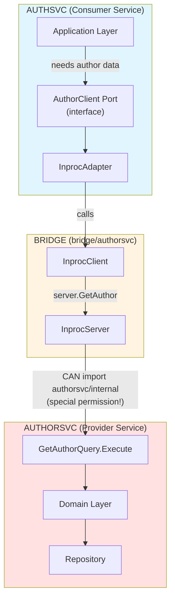

# Bridge Module Pattern

## Detailed Bridge Architecture

**The bridge module is the key innovation that enables strong boundaries with flexible transport.**

### Bridge Module Responsibilities

A bridge module for a service:
1. **Defines the public API** with Go interfaces
2. **Defines DTOs** ([data transfer objects](https://martinfowler.com/eaaCatalog/dataTransferObject.html))
3. **Provides in-process server** that wraps service internals
4. **Provides in-process client** that calls server directly
5. **Defines public error types**

### Example: Author Service Bridge

See [example-author-service-bridge.md](example-author-service-bridge.md)

### Understanding InprocServer and InprocClient

Before diving into the full implementation, let's understand what these components are and how they work together.

**What They Are:**

- **InprocServer**: The "server side" adapter that wraps a service's internal application layer and exposes it through the bridge interface
- **InprocClient**: The "client side" adapter that calls InprocServer directly via function calls (no network)

**Simplified Structure:**

```go
// InprocServer wraps the service's internal application layer
type InprocServer struct {
    // References to the REAL service's application layer
    getAuthorQuery    *query.GetAuthorQuery      // from authorsvc/internal/application/query
    listAuthorsQuery  *query.ListAuthorsQuery    // from authorsvc/internal/application/query
    createAuthorCmd   *command.CreateAuthorCommand  // from authorsvc/internal/application/command
    updateAuthorCmd   *command.UpdateAuthorCommand  // from authorsvc/internal/application/command
}

// InprocClient calls the server directly (no network)
type InprocClient struct {
    server *InprocServer  // Direct reference to server instance
}
```

**The Flow:**



**Lifecycle:**

1. **Authorsvc Startup** (provider service):
   ```go
   // authorsvc/cmd/main.go
   func main() {
       // Initialize internal application layer
       getAuthorQuery := query.NewGetAuthorQuery(repo)
       createAuthorCmd := command.NewCreateAuthorCommand(repo)

       // Create InprocServer wrapping the application layer
       authorServer := authorsvc.NewInprocServer(
           getAuthorQuery,
           // ... other queries/commands
       )

       // Register as singleton (shared across services in same process)
       RegisterAuthorService(authorServer)
   }
   ```

2. **Authsvc Startup** (consumer service):
   ```go
   // authsvc/cmd/main.go
   func main() {
       // Get reference to authorsvc's InprocServer (singleton)
       authorServer := GetAuthorService()

       // Create InprocClient that calls the server
       authorBridge := authorsvc.NewInprocClient(authorServer)

       // Wrap in port adapter
       authorClient := inproc.NewClient(authorBridge)

       // Wire into application
       deps := infra.InitializeDependencies(cfg, authorClient)
   }
   ```

3. **Runtime Call Flow**:
   ```go
   // authsvc application layer
   result := authorClient.GetAuthor(ctx, "author-123")
       │
       ▼ (interface call)
   // authsvc adapter
   inprocAdapter.GetAuthor(ctx, "author-123")
       │
       ▼ (direct function call)
   // bridge InprocClient
   client.server.GetAuthor(ctx, "author-123")
       │
       ▼ (direct function call)
   // bridge InprocServer
   server.getAuthorQuery.Execute(ctx, "author-123")
       │
       ▼ (direct function call)
   // authorsvc internal application layer
   query.Execute(ctx, "author-123")
   ```

**Key Principles:**

1. **Special Import Permission**:
   - InprocServer lives in `bridge/authorsvc/`
   - It's the ONLY code outside `authorsvc/` allowed to import `authorsvc/internal/*`
   - This is intentional and controlled

2. **Thin Delegation Layer**:
   - InprocServer contains NO business logic
   - It only translates between bridge DTOs and internal types
   - It maps domain errors to bridge errors

3. **Shared Singleton**:
   - When services run in same process, they share ONE InprocServer instance
   - No duplication of application layer instances
   - Efficient memory usage

4. **Zero Network Overhead**:
   - InprocClient -> InprocServer is a direct function call
   - No serialization, no HTTP, no network latency
   - Performance identical to direct internal imports (but with boundaries!)

5. **Swappable Implementation**:
   - Consumer sees only the bridge interface (`AuthorService`)
   - Can swap InprocClient for NetworkClient without changing application layer
   - Bridge provides the abstraction point

**Complete Implementation:**

Now see the full implementation with all methods and error handling in the file [example-bridge-authorsvc-authorsvc.md](example-bridge-authorsvc-authorsvc.md).

### Using the Bridge in Another Service

```go
//services/authsvc/internal/adapters/outbound/authorclient/inproc/client.go
package inproc

import (
    "context"

    // Import the bridge (public, allowed)
    "github.com/example/service-manager/bridge/authorsvc"

    // Import application port (internal to authsvc)
    "github.com/example/service-manager/services/authsvc/internal/application/ports"
)

// Client adapts the bridge.AuthorService to our application's ports.AuthorClient.
type Client struct {
    bridge authorsvc.AuthorService
}

func NewClient(bridge authorsvc.AuthorService) *Client {
    return &Client{bridge: bridge}
}

func (c *Client) GetAuthor(ctx context.Context, authorID string) (*ports.AuthorInfo, error) {
    // Call bridge (which calls authorsvc internally)
    dto, err := c.bridge.GetAuthor(ctx, authorID)
    if err != nil {
        // Translate bridge errors to application errors
        if errors.Is(err, authorsvc.ErrAuthorNotFound) {
            return nil, ports.ErrAuthorNotFound
        }
        return nil, ports.ErrAuthorServiceDown
    }

    // Map bridge DTO to application DTO
    return &ports.AuthorInfo{
        ID:        dto.ID,
        Name:      dto.Name,
        Bio:       dto.Bio,
        AvatarURL: dto.AvatarURL,
    }, nil
}
```

### Wiring in main.go

```go
//services/authsvc/cmd/authsvc/main.go
package main

import (
    "log"

    "github.com/example/service-manager/bridge/authorsvc"
    "github.com/example/service-manager/services/authsvc/internal/adapters/outbound/authorclient/inproc"
    "github.com/example/service-manager/services/authsvc/internal/infra"
)

func main() {
    cfg := infra.LoadConfig()

    // Get the AuthorService InprocServer from authorsvc
    // (In practice, this is a singleton shared across services in same process)
    authorServer := getAuthorServiceInprocServer() // Implementation detail

    // Create in-process client
    authorBridge := authorsvc.NewInprocClient(authorServer)

    // Wrap in adapter
    authorClient := inproc.NewClient(authorBridge)

    // Wire up authsvc with the author client
    deps := infra.InitializeDependencies(cfg, authorClient)

    // Start server...
}
```

## Bridge Pattern Benefits

1. **Compiler-Enforced Boundaries**
   - authsvc cannot import `authorsvc/internal` (compiler error)
   - authsvc can only import `bridge/authorsvc` (public API)
   - Violations are caught at compile time, not runtime or review

2. **Zero Network Overhead**
   - In-process client -> server is a direct function call
   - No serialization, no HTTP stack, no network latency
   - Performance equivalent to shared-module monolith

3. **Clear Migration Path**
   - Today: authsvc uses `bridge/authorsvc.InprocClient`
   - Tomorrow: authsvc uses `authorconnect.Client` (HTTP/Connect)
   - Change is localized to wiring in `main.go`
   - Application layer is unchanged

4. **Explicit Seam**
   - Bridge makes the service boundary visible
   - Clear "public API" vs "internal implementation"
   - Documentation target for service contracts

5. **Flexible Implementation**
   - Same interface works for multiple transports
   - Can mix transports (some in-process, some network)
   - Easy to test (mock the bridge interface)

## Bridge Anti-Patterns

**Bridge modules must remain:**

- **Stateless** - No global variables, no caches, no state
- **Business-logic free** - No domain rules, no validation beyond DTO structure
- **DTO + interface only** - Just data contracts and method signatures

**Warning Signs You're Creating a Shared Kernel:**

✗ **Business rules in bridge modules**
```go
// BAD: Business logic in bridge
func (dto *AuthorDTO) Validate() error {
    if len(dto.Name) < 3 {
        return errors.New("name too short")
    }
    // This is domain logic - belongs in authorsvc/internal/domain
}
```

✓ **Keep bridges pure:**
```go
// GOOD: Bridge is just a contract
type AuthorDTO struct {
    ID   string
    Name string
    Bio  string
}

// Validation happens in the service's domain layer
```

✗ **Shared utilities in bridge**
```go
// BAD: Shared business utilities
package authorsvc

func CalculateAuthorRating(articles int, followers int) int {
    // This creates coupling - multiple services depend on this logic
}
```

✗ **Domain models in bridge**
```go
// BAD: Exposing internal domain models
package authorsvc

import "github.com/.../services/authorsvc/internal/domain/author"

type AuthorService interface {
    GetAuthor(ctx context.Context, id string) (*author.Author, error)
    // Exposing internal domain type breaks the boundary
}
```

✓ **Use DTOs instead:**
```go
// GOOD: Bridge-specific DTOs decouple from internal domain
type AuthorDTO struct {
    ID   string
    Name string
}

type AuthorService interface {
    GetAuthor(ctx context.Context, id string) (*AuthorDTO, error)
    // DTO is owned by the bridge, not the internal domain
}
```

**The Golden Rule:**

> If you're tempted to import a bridge module from multiple services to share business logic, you're recreating a shared-kernel monolith. Stop and refactor the logic into the appropriate service's domain layer instead.

**What Belongs in Bridge Modules:**

- Interface definitions (service contracts)
- DTOs (pure data structures)
- Error constants (semantic errors like `ErrNotFound`)
- InprocServer (wraps internal application layer)
- InprocClient (calls InprocServer)

**What Does NOT Belong in Bridge Modules:**

- Business validation rules
- Domain calculations or algorithms
- Shared utilities across services
- Database models or repository logic
- HTTP handlers or transport-specific code
- Configuration or feature flags

By keeping bridge modules pure, you maintain clean service boundaries and avoid the coupling problems that plague shared-kernel architectures.

