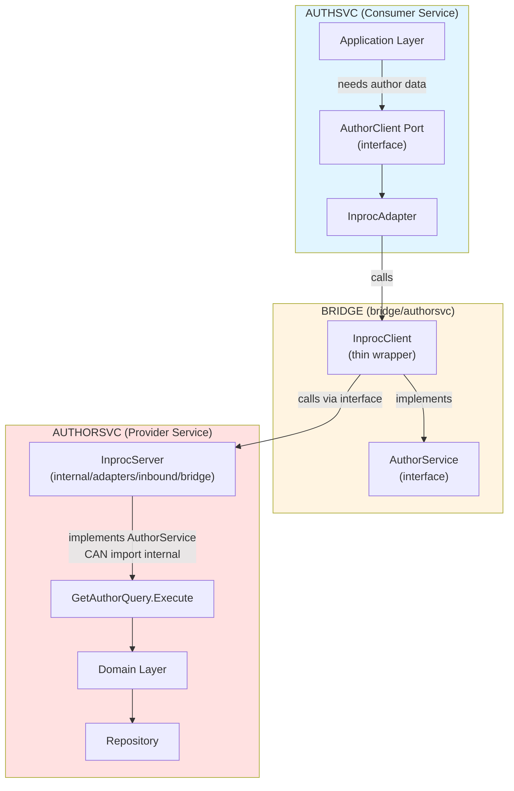

# Bridge Module Pattern

## Detailed Bridge Architecture

**The bridge module is the key innovation that enables strong boundaries with flexible transport.**

### Bridge Module Responsibilities

A bridge module for a service contains ONLY public contracts:
1. **Defines the public API** with Go interfaces
2. **Defines DTOs** ([data transfer objects](https://martinfowler.com/eaaCatalog/dataTransferObject.html))
3. **Defines public error types**
4. **Provides in-process client** that calls the interface (thin wrapper)

The service itself (not the bridge) provides:
5. **In-process server implementation** in `services/*/internal/adapters/inbound/bridge/` that implements the bridge interface

### Example: Author Service Bridge

See [example-author-service-bridge.md](example-author-service-bridge.md)

### Understanding InprocServer and InprocClient

Before diving into the full implementation, let's understand what these components are and how they work together.

**What They Are:**

- **InprocServer**: An inbound adapter that lives in `services/authorsvc/internal/adapters/inbound/bridge/` and implements the bridge interface by wrapping the service's application layer
- **InprocClient**: A thin client wrapper that lives in `bridge/authorsvc/` and calls any implementation of the bridge interface (no network)

**Simplified Structure:**

```go
// Bridge Module: bridge/authorsvc/inproc_client.go
// InprocClient accepts ANY implementation of AuthorService
type InprocClient struct {
    server AuthorService  // Interface reference (not concrete type!)
}

// Service Adapter: services/authorsvc/internal/adapters/inbound/bridge/inproc_server.go
// InprocServer implements the bridge interface
type InprocServer struct {
    // References to the service's internal application layer
    getAuthorQuery    *query.GetAuthorQuery      // from authorsvc/internal/application/query
    listAuthorsQuery  *query.ListAuthorsQuery    // from authorsvc/internal/application/query
    createAuthorCmd   *command.CreateAuthorCommand  // from authorsvc/internal/application/command
    updateAuthorCmd   *command.UpdateAuthorCommand  // from authorsvc/internal/application/command
}

// Factory returns interface type for loose coupling
func NewInprocServer(...) AuthorService {
    return &InprocServer{...}
}
```

**The Flow:**



**Lifecycle:**

1. **Monolith main.go** (direct explicit wiring):
   ```go
   // cmd/monolith/main.go
   package main

   import (
       bridgeauthor "github.com/example/service-manager/bridge/authorsvc"
       authorconfig "github.com/example/service-manager/services/authorsvc/config"
       authoradapters "github.com/example/service-manager/services/authorsvc/internal/adapters/inbound/bridge"
       "github.com/example/service-manager/services/authsvc"
   )

   func main() {
       ctx := context.Background()

       // Phase 1: Load author service config
       authorCfg, _ := authorconfig.Load()

       // Phase 2: Create InprocServer (lives in authorsvc internal adapters)
       // Returns: bridgeauthor.AuthorService interface
       authorServer := authoradapters.NewInprocServer(authorCfg, logger)

       // Phase 3: Wrap with InprocClient (lives in bridge module)
       // Accepts: bridgeauthor.AuthorService interface
       authorClient := bridgeauthor.NewInprocClient(authorServer)

       // Phase 4: Initialize consumer service with the client
       authCfg, _ := authconfig.Load()
       authService := authsvc.New(authCfg, authorClient)

       // Phase 5: Run services via errgroup supervisor
       g, gCtx := errgroup.WithContext(ctx)
       g.Go(func() error { return authorServer.Run(gCtx) })
       g.Go(func() error { return authService.Run(gCtx) })

       if err := g.Wait(); err != nil {
           log.Fatal(err)
       }
   }
   ```

2. **Runtime Call Flow**:
   ```go
   // authsvc application layer
   result := authorClient.GetAuthor(ctx, "author-123")
       │
       ▼ (interface call)
   // authsvc outbound adapter
   inprocAdapter.GetAuthor(ctx, "author-123")
       │
       ▼ (interface call)
   // bridge InprocClient (thin wrapper in bridge module)
   client.server.GetAuthor(ctx, "author-123")
       │
       ▼ (interface call - no knowledge of concrete InprocServer type!)
   // authorsvc InprocServer (inbound adapter in service internal)
   server.getAuthorQuery.Execute(ctx, "author-123")
       │
       ▼ (direct function call - same module, can import internals)
   // authorsvc internal application layer
   query.Execute(ctx, "author-123")
   ```

**Key Principles:**

1. **True Module Independence**:
   - InprocServer lives in `services/authorsvc/internal/adapters/inbound/bridge/`
   - Bridge module has literally zero dependencies (no `require` statements)
   - InprocServer CAN import service internals (same Go module)
   - Bridge CANNOT import service internals (different Go module - compiler enforced)

2. **Interface-Based Coupling**:
   - InprocClient holds `AuthorService` interface, not `*InprocServer` concrete type
   - NewInprocServer() returns `AuthorService` interface
   - Enables loose coupling and testability
   - Consumers never know about the concrete implementation

3. **Thin Delegation Layer**:
   - InprocServer contains NO business logic
   - It only translates between bridge DTOs and internal types
   - It maps domain errors to bridge errors
   - Pure adapter pattern

4. **Zero Network Overhead**:
   - InprocClient -> InprocServer is a direct function call via interface
   - No serialization, no HTTP, no network latency
   - Performance identical to direct internal imports (but with boundaries!)

5. **Swappable Implementation**:
   - Consumer sees only the bridge interface (`AuthorService`)
   - Can swap InprocClient for NetworkClient without changing application layer
   - Bridge provides the abstraction point

**Complete Implementation:**

Now see the full implementation with all methods and error handling in the file [example-bridge-authorsvc-authorsvc.md](example-bridge-authorsvc-authorsvc.md).

### Using the Bridge in Another Service

```go
//services/authsvc/internal/adapters/outbound/authorclient/inproc/client.go
package inproc

import (
    "context"

    // Import the bridge (public, allowed)
    "github.com/example/service-manager/bridge/authorsvc"

    // Import application port (internal to authsvc)
    "github.com/example/service-manager/services/authsvc/internal/application/ports"
)

// Client adapts the bridge.AuthorService to our application's ports.AuthorClient.
type Client struct {
    bridge authorsvc.AuthorService
}

func NewClient(bridge authorsvc.AuthorService) *Client {
    return &Client{bridge: bridge}
}

func (c *Client) GetAuthor(ctx context.Context, authorID string) (*ports.AuthorInfo, error) {
    // Call bridge (which calls authorsvc internally)
    dto, err := c.bridge.GetAuthor(ctx, authorID)
    if err != nil {
        // Translate bridge errors to application errors
        if errors.Is(err, authorsvc.ErrAuthorNotFound) {
            return nil, ports.ErrAuthorNotFound
        }
        return nil, ports.ErrAuthorServiceDown
    }

    // Map bridge DTO to application DTO
    return &ports.AuthorInfo{
        ID:        dto.ID,
        Name:      dto.Name,
        Bio:       dto.Bio,
        AvatarURL: dto.AvatarURL,
    }, nil
}
```

### Wiring in main.go

The monolith's main.go performs direct explicit wiring with clear initialization order:

```go
// cmd/monolith/main.go
package main

import (
    bridgeauthor "github.com/example/service-manager/bridge/authorsvc"
    authorconfig "github.com/example/service-manager/services/authorsvc/config"
    authoradapters "github.com/example/service-manager/services/authorsvc/internal/adapters/inbound/bridge"
    authconfig "github.com/example/service-manager/services/authsvc/config"
    "github.com/example/service-manager/services/authsvc"
    authorclientadapter "github.com/example/service-manager/services/authsvc/internal/adapters/outbound/authorclient/inproc"
)

func main() {
    ctx := context.Background()

    // 1. Config: Load author service configuration
    authorCfg, _ := authorconfig.Load()

    // 2. Provider: Create InprocServer (returns interface)
    authorServer := authoradapters.NewInprocServer(authorCfg, logger)

    // 3. Bridge: Wrap with InprocClient
    authorClient := bridgeauthor.NewInprocClient(authorServer)

    // 4. Consumer Adapter: Wrap bridge client in outbound adapter
    authorClientAdapter := authorclientadapter.NewClient(authorClient)

    // 5. Consumer Service: Initialize with dependencies
    authCfg, _ := authconfig.Load()
    authService := authsvc.New(authCfg, authorClientAdapter)

    // 6. Run: Start all services via errgroup
    g, gCtx := errgroup.WithContext(ctx)
    g.Go(func() error { return authorServer.Run(gCtx) })
    g.Go(func() error { return authService.Run(gCtx) })

    if err := g.Wait(); err != nil {
        log.Fatal(err)
    }
}
```

**Key Points:**
- **Initialization order is explicit**: Provider service before consumer service
- **No registry needed**: Direct wiring in main.go
- **Type safety**: Compiler enforces correct interfaces
- **Interface-based**: Everything operates on `AuthorService` interface, not concrete types

## Bridge Pattern Benefits

1. **Compiler-Enforced Boundaries**
   - authsvc cannot import `authorsvc/internal` (compiler error)
   - authsvc can only import `bridge/authorsvc` (public API)
   - Violations are caught at compile time, not runtime or review

2. **Zero Network Overhead**
   - In-process client -> server is a direct function call
   - No serialization, no HTTP stack, no network latency
   - Performance equivalent to shared-module monolith

3. **Clear Migration Path**
   - Today: authsvc uses `bridge/authorsvc.InprocClient`
   - Tomorrow: authsvc uses `authorconnect.Client` (HTTP/Connect)
   - Change is localized to wiring in `main.go`
   - Application layer is unchanged

4. **Explicit Seam**
   - Bridge makes the service boundary visible
   - Clear "public API" vs "internal implementation"
   - Documentation target for service contracts

5. **Flexible Implementation**
   - Same interface works for multiple transports
   - Can mix transports (some in-process, some network)
   - Easy to test (mock the bridge interface)

## Bridge Anti-Patterns

**Bridge modules must remain:**

- **Stateless** - No global variables, no caches, no state
- **Business-logic free** - No domain rules, no validation beyond DTO structure
- **DTO + interface only** - Just data contracts and method signatures

**Warning Signs You're Creating a Shared Kernel:**

✗ **Business rules in bridge modules**
```go
// BAD: Business logic in bridge
func (dto *AuthorDTO) Validate() error {
    if len(dto.Name) < 3 {
        return errors.New("name too short")
    }
    // This is domain logic - belongs in authorsvc/internal/domain
}
```

✓ **Keep bridges pure:**
```go
// GOOD: Bridge is just a contract
type AuthorDTO struct {
    ID   string
    Name string
    Bio  string
}

// Validation happens in the service's domain layer
```

✗ **Shared utilities in bridge**
```go
// BAD: Shared business utilities
package authorsvc

func CalculateAuthorRating(articles int, followers int) int {
    // This creates coupling - multiple services depend on this logic
}
```

✗ **Domain models in bridge**
```go
// BAD: Exposing internal domain models
package authorsvc

import "github.com/.../services/authorsvc/internal/domain/author"

type AuthorService interface {
    GetAuthor(ctx context.Context, id string) (*author.Author, error)
    // Exposing internal domain type breaks the boundary
}
```

✓ **Use DTOs instead:**
```go
// GOOD: Bridge-specific DTOs decouple from internal domain
type AuthorDTO struct {
    ID   string
    Name string
}

type AuthorService interface {
    GetAuthor(ctx context.Context, id string) (*AuthorDTO, error)
    // DTO is owned by the bridge, not the internal domain
}
```

**The Golden Rule:**

> If you're tempted to import a bridge module from multiple services to share business logic, you're recreating a shared-kernel monolith. Stop and refactor the logic into the appropriate service's domain layer instead.

**What Belongs in Bridge Modules:**

- Interface definitions (service contracts)
- DTOs (pure data structures)
- Error constants (semantic errors like `ErrNotFound`)
- InprocClient (thin wrapper that calls the interface)

**What Belongs in Service Internal Adapters** (`services/*/internal/adapters/inbound/bridge/`):

- InprocServer (implements the bridge interface)
- DTO mapping logic (bridge DTOs ↔ internal types)
- Error translation (domain errors → bridge errors)

**What Does NOT Belong Anywhere in Bridges or Adapters:**

- Business validation rules (belongs in domain layer)
- Domain calculations or algorithms (belongs in domain layer)
- Shared utilities across services (create a separate shared library if truly needed)
- Database models or repository logic (belongs in persistence adapters)
- HTTP handlers (belongs in HTTP inbound adapters)
- Configuration (belongs in service config package)
- Feature flags (belongs in service infrastructure)

By keeping bridge modules truly dependency-free and implementations in service adapters, you achieve true module independence and avoid the coupling problems that plague shared-kernel architectures.

