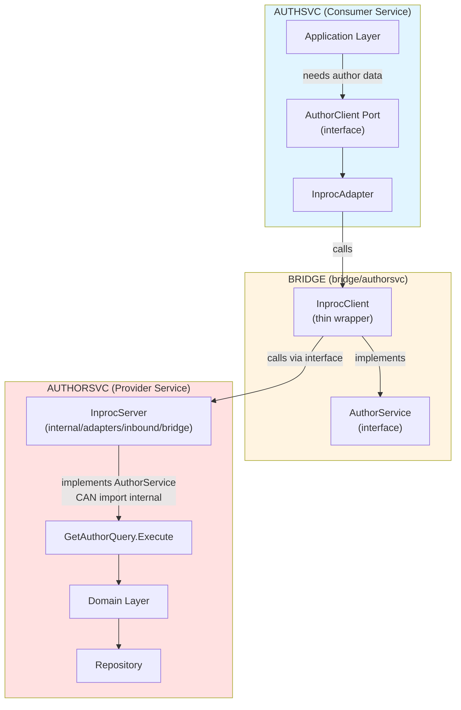

# Bridge Module Pattern

## Table of Contents

<!-- markdown-toc start - Don't edit this section. Run M-x markdown-toc-refresh-toc -->
- [Bridge Module Pattern](#bridge-module-pattern)
  - [Table of Contents](#table-of-contents)
  - [Detailed Bridge Architecture](#detailed-bridge-architecture)
    - [Bridge Module Responsibilities](#bridge-module-responsibilities)
    - [Example: Author Service Bridge](#example-author-service-bridge)
    - [Understanding InprocServer and InprocClient](#understanding-inprocserver-and-inprocclient)
    - [Using the Bridge in Another Service](#using-the-bridge-in-another-service)
    - [Wiring in main.go](#wiring-in-maingo)
  - [Bridge Pattern Benefits](#bridge-pattern-benefits)
  - [Bridge Anti-Patterns](#bridge-anti-patterns)
    - [What's Now Impossible (Enforced by arch-test)](#whats-now-impossible-enforced-by-arch-test)
    - [What's Still Dangerous (Human Element)](#whats-still-dangerous-human-element)
    - [What Belongs Where](#what-belongs-where)
    - [Deep Dive: Why This Complexity?](#deep-dive-why-this-complexity)
      - [1. The "Dependency Hell" Problem](#1-the-dependency-hell-problem)
      - [2. Contract Sharing vs. Code Sharing](#2-contract-sharing-vs-code-sharing)
      - [3. The "Pure Bridge" Rule](#3-the-pure-bridge-rule)
    - [Deep Dive: Why Not Co-locate the API?](#deep-dive-why-not-co-locate-the-api)
      - [1. The "Dependency Hell" Trap (Source-Level Isolation)](#1-the-dependency-hell-trap-source-level-isolation)
      - [2. Prevention of Cyclic Dependencies](#2-prevention-of-cyclic-dependencies)
      - [3. Physical vs. Logical Boundaries](#3-physical-vs-logical-boundaries)
      - [Summary Comparison](#summary-comparison)
  - [Annexe: Why `/brigde/xxx` instead of `/service/api/xxx`?](#annexe-why-brigdexxx-instead-of-serviceapixxx)
<!-- markdown-toc end -->

## Detailed Bridge Architecture

**The bridge module is the key innovation that enables strong boundaries with flexible transport.**

### Bridge Module Responsibilities

A bridge module for a service contains ONLY public contracts:
1. **Defines the public API** with Go interfaces
2. **Defines DTOs** ([data transfer objects](https://martinfowler.com/eaaCatalog/dataTransferObject.html))
3. **Defines public error types**
4. **Provides in-process client** that calls the interface (thin wrapper)

The service itself (not the bridge) provides:
5. **In-process server implementation** in `services/*/internal/adapters/inbound/bridge/` that implements the bridge interface

### Example: Author Service Bridge

See [example-author-service-bridge.md](example-author-service-bridge.md)

### Understanding InprocServer and InprocClient

Before diving into the full implementation, let's understand what these components are and how they work together.

**What They Are:**

- **InprocServer**: An inbound adapter that lives in `services/authorsvc/internal/adapters/inbound/bridge/` and implements the bridge interface by wrapping the service's application layer
- **InprocClient**: A thin client wrapper that lives in `bridge/authorsvc/` and calls any implementation of the bridge interface (no network)

**Simplified Structure:**

```go
// Bridge Module: bridge/authorsvc/inproc_client.go
// InprocClient accepts ANY implementation of AuthorService
type InprocClient struct {
    server AuthorService  // Interface reference (not concrete type!)
}

// Service Adapter: services/authorsvc/internal/adapters/inbound/bridge/inproc_server.go
// InprocServer implements the bridge interface
type InprocServer struct {
    // References to the service's internal application layer
    getAuthorQuery    *query.GetAuthorQuery      // from authorsvc/internal/application/query
    listAuthorsQuery  *query.ListAuthorsQuery    // from authorsvc/internal/application/query
    createAuthorCmd   *command.CreateAuthorCommand  // from authorsvc/internal/application/command
    updateAuthorCmd   *command.UpdateAuthorCommand  // from authorsvc/internal/application/command
}

// Factory returns interface type for loose coupling
func NewInprocServer(...) AuthorService {
    return &InprocServer{...}
}
```

**The Flow:**



**Lifecycle:**

1. **Monolith main.go** (direct explicit wiring):
   ```go
   // cmd/monolith/main.go
   package main

   import (
       bridgeauthor "github.com/example/service-manager/bridge/authorsvc"
       authorconfig "github.com/example/service-manager/services/authorsvc/config"
       authoradapters "github.com/example/service-manager/services/authorsvc/internal/adapters/inbound/bridge"
       "github.com/example/service-manager/services/authsvc"
   )

   func main() {
       ctx := context.Background()

       // Phase 1: Load author service config
       authorCfg, _ := authorconfig.Load()

       // Phase 2: Create InprocServer (lives in authorsvc internal adapters)
       // Returns: bridgeauthor.AuthorService interface
       authorServer := authoradapters.NewInprocServer(authorCfg, logger)

       // Phase 3: Wrap with InprocClient (lives in bridge module)
       // Accepts: bridgeauthor.AuthorService interface
       authorClient := bridgeauthor.NewInprocClient(authorServer)

       // Phase 4: Initialize consumer service with the client
       authCfg, _ := authconfig.Load()
       authService := authsvc.New(authCfg, authorClient)

       // Phase 5: Run services via errgroup supervisor
       g, gCtx := errgroup.WithContext(ctx)
       g.Go(func() error { return authorServer.Run(gCtx) })
       g.Go(func() error { return authService.Run(gCtx) })

       if err := g.Wait(); err != nil {
           log.Fatal(err)
       }
   }
   ```

2. **Runtime Call Flow**:
   ```go
   // authsvc application layer
   result := authorClient.GetAuthor(ctx, "author-123")
       │
       ▼ (interface call)
   // authsvc outbound adapter
   inprocAdapter.GetAuthor(ctx, "author-123")
       │
       ▼ (interface call)
   // bridge InprocClient (thin wrapper in bridge module)
   client.server.GetAuthor(ctx, "author-123")
       │
       ▼ (interface call - no knowledge of concrete InprocServer type!)
   // authorsvc InprocServer (inbound adapter in service internal)
   server.getAuthorQuery.Execute(ctx, "author-123")
       │
       ▼ (direct function call - same module, can import internals)
   // authorsvc internal application layer
   query.Execute(ctx, "author-123")
   ```

**Key Principles:**

1. **True Module Independence**:
   - InprocServer lives in `services/authorsvc/internal/adapters/inbound/bridge/`
   - Bridge module has literally zero dependencies (no `require` statements)
   - InprocServer CAN import service internals (same Go module)
   - Bridge CANNOT import service internals (different Go module - compiler enforced)

2. **Interface-Based Coupling**:
   - InprocClient holds `AuthorService` interface, not `*InprocServer` concrete type
   - NewInprocServer() returns `AuthorService` interface
   - Enables loose coupling and testability
   - Consumers never know about the concrete implementation

3. **Thin Delegation Layer**:
   - InprocServer contains NO business logic
   - It only translates between bridge DTOs and internal types
   - It maps domain errors to bridge errors
   - Pure adapter pattern

4. **Zero Network Overhead**:
   - InprocClient -> InprocServer is a direct function call via interface
   - No serialization, no HTTP, no network latency
   - Performance identical to direct internal imports (but with boundaries!)

5. **Swappable Implementation**:
   - Consumer sees only the bridge interface (`AuthorService`)
   - Can swap InprocClient for NetworkClient without changing application layer
   - Bridge provides the abstraction point

**Complete Implementation:**

Now see the full implementation with all methods and error handling in the file [example-bridge-authorsvc-authorsvc.md](example-bridge-authorsvc-authorsvc.md).

### Using the Bridge in Another Service

```go
//services/authsvc/internal/adapters/outbound/authorclient/inproc/client.go
package inproc

import (
    "context"

    // Import the bridge (public, allowed)
    "github.com/example/service-manager/bridge/authorsvc"

    // Import application port (internal to authsvc)
    "github.com/example/service-manager/services/authsvc/internal/application/ports"
)

// Client adapts the bridge.AuthorService to our application's ports.AuthorClient.
type Client struct {
    bridge authorsvc.AuthorService
}

func NewClient(bridge authorsvc.AuthorService) *Client {
    return &Client{bridge: bridge}
}

func (c *Client) GetAuthor(ctx context.Context, authorID string) (*ports.AuthorInfo, error) {
    // Call bridge (which calls authorsvc internally)
    dto, err := c.bridge.GetAuthor(ctx, authorID)
    if err != nil {
        // Translate bridge errors to application errors
        if errors.Is(err, authorsvc.ErrAuthorNotFound) {
            return nil, ports.ErrAuthorNotFound
        }
        return nil, ports.ErrAuthorServiceDown
    }

    // Map bridge DTO to application DTO
    return &ports.AuthorInfo{
        ID:        dto.ID,
        Name:      dto.Name,
        Bio:       dto.Bio,
        AvatarURL: dto.AvatarURL,
    }, nil
}
```

### Wiring in main.go

The monolith's main.go performs direct explicit wiring with clear initialization order:

```go
// cmd/monolith/main.go
package main

import (
    bridgeauthor "github.com/example/service-manager/bridge/authorsvc"
    authorconfig "github.com/example/service-manager/services/authorsvc/config"
    authoradapters "github.com/example/service-manager/services/authorsvc/internal/adapters/inbound/bridge"
    authconfig "github.com/example/service-manager/services/authsvc/config"
    "github.com/example/service-manager/services/authsvc"
    authorclientadapter "github.com/example/service-manager/services/authsvc/internal/adapters/outbound/authorclient/inproc"
)

func main() {
    ctx := context.Background()

    // 1. Config: Load author service configuration
    authorCfg, _ := authorconfig.Load()

    // 2. Provider: Create InprocServer (returns interface)
    authorServer := authoradapters.NewInprocServer(authorCfg, logger)

    // 3. Bridge: Wrap with InprocClient
    authorClient := bridgeauthor.NewInprocClient(authorServer)

    // 4. Consumer Adapter: Wrap bridge client in outbound adapter
    authorClientAdapter := authorclientadapter.NewClient(authorClient)

    // 5. Consumer Service: Initialize with dependencies
    authCfg, _ := authconfig.Load()
    authService := authsvc.New(authCfg, authorClientAdapter)

    // 6. Run: Start all services via errgroup
    g, gCtx := errgroup.WithContext(ctx)
    g.Go(func() error { return authorServer.Run(gCtx) })
    g.Go(func() error { return authService.Run(gCtx) })

    if err := g.Wait(); err != nil {
        log.Fatal(err)
    }
}
```

**Key Points:**
- **Initialization order is explicit**: Provider service before consumer service
- **No registry needed**: Direct wiring in main.go
- **Type safety**: Compiler enforces correct interfaces
- **Interface-based**: Everything operates on `AuthorService` interface, not concrete types

## Bridge Pattern Benefits

1. **Compiler-Enforced Boundaries**
   - authsvc cannot import `authorsvc/internal` (compiler error)
   - authsvc can only import `bridge/authorsvc` (public API)
   - Violations are caught at compile time, not runtime or review

2. **Zero Network Overhead**
   - In-process client -> server is a direct function call
   - No serialization, no HTTP stack, no network latency
   - Performance equivalent to shared-module monolith

3. **Clear Migration Path**
   - Today: authsvc uses `bridge/authorsvc.InprocClient`
   - Tomorrow: authsvc uses `authorconnect.Client` (HTTP/Connect)
   - Change is localized to wiring in `main.go`
   - Application layer is unchanged

4. **Explicit Seam**
   - Bridge makes the service boundary visible
   - Clear "public API" vs "internal implementation"
   - Documentation target for service contracts

5. **Flexible Implementation**
   - Same interface works for multiple transports
   - Can mix transports (some in-process, some network)
   - Easy to test (mock the bridge interface)

## Bridge Anti-Patterns

**Note:** Our `arch-test` suite now physically prevents importing internal packages or adding external dependencies in bridge modules. However, **logical coupling** is still possible and must be caught in code review. Even if code compiles, it doesn't mean it belongs in a bridge.

**Bridge modules must remain:**

- **Stateless** - No global variables, no caches, no state
- **Business-logic free** - No domain rules, no validation, not even "pure" helper functions
- **DTO + interface only** - Just data contracts and method signatures

### What's Now Impossible (Enforced by arch-test)

These violations will be caught by `arch-test` in CI and fail the build:

✗ **Bridge importing service internals**
```go
// BAD: Compiler allows, but arch-test prevents
package authorsvc

import "github.com/.../services/authorsvc/internal/domain/author"

type AuthorService interface {
    GetAuthor(ctx context.Context, id string) (*author.Author, error)
    // arch-test detects internal/ import and FAILS
}
```

✗ **Bridge with external dependencies**
```go
// BAD: Adding dependencies in bridge/authorsvc/go.mod
module github.com/example/service-manager/bridge/authorsvc

require (
    github.com/google/uuid v1.3.0  // arch-test detects require and FAILS
)
```

✓ **What arch-test enforces:**
- Bridge `go.mod` has **zero** `require` statements
- Bridge code never imports any `internal/` packages
- Violations fail CI before merge

### What's Still Dangerous (Human Element)

These violations compile successfully but break architectural principles. They must be caught in code review:

✗ **Bridge bloat with business logic**
```go
// BAD: Compiles fine, but violates bridge purity
package authorsvc

func (dto *AuthorDTO) Validate() error {
    if len(dto.Name) < 3 {
        return errors.New("name too short")  // Domain logic doesn't belong here
    }
    // Even though this is "pure" logic with no dependencies,
    // it creates coupling - belongs in authorsvc/internal/domain
}

func CalculateAuthorRating(articles int, followers int) int {
    return articles*10 + followers  // Pure calculation, but still wrong place!
}
```

**Why this is dangerous:**
- Creates logical coupling across services that import the bridge
- Violates Single Responsibility - bridges are contracts, not business logic
- Even "pure" helper functions create shared-kernel problems

✓ **Keep bridges pure:**
```go
// GOOD: Bridge is just a contract
type AuthorDTO struct {
    ID   string
    Name string
    Bio  string
}

// Validation and business logic live in authorsvc/internal/domain
// Bridges only define the contract
```

✗ **Shared utilities in bridge**
```go
// BAD: Compiles, but creates service coupling
package authorsvc

import "time"

func FormatAuthorDate(t time.Time) string {
    return t.Format("2006-01-02")  // Seemingly innocent utility
    // Problem: Multiple services now depend on this formatting logic
}
```

**Why this is wrong:**
- If formatting changes, ALL services importing this bridge are affected
- You've recreated a shared-kernel monolith with loose coupling
- Each service should handle its own formatting needs

✗ **Bridge-Internal confusion (DTOs as Entities)**
```go
// BAD: Domain layer using bridge DTOs directly
package domain

import "github.com/.../bridge/authorsvc"

type User struct {
    ID      string
    Author  *authorsvc.AuthorDTO  // Domain using DTO as entity - WRONG
}
```

**Why this is dangerous:**
- Domain layer becomes coupled to external contract changes
- DTOs are for transport, Entities are for business logic
- Breaks dependency inversion (domain depends on adapter contract)

✓ **Proper layering:**
```go
// GOOD: Domain has its own types
package domain

type Author struct {  // Domain entity
    ID   AuthorID
    Name AuthorName
}

// Adapter layer maps between domain entities and bridge DTOs
// services/authsvc/internal/adapters/outbound/authorclient/inproc/client.go
func (c *Client) GetAuthor(id string) (*domain.Author, error) {
    dto, err := c.bridge.GetAuthor(ctx, id)
    // Map DTO → Domain Entity
    return &domain.Author{
        ID:   domain.NewAuthorID(dto.ID),
        Name: domain.NewAuthorName(dto.Name),
    }, nil
}
```

**The Golden Rule:**

> If you're tempted to add ANY logic to a bridge module (even "pure" helper functions), you're recreating a shared-kernel monolith. Stop and refactor the logic into the appropriate service's domain layer instead.

### What Belongs Where

**In Bridge Modules** (`bridge/authorsvc/`):
- Interface definitions (service contracts)
- DTOs (pure data structures, no methods except basic getters/setters)
- Error constants (semantic errors like `ErrNotFound`)
- InprocClient (thin wrapper that calls the interface)

**In Service Internal Adapters** (`services/*/internal/adapters/inbound/bridge/`):
- InprocServer (implements the bridge interface)
- DTO mapping logic (bridge DTOs ↔ domain entities)
- Error translation (domain errors → bridge errors)

**In Service Domain Layer** (`services/*/internal/domain/`):
- Business validation rules
- Domain calculations and algorithms
- Entity behavior and invariants
- Value objects with rich behavior

**NOT in Bridges or Adapters:**
- Business validation rules (→ domain layer)
- Domain calculations or algorithms (→ domain layer)
- Shared utilities across services (→ create separate shared library module if truly needed)
- Database models or repository logic (→ persistence adapters)
- HTTP handlers (→ HTTP inbound adapters)
- Configuration (→ service config package)
- Feature flags (→ service infrastructure)

By keeping bridge modules truly dependency-free and logically pure, you achieve true module independence and avoid the coupling problems that plague shared-kernel architectures.

### Deep Dive: Why This Complexity?

A common critique of this pattern is: *"Why not just use a single `go.mod` with strict linting? It's simpler."*

While a single module is simpler initially, the **Multiple Module (Workspace)** approach solves specific problems that linting cannot address.

#### 1. The "Dependency Hell" Problem
In Go, a single `go.mod` file resolves a **single dependency graph** for the entire project. This means every service in the monolith must share the exact same version of every library.

**Scenario:**
*   `Service A` relies on `aws-sdk-go` v1 (legacy).
*   `Service B` wants to use an AI library that requires `aws-sdk-go` v2.

**In a Single Module Monolith:**
You are blocked. You cannot upgrade Service B without refactoring Service A. One service's technical debt holds back the entire platform.

**In this Architecture:**
*   `services/serviceA/go.mod` requires `aws-sdk-go v1`
*   `services/serviceB/go.mod` requires `aws-sdk-go v2`

Because they are separate modules, they have **Independent Dependency Graphs**. The Go compiler handles this perfectly. This is critical for teams of 5-20 developers where coordinating library upgrades across the entire system is costly.

#### 2. Contract Sharing vs. Code Sharing
Another critique is that Bridge modules create "Coupling." It is vital to distinguish between two types of coupling:

*   **Implementation Coupling (Bad):** Sharing logic, validators, or database helpers. This makes services fragile; changing one breaks the other.
*   **Contract Coupling (Necessary):** Sharing interfaces and DTOs.

Services **must** share a contract to communicate (whether it's JSON schemas, gRPC Protobufs, or Go Interfaces).

The Bridge Module is strictly **Contract Coupling**. It is the semantic equivalent of a shared `.proto` repository in gRPC, but for in-process Go communication. It contains **no logic**, only definitions.

#### 3. The "Pure Bridge" Rule
To ensure the Bridge remains a Contract and not a Shared Kernel, we enforce strict rules (via `arch-test`):

1.  **No Internal Imports:** The Bridge cannot import `services/xxx/internal`.
2.  **No Logic:** The implementation (`InprocServer`) lives inside the **Service**, not the Bridge.
3.  **Dependency Inversion:** The Service imports the Bridge to implement the interface. The Bridge depends on nothing.

This structure allows `Service A` to be extracted to a new repository by simply copying `services/serviceA` and `bridge/serviceA`, with zero entanglement with `Service B`.

### Deep Dive: Why Not Co-locate the API?

A frequent question from developers is: *"Why not just place the API package inside the service module (e.g., `services/authorsvc/api`)? Why do we need a separate `bridge/` directory?"*

While co-locating the API appears simpler initially, it introduces severe architectural coupling in a Go environment.

#### 1. The "Dependency Hell" Trap (Source-Level Isolation)
If you place the API package inside `authorsvc/api`, it shares the `go.mod` of the service.

**The Consequence:**
Any consumer (e.g., `AuthService`) that imports `authorsvc/api` must add a `require` for the **entire** `authorsvc` module.

*   **Inherited Dependencies:** `AuthService` implicitly inherits **ALL** of `AuthorService`'s dependencies (AWS SDKs, Database drivers, logging libs), even if it only needs a struct definition.
*   **Development Friction:** Running `go test ./...` in `AuthService` forces the download and compilation of `AuthorService`'s heavy dependency tree.
*   **Version Conflicts:** If `AuthorService` relies on a legacy version of a library and `AuthService` needs a modern version, you are blocked.

**With a Bridge Module:**
*   `bridge/authorsvc` has a separate `go.mod` with **ZERO** dependencies.
*   `AuthService` imports `bridge/authorsvc` and inherits nothing.

*Note: While the final binary (`main.go`) will eventually merge all dependencies, the Bridge ensures **Source-Level Isolation**. This protects the development lifecycle, accelerates CI, and enables independent major version upgrades.*

#### 2. Prevention of Cyclic Dependencies
In complex systems, services often need to reference each other bi-directionally (e.g., *Orders* needs *Users* for addresses; *Users* needs *Orders* for history).

**If using `services/xxx/api`:**
*   Service A imports Service B's API.
*   Service B imports Service A's API.
*   **Result:** Go Module Cycle Error. Go does not allow cyclic module dependencies. You are structurally blocked.

**With Bridge Modules:**
*   Service A imports `bridge/ServiceB`.
*   Service B imports `bridge/ServiceA`.
*   **Result:** No cycle. The bridges are independent leaves in the dependency tree.

#### 3. Physical vs. Logical Boundaries
Moving the API into the service folder erodes the physical boundary that tooling can enforce.

*   **Current Architecture:** `arch-test` enforces that `bridge/` cannot import `internal/`. This is robust because they are different root directories.
*   **Co-located Approach:** If the API is in `services/authorsvc/api`, developers are frequently tempted to move "helper" structs from `internal/` to `api/` for convenience, re-introducing coupling.

#### Summary Comparison

| Feature | Co-located API (`services/api`) | Bridge Module (`bridge/`) |
| :--- | :--- | :--- |
| **Dependency Graph** | **Coupled:** Consumer inherits Provider's entire `go.mod`. | **Decoupled:** Consumer inherits 0 dependencies. |
| **Bi-directional calls** | **Impossible:** Causes module cycles. | **Possible:** Bridges break the cycle. |
| **Migration** | **Hard:** Extracting the service means extracting the API consumers depend on. | **Easy:** The API (Bridge) is already separate. |
| **Clarity** | **Low:** Mixes Public Contract with Private Implementation. | **High:** Explicit separation of "What I do" vs "How I do it". |

**Conclusion:** Keep the API in the separate `bridge/` module. It is the only way to guarantee the **Independent Dependency Graphs** that make this architecture scalable.

## Annexe: Why `/brigde/xxx` instead of `/service/api/xxx`?

This has been a long debate within our technical team…

At the question
> I would like to remove /brigde and move the content in the related service/api.

The answer is clear, **DON'T DO IT**. Here's why:

- **Compile-Time Dependencies VS Runtime Dependencies**
  - Importing `serviceA/api` into `serviceB` only gives `serviceB` access to the **Type Definitions (interfaces and DTOs)**. **It does not give `serviceB` a running instance of `serviceA`**.
  - If `serviceB`'s try to import `serviceA/api` and expect it to "just work," they will fail because the implementation behind the interface is missing, it's nil or non-existent.
  - If `serviceB` instantiates the real `serviceA`, `serviceB` would need to know how to configure `serviceA` (DB passwords, AWS keys, etc.).  
    This breaks encapsulation and **Violates the Boundaries**.
  - The "Pure Bridge" architecture solves this by enforcing **Dependency Inversion**.
- **Fatal flaw: Circular dependencies**
  - If Orders needs Users and Users needs Orders, `serviceA/api` ↔ `serviceA/api` creates a Go module cycle
  - Your build literally breaks - Go doesn't allow this
  - Bridge modules break the cycle because they're independent leaves
- **Real cost: Source-level pollution and "Dependency Hell" Trap**
  - Importing `serviceA/api` forces importing `serviceA`'s entire `go.mod` (pgx, AWS SDK, kafka-go, etc.)
  - go test in one service downloads dependencies from all services it talks to
  - CI becomes slower, local iteration becomes slower
  - Bridge design pattern solves this problem enforcing a dedicated layer `tests/e2e` for the tests and `cmd/monolith` as a bootstrap services' orchestrator, NOT inside `serviceB`'s codebase
- **When `services/api` works:**
  - Single-direction dependencies only (no cycles)
  - Small number of services (2-3)
  - Willing to accept slower tests/builds
  - The "Pure Bridge" architecture solves this by exposing only interfaces and DTOs without any services' dependencies.
- **Physical Boundary Enforcement:**
  - Co-locating the API erodes the physical boundary.
  - It makes it significantly harder for tooling (like arch-test) to enforce that the public contract never imports internal implementation details.
- **Harder extraction later**: if `serviceB/api` lives inside the `serviceB` module, when distribuing a module, every consumer of this module must change imports and you often end up re-creating a shared “contracts” repo anyway.
- **Dependency leakage**: it becomes tempting for `serviceB/api` to pull in “just one helper” (logging, errors, DB types). Then consumers inherit `serviceB`’s dependency graph and coupling creeps back.
- **Weaker boundary semantics**: “API = public surface” + “service internals” live together; governance is harder than a dedicated bridge/contracts module.

Importing the API is necessary for the **code to compile**, but **it is insufficient for the code to run**.  
Expecting `serviceB` to bootstrap `serviceA` for is an architectural anti-pattern that leads to **tight coupling** and the "Dependency Hell" that the "pure bridge" architecture solves elegantly.
