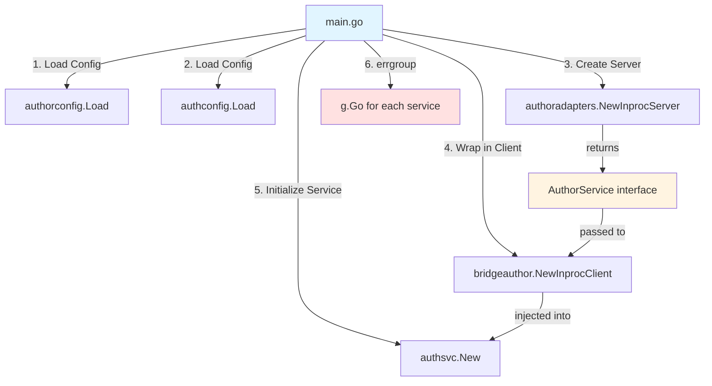

# Composition Root: Direct Explicit Wiring with errgroup Supervisor

The monolith's `main.go` performs direct explicit wiring with clear initialization order. This shows the **Pure Bridge Pattern** with truly independent modules.

## The Complete main.go

**File:** `cmd/monolith/main.go`

```go
package main

import (
    "context"
    "log"
    "net/http"
    "os"
    "os/signal"
    "syscall"
    "time"

    "golang.org/x/sync/errgroup"

    // Bridge modules (public contracts)
    bridgeauthor "github.com/example/service-manager/bridge/authorsvc"

    // Service config packages
    authorconfig "github.com/example/service-manager/services/authorsvc/config"
    authconfig "github.com/example/service-manager/services/authsvc/config"

    // Service adapters
    authoradapters "github.com/example/service-manager/services/authorsvc/internal/adapters/inbound/bridge"
    authorhttp "github.com/example/service-manager/services/authorsvc/internal/adapters/inbound/http"

    authsvc "github.com/example/service-manager/services/authsvc"
    authhttp "github.com/example/service-manager/services/authsvc/internal/adapters/inbound/http"
)

func main() {
    // ============================================================
    // 1. Root Context with Signal Handling (SIGTERM/SIGINT)
    // ============================================================
    ctx, cancel := signal.NotifyContext(context.Background(), os.Interrupt, syscall.SIGTERM)
    defer cancel()

    // ============================================================
    // 2. Configuration Loading
    // ============================================================
    // Each service defines HOW to load its config (Embedded FS + Env Override)
    // main.go decides WHEN to load it

    authorCfg, err := authorconfig.Load()
    if err != nil {
        log.Fatalf("Failed to load author service config: %v", err)
    }

    authCfg, err := authconfig.Load()
    if err != nil {
        log.Fatalf("Failed to load auth service config: %v", err)
    }

    // ============================================================
    // 3. Wiring Phase (Direct Explicit Dependency Injection)
    // ============================================================

    // A. Initialize Provider Service (authorsvc)
    //    Creates InprocServer in service internal adapters
    //    Returns: bridgeauthor.AuthorService interface
    authorServer := authoradapters.NewInprocServer(
        authorCfg.DB,
        authorCfg.Logger,
    )

    // Create HTTP handler for author service
    authorHTTPHandler := authorhttp.NewHandler(authorCfg)

    // B. Wrap Provider with Bridge Client
    //    Lives in bridge module, accepts AuthorService interface
    authorClient := bridgeauthor.NewInprocClient(authorServer)

    // C. Initialize Consumer Service (authsvc)
    //    Accepts the bridge client as a dependency
    authService := authsvc.New(authCfg, authorClient)

    // Create HTTP handler for auth service
    authHTTPHandler := authhttp.NewHandler(authCfg, authService)

    // ============================================================
    // 4. Execution Phase (The Supervisor - Shared Fate)
    // ============================================================
    // Use errgroup for concurrent service management
    // If ANY service fails, ALL services shut down (Shared Fate)

    g, gCtx := errgroup.WithContext(ctx)

    // --- Start Author Service HTTP Server ---
    g.Go(func() error {
        log.Printf("Starting Author Service on %s", authorCfg.HTTPPort)
        server := &http.Server{
            Addr:    authorCfg.HTTPPort,
            Handler: authorHTTPHandler,
        }

        // Graceful shutdown watcher
        go func() {
            <-gCtx.Done()
            log.Println("Shutting down Author Service...")
            shutdownCtx, cancel := context.WithTimeout(context.Background(), 5*time.Second)
            defer cancel()
            if err := server.Shutdown(shutdownCtx); err != nil {
                log.Printf("Author Service shutdown error: %v", err)
            }
        }()

        if err := server.ListenAndServe(); err != http.ErrServerClosed {
            return err // Error propagates to errgroup -> cancels gCtx -> stops all services
        }
        return nil
    })

    // --- Start Auth Service HTTP Server ---
    g.Go(func() error {
        log.Printf("Starting Auth Service on %s", authCfg.HTTPPort)
        server := &http.Server{
            Addr:    authCfg.HTTPPort,
            Handler: authHTTPHandler,
        }

        go func() {
            <-gCtx.Done()
            log.Println("Shutting down Auth Service...")
            shutdownCtx, cancel := context.WithTimeout(context.Background(), 5*time.Second)
            defer cancel()
            if err := server.Shutdown(shutdownCtx); err != nil {
                log.Printf("Auth Service shutdown error: %v", err)
            }
        }()

        if err := server.ListenAndServe(); err != http.ErrServerClosed {
            return err
        }
        return nil
    })

    // ============================================================
    // 5. Blocking Wait (Shared Fate Architecture)
    // ============================================================
    // If ANY service returns an error, ALL services shut down
    // This ensures no "zombie" processes with half the services running

    if err := g.Wait(); err != nil {
        log.Fatalf("Monolith shutdown due to error: %v", err)
    }

    log.Println("Monolith shutdown gracefully")
}
```

---

## Configuration Pattern: Embedded FS + Env Override

Each service implements its own config loader following this pattern:

**File:** `services/authorsvc/config/config.go`

```go
package config

import (
    "embed"
    "fmt"
    "os"

    "gopkg.in/yaml.v3"
)

//go:embed defaults.yaml
var defaultsFS embed.FS

type Config struct {
    HTTPPort string `yaml:"http_port"`
    DB       DBConfig `yaml:"db"`
    Logger   LoggerConfig `yaml:"logger"`
}

type DBConfig struct {
    Host     string `yaml:"host"`
    Port     int    `yaml:"port"`
    Database string `yaml:"database"`
    User     string `yaml:"user"`
    Password string `yaml:"password"`
}

type LoggerConfig struct {
    Level  string `yaml:"level"`
    Format string `yaml:"format"`
}

// Load reads embedded defaults and applies environment variable overrides
func Load() (*Config, error) {
    // 1. Load embedded defaults
    data, err := defaultsFS.ReadFile("defaults.yaml")
    if err != nil {
        return nil, fmt.Errorf("failed to read defaults: %w", err)
    }

    var cfg Config
    if err := yaml.Unmarshal(data, &cfg); err != nil {
        return nil, fmt.Errorf("failed to parse defaults: %w", err)
    }

    // 2. Apply environment variable overrides
    if port := os.Getenv("AUTHORSVC_HTTP_PORT"); port != "" {
        cfg.HTTPPort = port
    }
    if host := os.Getenv("AUTHORSVC_DB_HOST"); host != "" {
        cfg.DB.Host = host
    }
    if dbName := os.Getenv("AUTHORSVC_DB_NAME"); dbName != "" {
        cfg.DB.Database = dbName
    }
    if password := os.Getenv("AUTHORSVC_DB_PASSWORD"); password != "" {
        cfg.DB.Password = password
    }

    return &cfg, nil
}
```

**File:** `services/authorsvc/config/defaults.yaml`

```yaml
http_port: ":8081"
db:
  host: "localhost"
  port: 5432
  database: "authorsvc"
  user: "postgres"
  password: "postgres"
logger:
  level: "info"
  format: "json"
```

---

## Key Architectural Principles

### 1. Direct Explicit Wiring

**No registry pattern**, **no dependency injection framework** - just explicit initialization in main.go:

```go
authorServer := authoradapters.NewInprocServer(...)  // Step 1: Create server
authorClient := bridgeauthor.NewInprocClient(authorServer)  // Step 2: Wrap in client
authService := authsvc.New(authCfg, authorClient)  // Step 3: Inject into consumer
```

**Benefits:**
- Initialization order is visible and explicit
- No hidden magic, no globals, no singletons
- Easy to understand and debug
- Compiler enforces type safety

### 2. Configuration Ownership

Each service owns its configuration:
- **Service defines HOW**: Implements `config.Load()` with embedded defaults + env overrides
- **main.go decides WHEN**: Calls `config.Load()` at the appropriate time
- **No global config**: Each service gets its own config object

**Benefits:**
- Services are self-contained (can run standalone)
- No coupling through shared config
- Easy to test (mock config.Load())

### 3. Interface-Based Coupling

Everything operates on interfaces, not concrete types:

```go
authorServer := authoradapters.NewInprocServer(...)  // Returns AuthorService interface
authorClient := bridgeauthor.NewInprocClient(authorServer)  // Accepts AuthorService interface
```

**Benefits:**
- Loose coupling between provider and consumer
- Easy to swap implementations (in-process vs network)
- Testable (mock the interface)

### 4. Shared Fate Architecture (errgroup)

If ANY service fails, ALL services shut down:

```go
g.Go(func() error { return authorServer.Run(gCtx) })
g.Go(func() error { return authService.Run(gCtx) })

if err := g.Wait(); err != nil {
    log.Fatal(err)  // Entire monolith exits
}
```

**Why Shared Fate?**
- Prevents "zombie" processes (half the services running, half dead)
- Ensures clean state (either all healthy or all restarted)
- Leverages Kubernetes/Docker restart policies
- Simpler than partial failure handling

**Alternative:** For fine-grained fault tolerance (individual service restarts), consider [suture](https://github.com/thejerf/suture) for Erlang-style supervision trees.

### 5. Graceful Shutdown

Each service watches for context cancellation and shuts down gracefully:

```go
go func() {
    <-gCtx.Done()  // Context cancelled (SIGTERM or service failure)
    shutdownCtx, cancel := context.WithTimeout(context.Background(), 5*time.Second)
    defer cancel()
    server.Shutdown(shutdownCtx)  // Graceful shutdown with timeout
}()
```

**Benefits:**
- In-flight requests complete
- Database connections close cleanly
- No data corruption

---

## Wiring Flow Diagram



---

## Verification

After implementing this pattern, verify:

- [ ] No registry struct or singleton pattern
- [ ] Initialization order is explicit in main.go
- [ ] Each service has its own `config.Load()` implementation
- [ ] InprocServer is in `services/*/internal/adapters/inbound/bridge/`
- [ ] InprocClient is in `bridge/*/`
- [ ] All types are interface-based (no `*InprocServer` concrete types)
- [ ] errgroup manages service lifecycle (Shared Fate)
- [ ] Graceful shutdown handlers for all HTTP servers
- [ ] No `import "services/*/internal"` from other services or bridges
