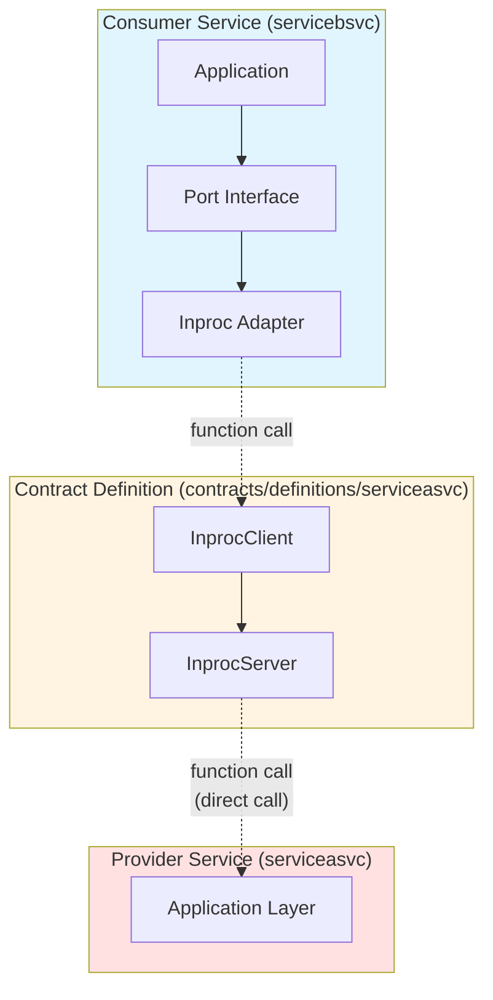
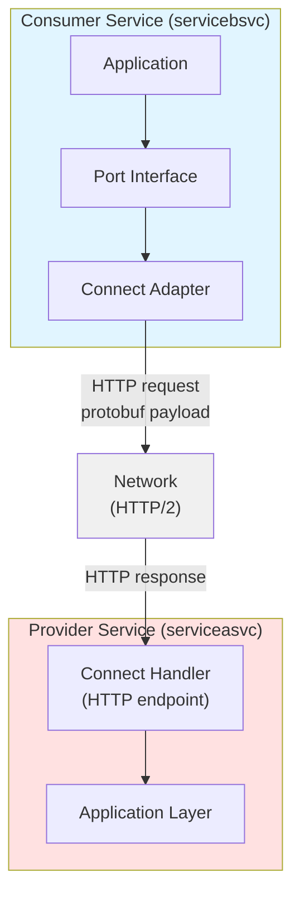

# Protobuf Contracts

Protobuf contracts are **optional** in this architecture. Use them when you need network transport.

## When to Use Protobuf

**Use protobuf when:**
- Services will communicate over the network
- You need backward compatibility guarantees
- You want code generation for multiple languages
- You need schema evolution with breaking change detection

**Skip protobuf when:**
- Services always run in the same process
- You want simpler Go interfaces (use contract DTOs)
- Prototyping or early development

## Hybrid Approach: Contract DTOs Now, Protobuf Later

**Option 1: Contract Definition with Go DTOs (Simple)**

```go
// contracts/definitions/serviceasvc/dto.go
type ServiceADTO struct {
    ID   string
    Name string
    Bio  string
}
```

**Option 2: Contract Definition with Protobuf DTOs (Network-Ready)**

```go
// contracts/definitions/serviceasvc/dto.go
import serviceasvcv1 "github.com/example/service-manager/contracts/gen/serviceasvc/v1"

// Use protobuf-generated types
type ServiceADTO = serviceasvcv1.ServiceA
```

**You can start with Option 1 and migrate to Option 2 when needed.**

## Understanding Network Transport with Connect

Before implementing network transport, let's understand how it parallels the in-process contract-based architecture and how to swap between them.

**What Connect Provides:**

- **Connect Handler** (Inbound): Network server that receives HTTP requests and calls the service's internal application layer
- **Connect Client** (Outbound): Network client that makes HTTP requests to remote services

**Parallel Structure:**

**IN-PROCESS:**


**NETWORK:**


**Key Insight:** Both approaches implement the same application port interface - only the transport mechanism changes.

**The Swap Mechanism:**

```go
// services/servicebsvc/cmd/servicebsvc/main.go
package main

import (
    "net/http"
    "time"

    "github.com/example/service-manager/contracts/definitions/serviceasvc"
    "github.com/example/service-manager/services/servicebsvc/internal/adapters/outbound/serviceaclient/inproc"
    "github.com/example/service-manager/services/servicebsvc/internal/adapters/outbound/serviceaclient/connect"
    "github.com/example/service-manager/services/servicebsvc/internal/application/ports"
    "github.com/example/service-manager/services/servicebsvc/internal/infra"
)

func main() {
    cfg := infra.LoadConfig()

    // SWAP POINT: Choose adapter based on configuration
    var serviceaClient ports.ServiceAClient

    if cfg.UseInProcessContracts {
        // ===== OPTION 1: In-Process =====
        // Get the ServiceAService InprocServer from serviceasvc
        // (In practice, this is a singleton shared across services in same process)
        serviceaServer := getServiceAServiceInprocServer()

        // Wrap in contract client
        serviceaContract := serviceasvc.NewInprocClient(serviceaServer)

        // Wrap in port adapter
        serviceaClient = inproc.NewClient(serviceaContract)
        // Performance: <1μs, zero serialization

    } else {
        // ===== OPTION 2: Network =====
        // Create HTTP client to remote service
        serviceaClient = connect.NewClient(
            cfg.ServiceAServiceURL, // e.g., "https://servicea-service:8080"
            &http.Client{
                Timeout: 5 * time.Second,
            },
        )
        // Performance: 1-5ms, protobuf serialization
    }

    // Rest of wiring is IDENTICAL - application doesn't know the difference
    deps := infra.InitializeDependencies(cfg, serviceaClient)

    // Start server...
}
```

**What Changes:**

| Aspect | In-Process | Network |
|--------|-----------|---------|
| **Consumer Adapter** | `inproc.NewClient(contract)` | `connect.NewClient(url, http)` |
| **Transport** | Function call | HTTP/2 |
| **Serialization** | None (shared memory) | Protobuf |
| **Latency** | <1μs | 1-5ms |
| **Dependencies** | Contract definition | Contracts module |
| **Provider Needs** | Nothing (shares process) | Connect Handler + HTTP server |

**What Stays the Same:**

- Application layer code (commands, queries, domain)
- Port interface definition (`ports.ServiceAClient`)
- Business logic and tests
- Domain models
- Port interface consumers

**Migration Path:**

```
Step 1: Start with In-Process
├─ Use contract definitions with InprocServer/Client
├─ No protobuf needed
├─ Simple Go interfaces
└─ Fast development iteration

Step 2: Add Protobuf (when ready)
├─ Define .proto contract
├─ Generate code (buf generate)
├─ Contract DTOs can use protobuf types
└─ Still using in-process transport

Step 3: Implement Connect Handlers
├─ Add Connect handler (inbound adapter)
├─ Handler calls same application layer
├─ Test with both transports
└─ Still running in same process

Step 4: Implement Connect Client
├─ Add Connect client (outbound adapter)
├─ Implements same port interface
├─ Ready for distributed deployment
└─ Can still run in same process

Step 5: Deploy Separately
├─ Configure with UseInProcessContracts=false
├─ Point to remote service URL
├─ Zero application code changes
└─ Gradually split services
```

**Configuration Example:**

```yaml
# Development: config/dev.yaml
use_in_process_contracts: true
servicea_service_url: ""  # Not needed

# Staging: config/staging.yaml
use_in_process_contracts: false
servicea_service_url: "http://servicea-service:8080"

# Production: config/prod.yaml
use_in_process_contracts: false
servicea_service_url: "https://servicea-service.internal:8080"
```

**When to Use Each:**

**In-Process (via Contract Definition):**
- Local development
- Integration tests
- Services that always deploy together
- Performance-critical paths
- Early prototyping

**Network (via Connect):**
- Need independent scaling
- Services owned by different teams
- Different deployment schedules
- Geographic distribution
- Polyglot consumers (other languages)

## Contracts Module Layout

The `contracts` module uses a single `go.mod` but separates schemas from generated artifacts into language-specific subdirectories:

```
contracts/                  # One Go module (go.mod here)
├── buf.gen.yaml            # Global generation config (all APIs)
├── buf.gen.servicea.yaml   # Service-specific config (Service A API only)
├── buf.gen.serviceb.yaml   # Service-specific config (Service B API only)
├── proto/                  # CLEAN: .proto schemas only
│   ├── buf.yaml            # Buf module config (proto root)
│   └── servicea/v1/
│       └── servicea.proto
├── gen/                    # DIRTY: generated code (do not edit)
│   ├── go/                 # Go generated code (language first, then service)
│   │   └── servicea/v1/
│   │       ├── servicea.pb.go
│   │       └── serviceav1connect/
│   │           └── servicea.connect.go
│   └── ts/                 # Generated TypeScript code (language first, then service)
│       ├── package.json    # npm package: @example/contracts
│       └── servicea/v1/
│           ├── servicea_pb.ts
│           └── servicea_connect.ts
```

**Why one module, not two:**

- **Atomic versioning**: the schema and its generated code are tagged together. You cannot accidentally have `v1.0` of the proto but `v0.9` of the generated stubs.
- **Clear imports**: `import "…/contracts/gen/go/serviceasvc/v1"` is unambiguous — it explicitly names the language artifact and service.
- **No pollution**: `.proto` files live in `contracts/proto`, untouched by generated clutter.
- **Simple workspace**: one entry in `go.work` instead of two synchronized modules.

**Service-Specific Generation:**

Each service should have its own `buf.gen.<service>.yaml` configuration file in the contracts directory. This allows services to:
- Generate only their own API code (faster builds)
- Specify which languages they need (e.g., Go-only for backend services)
- Maintain isolation between service codebases

### Buf Configuration Files

**This guide uses Buf v2 syntax.** Key difference from v1: use `remote:` (not `plugin:`) for BSR-hosted plugins in `buf.gen.yaml`.

This architecture uses multiple buf configuration files:

| File | Location | Purpose | Used by |
|------|----------|---------|---------|
| `buf.yaml` | Repo root | Workspace config | `buf lint`, `buf breaking` (CI) |
| `buf.yaml` | `contracts/proto/` | Module config | `buf generate`, `buf lint` |
| `buf.yaml` | `contracts/proto/<service>/` | Per-service module config (optional) | `buf lint`, `buf format` |
| `buf.gen.yaml` | `contracts/` | Global code generation (all APIs) | `buf generate` (CI/full builds) |
| `buf.gen.<service>.yaml` | `contracts/` | Service-specific generation | `buf generate --template` (dev builds) |

**Key Points:**

- Generation configs (`buf.gen*.yaml`) live inside `contracts/` (not at the repo root)
- Run `buf generate` from the `contracts/` directory
- All `out:` paths in `buf.gen.yaml` are relative to `contracts/` (typically `gen/go/` for Go code, `gen/ts/` for TypeScript)
- Use service-specific templates for development: `buf generate --template buf.gen.servicea.yaml`
- Use global template for CI or full builds: `buf generate`
- The repo-root `buf.yaml` does NOT drive generation — it only enables workspace-wide lint/breaking checks in CI

**`buf.yaml` — repo root (workspace config)**

Declares which buf modules exist in the repo. Used by `buf lint` and `buf breaking` in CI.

```yaml
# buf.yaml  (repo root)
version: v2
modules:
  - path: contracts/proto   # the only proto module in this repo
```

**`buf.yaml` — `contracts/proto/` (module config)**

Marks `contracts/proto/` as a self-contained buf module and defines its lint and breaking-change rules.

```yaml
# contracts/proto/buf.yaml
version: v2
lint:
  use:
    - STANDARD              # enforce standard proto style rules
  except:
    - PACKAGE_VERSION_SUFFIX # allow packages without _v1 suffix if preferred
breaking:
  use:
    - FILE                  # detect field removal, type changes, etc.
```

**`buf.gen.yaml` — `contracts/buf.gen.yaml` (global generation config)**

Defines code generation for ALL APIs. Use this for CI or full builds.

**IMPORTANT:** Buf v2 uses `remote:` for BSR-hosted plugins (not `plugin:` like v1).

```yaml
# contracts/buf.gen.yaml - Generate all APIs
version: v2
inputs:
  - directory: proto          # contracts/proto/ is the buf module
plugins:
  # Go: protobuf types
  - remote: buf.build/protocolbuffers/go    # 'remote:' for BSR plugins
    out: gen/go                             # → contracts/gen/go/
    opt: paths=source_relative
  # Go: Connect RPC stubs
  - remote: buf.build/connectrpc/go
    out: gen/go                             # → contracts/gen/go/
    opt: paths=source_relative
  # TypeScript: protobuf types (Protobuf-ES)
  - remote: buf.build/bufbuild/es
    out: gen/ts                             # → contracts/gen/ts/
    opt: target=ts
  # TypeScript: Connect RPC stubs
  - remote: buf.build/connectrpc/es
    out: gen/ts                             # → contracts/gen/ts/
    opt: target=ts
```

**`buf.gen.<service>.yaml` — Service-specific generation configs**

Each service should have its own generation config. This enables:
- **Faster builds**: Only regenerate the API you're working on
- **Language selection**: Backend services only need Go, frontends only need TypeScript
- **Isolation**: Changes to other services don't trigger your rebuilds

**Example: `contracts/buf.gen.author.yaml` (Author service only)**

```yaml
# contracts/buf.gen.author.yaml - Generate only Author API
version: v2
managed:
  enabled: false
inputs:
  - directory: proto/author   # Point directly to author proto directory
plugins:
  # Go: protobuf types
  - remote: buf.build/protocolbuffers/go
    out: go/author            # → contracts/go/author/
    opt: paths=source_relative
  # Go: Connect RPC stubs
  - remote: buf.build/connectrpc/go
    out: go/author            # → contracts/go/author/
    opt: paths=source_relative
  # Note: TypeScript plugins omitted for backend-only service
```

**Key differences from global config:**
- `inputs.directory` points to specific service: `proto/author` instead of `proto`
- `out` paths include service name: `go/author` instead of `go`
- Can omit plugins for unneeded languages (no TypeScript for backend services)
- Requires `proto/author/buf.yaml` to exist (marks it as a buf module)

**Usage:**

```bash
# Generate only Author API (development)
cd contracts
buf generate --template buf.gen.author.yaml

# Generate all APIs (CI/full build)
cd contracts
buf generate
```

**Service mise.toml integration:**

```toml
# services/authorsvc/mise.toml
[tasks.generate]
description = "Generate code from protobuf definitions (Author API only)"
run = """
cd ../../contracts
buf generate --template buf.gen.author.yaml
"""
```

**Plugin Options Explained:**

- `paths=source_relative` (Go): Generates files relative to the `.proto` source location. Use this for mono-repo layouts.
- `target=ts` (TypeScript): Generates TypeScript (vs `target=js` for JavaScript).

**Local Plugins (alternative to BSR):**

If you have locally installed protoc plugins, use `local:` instead:

```yaml
plugins:
  - local: protoc-gen-go          # must be in $PATH
    out: gen/go
    opt: paths=source_relative
  - local: protoc-gen-connect-go
    out: gen/go
    opt: paths=source_relative
```

Run generation:

```bash
cd contracts
buf generate
```

**Troubleshooting:**

- `field plugin not found`: You're using buf v1 syntax (`plugin:`) instead of v2 syntax (`remote:` or `local:`)
- `plugin not found in $PATH`: Install the plugin or use `remote:` to use BSR-hosted plugins
- `module not found`: Ensure `contracts/proto/buf.yaml` exists

### TypeScript package

The generated TypeScript lives in `contracts/gen/ts/` with its own `package.json`, making it an independently publishable npm package:

```json
{
  "name": "@example/contracts",
  "version": "1.0.0",
  "type": "module",
  "exports": {
    "./servicea/v1": "./servicea/v1/servicea_pb.ts"
  }
}
```

Frontend or Node services import from the same versioned contract:

```typescript
import { ServiceA, GetServiceARequest } from "@example/contracts/servicea/v1";
import { ServiceAService } from "@example/contracts/servicea/v1/servicea_connect";
```

The Go and TypeScript artifacts are generated from the same `.proto` source in the same `buf generate` run, so they are always in sync.

### Service-Specific Generation Configs

**Purpose:** Allow services to generate only their own proto code during development.

For monorepos with multiple services, you can create service-specific generation configs alongside the main `buf.gen.yaml`. This enables faster iteration during single-service development.

**`buf.gen.servicea.yaml` example:**
```yaml
# contracts/buf.gen.servicea.yaml
version: v2
managed:
  enabled: false
inputs:
  - directory: .
    paths:
      - proto/servicea  # Filter to only Service A protos
plugins:
  - remote: buf.build/protocolbuffers/go
    out: gen/go
    opt: paths=source_relative
  - remote: buf.build/connectrpc/go
    out: gen/go
    opt: paths=source_relative
```

**`buf.gen.serviceb.yaml` example:**
```yaml
# contracts/buf.gen.serviceb.yaml
version: v2
managed:
  enabled: false
inputs:
  - directory: .
    paths:
      - proto/serviceb  # Filter to only Service B protos
plugins:
  - remote: buf.build/protocolbuffers/go
    out: gen/go
    opt: paths=source_relative
  - remote: buf.build/connectrpc/go
    out: gen/go
    opt: paths=source_relative
```

**When to use:**
- **`buf.gen.yaml`**: Monolith builds - generates all services at once
- **`buf.gen.servicea.yaml`**: Service A development - only generates Service A code
- **`buf.gen.serviceb.yaml`**: Service B development - only generates Service B code

**Benefits:**
- Faster generation during single-service development
- Service teams can work independently
- Reduces build time when only one service's protos changed
- Clear separation of concerns for CI/CD pipelines

**Example usage in service's mise.toml:**
```toml
[tasks.generate]
description = "Generate code for Service A only"
run = """
cd {{vars.CONTRACTS_DIR}}
buf generate --template buf.gen.servicea.yaml
"""
```

**Example CI usage:**
```bash
# Full monolith build
cd contracts && buf generate

# Service-specific build (faster for PR checks)
cd contracts && buf generate --template buf.gen.servicea.yaml
```

## Complete Protobuf Workflow

See the file [complete-protobuf-workflow.md](complete-protobuf-workflow.md).

## Contract Versioning

**Adding fields (backward compatible):**

```protobuf
message ServiceA {
  string id = 1;
  string name = 2;
  string bio = 3;
  int32 item_count = 4;  // NEW FIELD - backward compatible
}
```

**Breaking changes require new version:**

```
contracts/
└── proto/
    └── serviceasvc/
        ├── v1/
        │   └── serviceasvc.proto    # Existing
        └── v2/
            └── serviceasvc.proto    # Breaking changes
```

**Check for breaking changes in CI:**

```bash
buf breaking --against '.git#branch=main'
```

