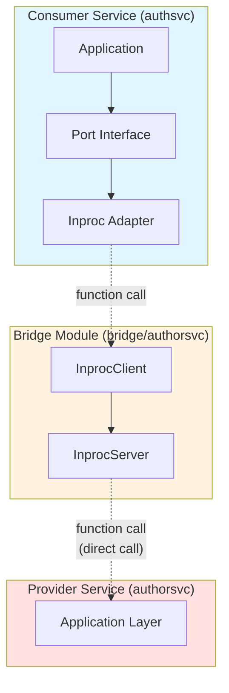
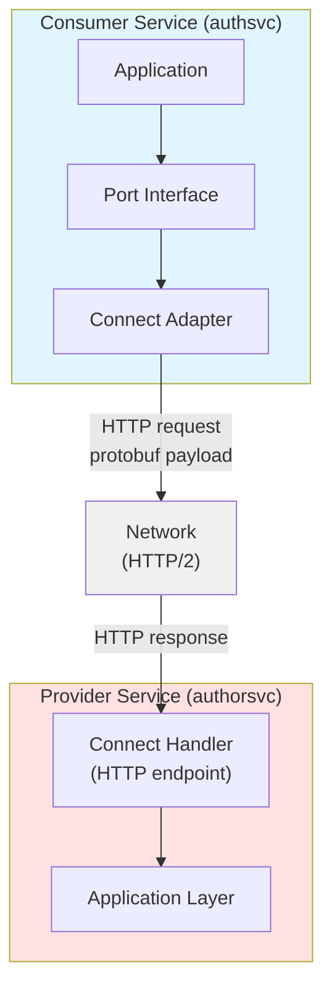

# Protobuf Contracts

Protobuf contracts are **optional** in this architecture. Use them when you need network transport.

## When to Use Protobuf

**Use protobuf when:**
- Services will communicate over the network
- You need backward compatibility guarantees
- You want code generation for multiple languages
- You need schema evolution with breaking change detection

**Skip protobuf when:**
- Services always run in the same process
- You want simpler Go interfaces (use bridge DTOs)
- Prototyping or early development

## Hybrid Approach: Bridge DTOs Now, Protobuf Later

**Option 1: Bridge with Go DTOs (Simple)**

```go
// bridge/authorsvc/dto.go
type AuthorDTO struct {
    ID   string
    Name string
    Bio  string
}
```

**Option 2: Bridge with Protobuf DTOs (Network-Ready)**

```go
// bridge/authorsvc/dto.go
import authorv1 "github.com/example/service-manager/contracts/author/v1"

// Use protobuf-generated types
type AuthorDTO = authorv1.Author
```

**You can start with Option 1 and migrate to Option 2 when needed.**

## Understanding Network Transport with Connect

Before implementing network transport, let's understand how it parallels the in-process bridge pattern and how to swap between them.

**What Connect Provides:**

- **Connect Handler** (Inbound): Network server that receives HTTP requests and calls the service's internal application layer
- **Connect Client** (Outbound): Network client that makes HTTP requests to remote services

**Parallel Structure:**

**IN-PROCESS:**


**NETWORK:**


**Key Insight:** Both approaches implement the same application port interface - only the transport mechanism changes.

**The Swap Mechanism:**

```go
// services/authsvc/cmd/authsvc/main.go
package main

import (
    "net/http"
    "time"

    "github.com/example/service-manager/bridge/authorsvc"
    "github.com/example/service-manager/services/authsvc/internal/adapters/outbound/authorclient/inproc"
    "github.com/example/service-manager/services/authsvc/internal/adapters/outbound/authorclient/connect"
    "github.com/example/service-manager/services/authsvc/internal/application/ports"
    "github.com/example/service-manager/services/authsvc/internal/infra"
)

func main() {
    cfg := infra.LoadConfig()

    // SWAP POINT: Choose adapter based on configuration
    var authorClient ports.AuthorClient

    if cfg.UseInProcessBridge {
        // ===== OPTION 1: In-Process =====
        // Get the AuthorService InprocServer from authorsvc
        // (In practice, this is a singleton shared across services in same process)
        authorServer := getAuthorServiceInprocServer()

        // Wrap in bridge client
        authorBridge := authorsvc.NewInprocClient(authorServer)

        // Wrap in port adapter
        authorClient = inproc.NewClient(authorBridge)
        // Performance: <1μs, zero serialization

    } else {
        // ===== OPTION 2: Network =====
        // Create HTTP client to remote service
        authorClient = connect.NewClient(
            cfg.AuthorServiceURL, // e.g., "https://author-service:8080"
            &http.Client{
                Timeout: 5 * time.Second,
            },
        )
        // Performance: 1-5ms, protobuf serialization
    }

    // Rest of wiring is IDENTICAL - application doesn't know the difference
    deps := infra.InitializeDependencies(cfg, authorClient)

    // Start server...
}
```

**What Changes:**

| Aspect | In-Process | Network |
|--------|-----------|---------|
| **Consumer Adapter** | `inproc.NewClient(bridge)` | `connect.NewClient(url, http)` |
| **Transport** | Function call | HTTP/2 |
| **Serialization** | None (shared memory) | Protobuf |
| **Latency** | <1μs | 1-5ms |
| **Dependencies** | Bridge module | Contracts module |
| **Provider Needs** | Nothing (shares process) | Connect Handler + HTTP server |

**What Stays the Same:**

- Application layer code (commands, queries, domain)
- Port interface definition (`ports.AuthorClient`)
- Business logic and tests
- Domain models
- Port interface consumers

**Migration Path:**

```
Step 1: Start with In-Process
├─ Use bridge with InprocServer/Client
├─ No protobuf needed
├─ Simple Go interfaces
└─ Fast development iteration

Step 2: Add Protobuf (when ready)
├─ Define .proto contract
├─ Generate code (buf generate)
├─ Bridge DTOs can use protobuf types
└─ Still using in-process transport

Step 3: Implement Connect Handlers
├─ Add Connect handler (inbound adapter)
├─ Handler calls same application layer
├─ Test with both transports
└─ Still running in same process

Step 4: Implement Connect Client
├─ Add Connect client (outbound adapter)
├─ Implements same port interface
├─ Ready for distributed deployment
└─ Can still run in same process

Step 5: Deploy Separately
├─ Configure with UseInProcessBridge=false
├─ Point to remote service URL
├─ Zero application code changes
└─ Gradually split services
```

**Configuration Example:**

```yaml
# Development: config/dev.yaml
use_in_process_bridge: true
author_service_url: ""  # Not needed

# Staging: config/staging.yaml
use_in_process_bridge: false
author_service_url: "http://author-service:8080"

# Production: config/prod.yaml
use_in_process_bridge: false
author_service_url: "https://author-service.internal:8080"
```

**When to Use Each:**

**In-Process (via Bridge):**
- Local development
- Integration tests
- Services that always deploy together
- Performance-critical paths
- Early prototyping

**Network (via Connect):**
- Need independent scaling
- Services owned by different teams
- Different deployment schedules
- Geographic distribution
- Polyglot consumers (other languages)

## Complete Protobuf Workflow

See the file [complete-protobuf-workflow.md](complete-protobuf-workflow.md).

## Contract Versioning

**Adding fields (backward compatible):**

```protobuf
message Author {
  string id = 1;
  string name = 2;
  string bio = 3;
  int32 article_count = 4;  // NEW FIELD - backward compatible
}
```

**Breaking changes require new version:**

```
contracts/
└── author/
    ├── v1/
    │   └── author.proto    # Existing
    └── v2/
        └── author.proto    # Breaking changes
```

**Check for breaking changes in CI:**

```bash
buf breaking --against '.git#branch=main'
```

