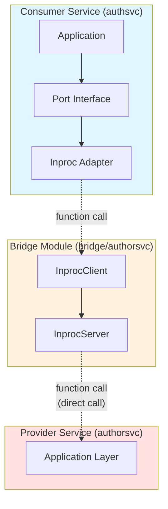
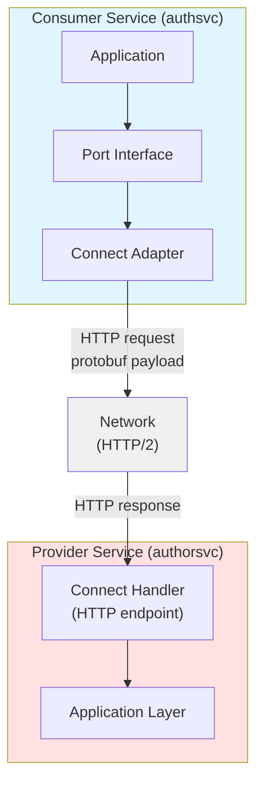

# Protobuf Contracts

Protobuf contracts are **optional** in this architecture. Use them when you need network transport.

## When to Use Protobuf

**Use protobuf when:**
- Services will communicate over the network
- You need backward compatibility guarantees
- You want code generation for multiple languages
- You need schema evolution with breaking change detection

**Skip protobuf when:**
- Services always run in the same process
- You want simpler Go interfaces (use bridge DTOs)
- Prototyping or early development

## Hybrid Approach: Bridge DTOs Now, Protobuf Later

**Option 1: Bridge with Go DTOs (Simple)**

```go
// bridge/authorsvc/dto.go
type AuthorDTO struct {
    ID   string
    Name string
    Bio  string
}
```

**Option 2: Bridge with Protobuf DTOs (Network-Ready)**

```go
// bridge/authorsvc/dto.go
import authorv1 "github.com/example/service-manager/contracts/go/author/v1"

// Use protobuf-generated types
type AuthorDTO = authorv1.Author
```

**You can start with Option 1 and migrate to Option 2 when needed.**

## Understanding Network Transport with Connect

Before implementing network transport, let's understand how it parallels the in-process bridge pattern and how to swap between them.

**What Connect Provides:**

- **Connect Handler** (Inbound): Network server that receives HTTP requests and calls the service's internal application layer
- **Connect Client** (Outbound): Network client that makes HTTP requests to remote services

**Parallel Structure:**

**IN-PROCESS:**


**NETWORK:**


**Key Insight:** Both approaches implement the same application port interface - only the transport mechanism changes.

**The Swap Mechanism:**

```go
// services/authsvc/cmd/authsvc/main.go
package main

import (
    "net/http"
    "time"

    "github.com/example/service-manager/bridge/authorsvc"
    "github.com/example/service-manager/services/authsvc/internal/adapters/outbound/authorclient/inproc"
    "github.com/example/service-manager/services/authsvc/internal/adapters/outbound/authorclient/connect"
    "github.com/example/service-manager/services/authsvc/internal/application/ports"
    "github.com/example/service-manager/services/authsvc/internal/infra"
)

func main() {
    cfg := infra.LoadConfig()

    // SWAP POINT: Choose adapter based on configuration
    var authorClient ports.AuthorClient

    if cfg.UseInProcessBridge {
        // ===== OPTION 1: In-Process =====
        // Get the AuthorService InprocServer from authorsvc
        // (In practice, this is a singleton shared across services in same process)
        authorServer := getAuthorServiceInprocServer()

        // Wrap in bridge client
        authorBridge := authorsvc.NewInprocClient(authorServer)

        // Wrap in port adapter
        authorClient = inproc.NewClient(authorBridge)
        // Performance: <1μs, zero serialization

    } else {
        // ===== OPTION 2: Network =====
        // Create HTTP client to remote service
        authorClient = connect.NewClient(
            cfg.AuthorServiceURL, // e.g., "https://author-service:8080"
            &http.Client{
                Timeout: 5 * time.Second,
            },
        )
        // Performance: 1-5ms, protobuf serialization
    }

    // Rest of wiring is IDENTICAL - application doesn't know the difference
    deps := infra.InitializeDependencies(cfg, authorClient)

    // Start server...
}
```

**What Changes:**

| Aspect | In-Process | Network |
|--------|-----------|---------|
| **Consumer Adapter** | `inproc.NewClient(bridge)` | `connect.NewClient(url, http)` |
| **Transport** | Function call | HTTP/2 |
| **Serialization** | None (shared memory) | Protobuf |
| **Latency** | <1μs | 1-5ms |
| **Dependencies** | Bridge module | Contracts module |
| **Provider Needs** | Nothing (shares process) | Connect Handler + HTTP server |

**What Stays the Same:**

- Application layer code (commands, queries, domain)
- Port interface definition (`ports.AuthorClient`)
- Business logic and tests
- Domain models
- Port interface consumers

**Migration Path:**

```
Step 1: Start with In-Process
├─ Use bridge with InprocServer/Client
├─ No protobuf needed
├─ Simple Go interfaces
└─ Fast development iteration

Step 2: Add Protobuf (when ready)
├─ Define .proto contract
├─ Generate code (buf generate)
├─ Bridge DTOs can use protobuf types
└─ Still using in-process transport

Step 3: Implement Connect Handlers
├─ Add Connect handler (inbound adapter)
├─ Handler calls same application layer
├─ Test with both transports
└─ Still running in same process

Step 4: Implement Connect Client
├─ Add Connect client (outbound adapter)
├─ Implements same port interface
├─ Ready for distributed deployment
└─ Can still run in same process

Step 5: Deploy Separately
├─ Configure with UseInProcessBridge=false
├─ Point to remote service URL
├─ Zero application code changes
└─ Gradually split services
```

**Configuration Example:**

```yaml
# Development: config/dev.yaml
use_in_process_bridge: true
author_service_url: ""  # Not needed

# Staging: config/staging.yaml
use_in_process_bridge: false
author_service_url: "http://author-service:8080"

# Production: config/prod.yaml
use_in_process_bridge: false
author_service_url: "https://author-service.internal:8080"
```

**When to Use Each:**

**In-Process (via Bridge):**
- Local development
- Integration tests
- Services that always deploy together
- Performance-critical paths
- Early prototyping

**Network (via Connect):**
- Need independent scaling
- Services owned by different teams
- Different deployment schedules
- Geographic distribution
- Polyglot consumers (other languages)

## Contracts Module Layout

The `contracts` module uses a single `go.mod` but separates schemas from generated artifacts into language-specific subdirectories:

```
contracts/                  # One Go module (go.mod here)
├── buf.gen.yaml            # Generation config — run `buf generate` from here
├── proto/                  # CLEAN: .proto schemas only
│   ├── buf.yaml            # Buf module config (proto root)
│   └── author/v1/
│       └── author.proto
├── go/                     # DIRTY: generated Go code (do not edit)
│   └── author/v1/
│       ├── author.pb.go
│       └── authorconnect/
│           └── author.connect.go
└── ts/                     # DIRTY: generated TypeScript code (do not edit)
    ├── package.json        # npm package: @example/contracts
    └── author/v1/
        ├── author_pb.ts
        └── author_connect.ts
```

**Why one module, not two:**

- **Atomic versioning**: the schema and its generated code are tagged together. You cannot accidentally have `v1.0` of the proto but `v0.9` of the generated stubs.
- **Clear imports**: `import "…/contracts/go/author/v1"` is unambiguous — it explicitly names the language artifact. Generic names like `gen/` give no signal.
- **No pollution**: `.proto` files live in `contracts/proto`, untouched by generated clutter.
- **Simple workspace**: one entry in `go.work` instead of two synchronized modules.

### Buf Configuration Files

**This guide uses Buf v2 syntax.** Key difference from v1: use `remote:` (not `plugin:`) for BSR-hosted plugins in `buf.gen.yaml`.

This architecture uses three separate buf configuration files:

| File | Location | Purpose | Used by |
|------|----------|---------|---------|
| `buf.yaml` | Repo root | Workspace config | `buf lint`, `buf breaking` (CI) |
| `buf.yaml` | `contracts/proto/` | Module config | `buf generate`, `buf lint` |
| `buf.gen.yaml` | `contracts/` | Code generation | `buf generate` |

**Key Points:**

- `buf.gen.yaml` lives inside `contracts/` (not at the repo root)
- Run `buf generate` from the `contracts/` directory
- All `out:` paths in `buf.gen.yaml` are relative to `contracts/`
- The repo-root `buf.yaml` does NOT drive generation — it only enables workspace-wide lint/breaking checks in CI

**`buf.yaml` — repo root (workspace config)**

Declares which buf modules exist in the repo. Used by `buf lint` and `buf breaking` in CI.

```yaml
# buf.yaml  (repo root)
version: v2
modules:
  - path: contracts/proto   # the only proto module in this repo
```

**`buf.yaml` — `contracts/proto/` (module config)**

Marks `contracts/proto/` as a self-contained buf module and defines its lint and breaking-change rules.

```yaml
# contracts/proto/buf.yaml
version: v2
lint:
  use:
    - STANDARD              # enforce standard proto style rules
  except:
    - PACKAGE_VERSION_SUFFIX # allow packages without _v1 suffix if preferred
breaking:
  use:
    - FILE                  # detect field removal, type changes, etc.
```

**`buf.gen.yaml` — `contracts/buf.gen.yaml` (generation config)**

Defines code generation plugins and their output directories.

**IMPORTANT:** Buf v2 uses `remote:` for BSR-hosted plugins (not `plugin:` like v1).

```yaml
# contracts/buf.gen.yaml
version: v2
inputs:
  - directory: proto          # contracts/proto/ is the buf module
plugins:
  # Go: protobuf types
  - remote: buf.build/protocolbuffers/go    # 'remote:' for BSR plugins
    out: go                                 # → contracts/go/
    opt: paths=source_relative
  # Go: Connect RPC stubs
  - remote: buf.build/connectrpc/go
    out: go                                 # → contracts/go/
    opt: paths=source_relative
  # TypeScript: protobuf types (Protobuf-ES)
  - remote: buf.build/bufbuild/es
    out: ts                                 # → contracts/ts/
    opt: target=ts
  # TypeScript: Connect RPC stubs
  - remote: buf.build/connectrpc/es
    out: ts                                 # → contracts/ts/
    opt: target=ts
```

**Plugin Options Explained:**

- `paths=source_relative` (Go): Generates files relative to the `.proto` source location. Use this for mono-repo layouts.
- `target=ts` (TypeScript): Generates TypeScript (vs `target=js` for JavaScript).

**Local Plugins (alternative to BSR):**

If you have locally installed protoc plugins, use `local:` instead:

```yaml
plugins:
  - local: protoc-gen-go          # must be in $PATH
    out: go
    opt: paths=source_relative
  - local: protoc-gen-connect-go
    out: go
    opt: paths=source_relative
```

Run generation:

```bash
cd contracts
buf generate
```

**Troubleshooting:**

- `field plugin not found`: You're using buf v1 syntax (`plugin:`) instead of v2 syntax (`remote:` or `local:`)
- `plugin not found in $PATH`: Install the plugin or use `remote:` to use BSR-hosted plugins
- `module not found`: Ensure `contracts/proto/buf.yaml` exists

### TypeScript package

The generated TypeScript lives in `contracts/ts/` with its own `package.json`, making it an independently publishable npm package:

```json
{
  "name": "@example/contracts",
  "version": "1.0.0",
  "type": "module",
  "exports": {
    "./author/v1": "./author/v1/author_pb.ts"
  }
}
```

Frontend or Node services import from the same versioned contract:

```typescript
import { Author, GetAuthorRequest } from "@example/contracts/author/v1";
import { AuthorService } from "@example/contracts/author/v1/author_connect";
```

The Go and TypeScript artifacts are generated from the same `.proto` source in the same `buf generate` run, so they are always in sync.

## Complete Protobuf Workflow

See the file [complete-protobuf-workflow.md](complete-protobuf-workflow.md).

## Contract Versioning

**Adding fields (backward compatible):**

```protobuf
message Author {
  string id = 1;
  string name = 2;
  string bio = 3;
  int32 article_count = 4;  // NEW FIELD - backward compatible
}
```

**Breaking changes require new version:**

```
contracts/
└── proto/
    └── author/
        ├── v1/
        │   └── author.proto    # Existing
        └── v2/
            └── author.proto    # Breaking changes
```

**Check for breaking changes in CI:**

```bash
buf breaking --against '.git#branch=main'
```

